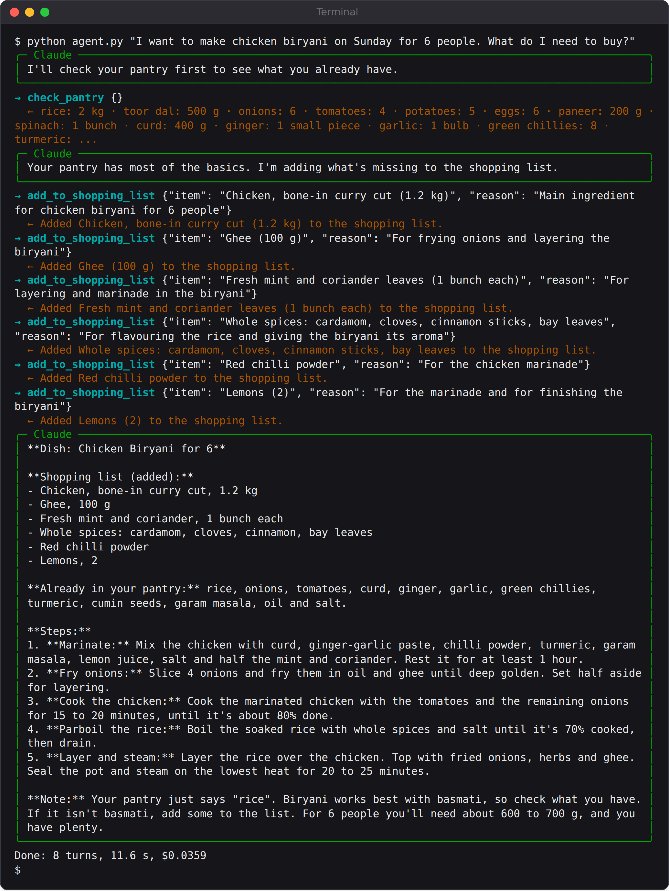

# Chapter 3: Your First Agent: Pantry Chef

Your first agent solves a problem every household has at six in the evening: *what can I cook with what's in the kitchen?* Pantry Chef looks at what you have, suggests one dish, explains how to make it, and adds anything missing to your shopping list.

It's small, about 80 lines, but it's a real agent. It decides for itself which tools to use and when, and it changes something in the world: a shopping list file that wasn't there before. Everything later in the book builds on the pattern you'll learn here.

## What You'll Build

Pantry Chef has two tools:

- `check_pantry` reads `pantry.json` and lists what's in the kitchen.
- `add_to_shopping_list` writes one line to `shopping-list.txt`.

You'll ask it a question in plain English. Claude decides to check the pantry, works out a dish, and calls `add_to_shopping_list` once for each missing ingredient. You never tell it how many times to call a tool, or in what order.

## Step 1: The Pantry

Create a folder called `01-pantry-chef`, and in it a file called `pantry.json`. This is the agent's view of your kitchen:

```
@include projects/01-pantry-chef/pantry.json#L1-L8
```

The full file lists 17 items; Appendix G has all of them. Change it to match your own kitchen if you like; the agent reads it fresh every time.

Copy `watch.py` into the folder too. It's printed in full in Chapter 4; for now, all you need to know is that `show(message)` prints each step the agent takes.

## Step 2: Give Claude Tools

A **tool** is a Python function that Claude can ask your program to run. You describe it with the `@tool` decorator, which takes three things:

1. A **name**, which Claude uses to call it.
2. A **description**, which Claude reads to decide *when* to call it. This is the most important part, and Chapter 5 is all about writing good ones.
3. An **input schema**, which lists what Claude must provide. `{}` means "nothing"; `{"item": str, "reason": str}` means two pieces of text.

Here's the first tool:

```
@include projects/01-pantry-chef/agent.py::check_pantry
```

The function receives `args`, a dictionary of the inputs Claude chose, and returns a dictionary with a `content` list. Each item in `content` is a block of the result; here, one block of text listing the pantry. That text is exactly what Claude will see.

The second tool writes to a file:

```
@include projects/01-pantry-chef/agent.py::add_to_shopping_list
```

Notice that this tool asks for a `reason` as well as the item. Claude doesn't need a reason to add milk to a list, but *you* will want to know why it was added when you read the list in the shop. Asking a tool for its reason is a cheap way to make an agent's actions explainable.

## Step 3: Put the Tools on a Server

The Agent SDK talks to tools through **MCP**, the Model Context Protocol, an open standard for connecting AI models to tools and data. You'll build a full MCP server of your own in Chapter 13. For now, the SDK can wrap your Python functions in a small MCP server that runs inside your program:

```
@include projects/01-pantry-chef/agent.py::kitchen
```

The server's name, `kitchen`, becomes part of each tool's full name. Claude sees the tools as `mcp__kitchen__check_pantry` and `mcp__kitchen__add_to_shopping_list`: `mcp`, then the server name, then the tool name, joined by double underscores.

## Step 4: Configure the Agent

The options bring everything together:

```
@include projects/01-pantry-chef/agent.py::options
```

Line by line:

- **`model`** picks Claude Sonnet 5.5, a good balance of skill, speed and cost.
- **`system_prompt`** gives the agent its role and its rules. "Always check the pantry before suggesting a dish" stops Claude from suggesting a recipe that needs things you don't have.
- **`mcp_servers`** connects the kitchen server.
- **`tools=[]`** turns off the SDK's built-in tools, such as reading files and running commands. This agent doesn't need them, so it shouldn't have them. Giving an agent only the tools it needs is the single most effective safety habit in this book.
- **`allowed_tools`** lists the tools that may run without asking for permission. Without this list, the SDK would stop and ask before each tool call; Chapter 11 explains the full permission system.
- **`max_turns`** and **`max_budget_usd`** are the safety limits from Chapter 2.

## Step 5: Run the Loop

Finally, `main()` takes your question from the command line, or uses a default one, and runs the agent:

```
@include projects/01-pantry-chef/agent.py::main
```

`query()` starts the agent loop and returns a stream of messages as Claude works. The `async for` loop receives them one by one, and `show()` prints each one. That's all the code there is. The SDK handles everything between: sending the request, running the tools Claude asks for, sending back the results, and stopping when Claude is done.

> **Note:** `async` and `await` let Python wait for slow things, such as a reply from Claude, without freezing. You don't need to understand them deeply to build agents. Copy the pattern: an `async def main()`, an `async for` loop over `query()`, and `asyncio.run(main())` at the bottom.

## Run It

From inside the `01-pantry-chef` folder:

```
python agent.py
```

Here is a real run, shortened a little:

```
Terminal output:
→ check_pantry {}
  ← rice: 2 kg · toor dal: 500 g · onions: 6 · tomatoes: 4 · ...
→ add_to_shopping_list {"item": "Spinach (1 extra bunch)", "reason":
"Palak paneer for 3 people needs more spinach than the one bunch in
the pantry."}
  ← Added Spinach (1 extra bunch) to the shopping list.
╭─ Claude ──────────────────────────────────────────────────────────╮
│ **Tonight's dinner: Palak paneer with jeera rice**                 │
│                                                                    │
│ You have nearly everything for it. I added one extra bunch of      │
│ spinach to your shopping list, because one bunch is a little short │
│ for 3 people.                                                      │
│ ...                                                                │
│ 5. **Stretch it (optional):** Add 1–2 boiled, cubed potatoes so    │
│ 200 g of paneer feeds three.                                       │
╰────────────────────────────────────────────────────────────────────╯
Done: 3 turns, 8.6 s, $0.0198
```

Read it from the top. The arrow `→` is Claude asking for a tool; the arrow `←` is the result your program sent back. Claude checked the pantry first, as instructed. It chose palak paneer because you have spinach and paneer, noticed that one bunch of spinach is a little short for three people, and added a second bunch to the list, with a reason. Then it wrote the recipe. Three turns, under nine seconds, two US cents.

Now ask for something you *can't* make from the pantry:

```
python agent.py "I want to make chicken biryani on Sunday for 6 people. What do I need to buy?"
```



This time Claude called `add_to_shopping_list` six times: chicken, ghee, mint and coriander, whole spices, chilli powder and lemons. The file it left behind:

```
@include projects/01-pantry-chef/evals/biryani-shopping-list.txt
```

Look at the end of the reply, too. Claude noticed something you never asked about: "Your pantry just says 'rice'. Biryani works best with basmati, so check what you have." That's the kind of judgement that makes agents useful, and the kind you can't get from a fixed workflow.

## Same Question, Different Answers

Run the dinner question twice, and you'll probably get two different dinners. When this book's first test run asked it, Claude chose palak paneer and added *nothing* to the list, judging that one bunch of spinach was enough. The run above chose the same dish and added a bunch. Both are reasonable.

This is normal for language models, and it's the first lesson of agent building: **a single good run proves very little.** For a dinner suggestion, variety is a feature. For a refund decision, it would be a bug. From Chapter 6 onwards, every agent is run several times and checked by code, so you'll know how consistent it really is.

> **Try It:** Edit `pantry.json`: delete the paneer and add "chicken: 500 g". Ask for dinner again. Then ask in Tamil or Hindi, or ask for "something sweet for a birthday", and watch how Claude adapts. Delete `shopping-list.txt` between runs if you want a fresh list.

## What You've Learned

This small agent contains every idea the rest of the book develops:

- **Tools** let Claude act: read data, write files, change things.
- **The system prompt** sets the agent's role and rules.
- **Permissions** decide which tools may run, and taking away tools the agent doesn't need is the first safety measure.
- **The loop** is run by the SDK: Claude decides, your code acts, Claude sees the result, and so on until it's done.
- **Limits** stop runaway loops and runaway bills.

## Key Takeaways

- A tool is a Python function with a name, a description and an input schema, made available to Claude through the `@tool` decorator.
- `create_sdk_mcp_server` puts your tools on a small server inside your program. Claude sees them as `mcp__server__tool`.
- `tools=[]` removes built-in tools the agent doesn't need; `allowed_tools` lets your own tools run without asking.
- Claude chooses which tools to call, how often and in what order. You describe the goal, not the steps.
- The same request can give different results. Never judge an agent by one run.
