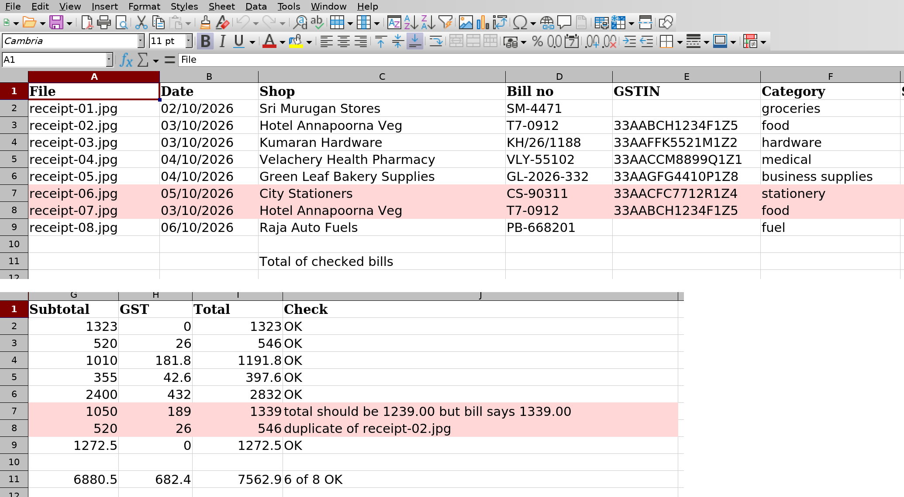

# Chapter 7: Project 3: Receipt Scanner

Every small business has a box of crumpled receipts that someone has to type into a spreadsheet before the accountant visits. Amudha's box has bills from the grocery store, the pharmacy, a hardware shop, a stationer, a petrol pump, and a restaurant where she took a supplier to lunch. This agent reads photos of those bills and turns them into an Excel sheet ready for her accountant.

It also teaches the most useful design pattern in this book, one you'll use again and again: **the model reads, the code checks.** Claude is excellent at reading a tilted, slightly blurred photo of a receipt. Plain Python is excellent at adding up numbers and spotting duplicates. Let each do what it's best at.

## The Receipts

The project's `receipts` folder has eight phone photos of shop bills. They're fictional, made by a script in Appendix G, but they look like the real thing: tilted, shadowed and a little soft, as photos taken on a kitchen counter usually are.


Two of them hide problems that a careless bookkeeper would miss:

- The **City Stationers** bill has a total that's Rs. 100 more than its items and tax add up to.
- The **Hotel Annapoorna** lunch bill was photographed twice. Typing both into the books would claim the same expense twice.

## Design: Who Does What

Before writing any code, decide which parts of the job need judgement and which need precision:

| Job | Who does it | Why |
| --- | --- | --- |
| Find the receipt photos | Claude, with the `Glob` tool | Simple, but lets the agent handle any number of files |
| Read each photo and copy the details | Claude, with the `Read` tool | Reading messy images is what language models are good at |
| Check that items add up to the subtotal, and subtotal plus tax to the total | Python | Arithmetic must be exact, every time |
| Spot duplicate bills | Python | A simple comparison of shop, bill number and date |
| Write the spreadsheet | Python, with `openpyxl` | Formatting is fixed, so there's nothing to decide |

Notice what Claude is *not* asked to do: it doesn't check the arithmetic, and it doesn't fix anything. In fact, it's told not to.

## The Agent

Install the spreadsheet library first:

```
pip install openpyxl
```

The agent gets two built-in tools and nothing else:

```
@include projects/03-receipt-scanner/agent.py::options
```

`cwd` sets the folder the agent works in, so `Read` and `Glob` see the project's files. Reading files inside that folder is allowed automatically; reading anywhere else would need permission, which this agent doesn't have.

Look closely at the system prompt: "Copy numbers exactly as printed, even if they look wrong: don't correct or recalculate anything." Without that sentence, a helpful model might quietly "fix" the City Stationers total to the right amount, and the overcharge would vanish from the record. You want the agent to report what the paper says, and the code to decide whether it's right.

## Structured Output

The agent's job is to fill in a form, so this project asks for **structured output**: instead of a chatty reply, Claude must return data in an exact shape that you describe with a JSON Schema. The SDK checks Claude's answer against the schema, and if it doesn't match, asks Claude to fix it.

```
@include projects/03-receipt-scanner/agent.py::SCHEMA
```

Every receipt must have a file name, shop, bill number, date, GSTIN (the tax registration number, empty if there isn't one), a list of items, the subtotal, the tax, the total and a category. The `enum` for category means Claude must pick one of eight words; it can't invent "misc stuff".

You ask for structured output with one option, `output_format`, and read it from the result message's `structured_output` field.

## The Checks

Here's the plain Python that checks Claude's work:

```
@include projects/03-receipt-scanner/agent.py::check
```

It runs three checks on every receipt: do the items add up to the subtotal; do the subtotal and tax add up to the total; and has this shop, bill number and date already appeared? The 50-paise tolerance allows for rounding on the printed bill. Each receipt gets a list of problems; an empty list means it passed.

Then `write_excel` writes the sheet, colours any receipt with a problem in light red, and adds a total of the receipts that passed (Appendix G has it in full). Finally, `main` connects everything:

```
@include projects/03-receipt-scanner/agent.py::main
```

## Run It

```
python agent.py
```

```
Terminal output:
→ Glob {"pattern": "**/receipts/**/*"}
  ← receipts/receipt-01.jpg · receipts/receipt-02.jpg · ...
→ Read {"file_path": "receipts/receipt-01.jpg"}
→ Read {"file_path": "receipts/receipt-02.jpg"}
...
→ Read {"file_path": "receipts/receipt-08.jpg"}
→ StructuredOutput {"receipts": [{"file": "receipt-01.jpg", ...
Done: 11 turns, 15.8 s, $0.0921
receipt-01.jpg: Sri Murugan Stores, Rs. 1,323.00 -> OK
receipt-02.jpg: Hotel Annapoorna Veg, Rs. 546.00 -> OK
receipt-03.jpg: Kumaran Hardware, Rs. 1,191.80 -> OK
receipt-04.jpg: Velachery Health Pharmacy, Rs. 397.60 -> OK
receipt-05.jpg: Green Leaf Bakery Supplies, Rs. 2,832.00 -> OK
receipt-06.jpg: City Stationers, Rs. 1,339.00 -> total should be
1239.00 but bill says 1339.00
receipt-07.jpg: Hotel Annapoorna Veg, Rs. 546.00 -> duplicate of
receipt-02.jpg
receipt-08.jpg: Raja Auto Fuels, Rs. 1,272.50 -> OK
```

Claude found the eight photos, read them one by one, and returned the details as structured data. Then the code found both problems: the stationer's Rs. 100 overcharge and the duplicate lunch bill. Sixteen seconds and nine US cents for a job that takes a person half an hour.

Here's the spreadsheet it wrote, opened in a spreadsheet program:



## How Accurate Is It?

One good-looking run proves little, so the project has a grader. A file called `evals/truth.json` holds the correct answer for every receipt, written when the receipts were created, including which ones should be flagged:

```
@include projects/03-receipt-scanner/grade.py::grade
```

The grader compares seven fields on each of the eight receipts (shop, bill number, date, GSTIN, subtotal, tax and total), checks the number of item lines, and checks that exactly the right receipts were flagged. Text is compared ignoring capital letters; money must match to the paisa.

The agent was run three times. All three runs scored **56 of 56 fields** and **8 of 8 flags**, for between 9.1 and 9.6 US cents a run.

> **Note:** Perfect scores on eight clean, printed receipts don't mean perfect scores on your real ones. Handwritten bills, faded thermal paper and receipts in Tamil or Hindi are harder. Before trusting the agent with your own bills, make a truth file for twenty of them and run the grader. It takes an hour, and it tells you exactly how much to trust the agent.

## Why Not Let Claude Do the Maths?

Claude can add up a receipt correctly most of the time. So why use code?

- **"Most of the time" isn't good enough for accounts.** Code is right every time, and you can prove it with a test.
- **The checks must be independent.** If the same model reads the receipt and then checks its own reading, a misread number can pass its own check. Code that recomputes the totals catches the misreading as well as the overcharge.
- **It's cheaper and faster.** Arithmetic in Python is free and instant.

The same pattern appears throughout the book. The research analyst in Chapter 8 has code verify every quote. The data analyst in Chapter 9 is graded by code that recomputes every number. The ShopMate brief in Part V is checked against the order files. Whenever a fact can be checked by code, check it with code.

## Privacy

Receipts carry personal and business details: names, phone numbers, tax numbers, what you bought and where. When an agent reads them, those images are sent to the Claude API. Anthropic's commercial terms cover how API data is handled, and you should read them, but the simplest protection is to send only what the job needs. Don't point a receipt agent at your whole photo library; give it a folder with just the receipts.

> **Try It:** Take photos of three of your own receipts and put them in the `receipts` folder (move the sample ones out first). Run the agent. Then write the correct values into `evals/truth.json` yourself and run `python grade.py`. Did it read everything correctly? Which fields were hardest?

## Key Takeaways

- The model reads, the code checks. Use Claude for perception and judgement, and Python for arithmetic and rules.
- Tell the agent to copy what it sees, not to correct it, so problems stay visible.
- Structured output (`output_format` with a JSON Schema) turns an agent's answer into data your code can use. Use `enum` for fixed choices.
- Check the agent against a truth file you trust, and run it more than once.
- Send the agent only the files it needs.
