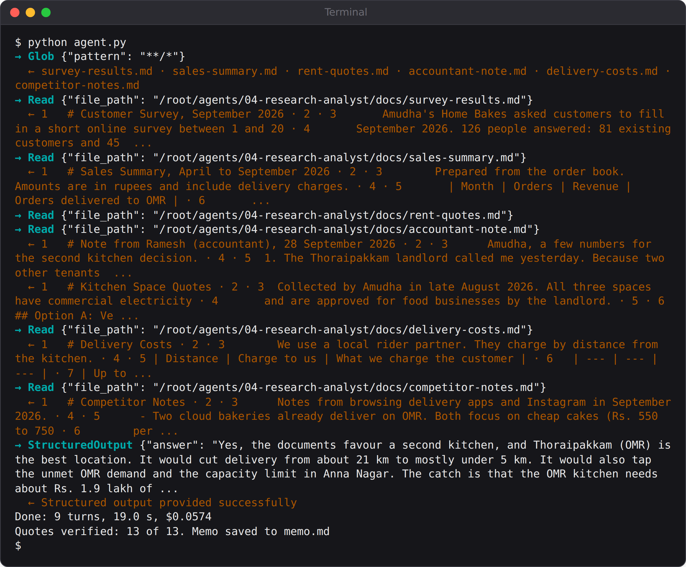

# Chapter 8: Project 4: Research Analyst with Verified Quotes

Amudha has a big decision to make. Her kitchen in Anna Nagar is full on weekends, and customers in the IT corridor along OMR keep asking her to deliver closer. Should she open a second kitchen, and if so, where? The facts are scattered across six documents: a customer survey, six months of sales, three rent quotes, a note from her accountant, her delivery costs, and notes on competitors.

This agent reads them all and writes a decision memo. Its special feature is that it can't quietly make things up: every finding must come with a word-for-word quote from a named file, and plain code checks every quote before you see the memo.

## The Problem with Confident Answers

Language models write fluently and confidently, and that's exactly the problem when the stakes are real. A memo that says "the OMR rent is Rs. 45,000" reads just as convincingly whether the number came from the documents, from an older document, or from nowhere. Amudha shouldn't sign a lease based on a memo she can't check.

The fix has three parts:

1. **Ground the agent.** Tell it to answer only from the documents, and to list what the documents don't say instead of guessing.
2. **Make it show its sources.** Every finding needs a quote and a file name.
3. **Check the sources with code.** After the agent finishes, a few lines of Python confirm that each quote really appears in its file.

## The Documents

The project's `docs` folder holds six short Markdown files (all printed in Appendix G). They were written to be realistic, which means messy: they overlap, and in one place they disagree. The rent quotes from late August put the OMR space at Rs. 45,000 a month, but the accountant's note from 28 September says:

```
@include projects/04-research-analyst/docs/accountant-note.md#L5-L7
```

A careless reader would use the first number they saw. A good analyst would notice the conflict, check the dates, and use the newer figure. Let's see what the agent does.

## The Agent

This agent uses three built-in tools: `Glob` to find the files, `Read` to read them, and `Grep` to search inside them. Its working folder is set to `docs`, so that's all it can see:

```
@include projects/04-research-analyst/agent.py::options
```

The system prompt sets the rules of good research: read everything first, quote word for word, prefer the newer document when sources disagree, and say what's missing rather than guess.

The answer comes back as structured output with four parts: a direct answer, a list of findings (each with a claim, a file and a quote), a list of conflicts, and a list of things the documents don't say:

```
@include projects/04-research-analyst/agent.py::SCHEMA
```

That last field, `not_in_documents`, matters more than it looks. Giving the agent an explicit, approved place to put "I don't know" makes it much less likely to fill the gap with a guess.

## Checking Every Quote

When the agent finishes, two short functions check its work:

```
@include projects/04-research-analyst/agent.py::squash,verify
```

`squash` makes the comparison forgiving about the things that don't matter: spacing, line breaks, capital letters, and the `|` and `*` characters of Markdown tables. It's strict about everything that does matter: the words and numbers themselves. `verify` looks up each quote in the file the agent named, and marks it `verified` or not.

The memo writer then labels every finding. A quote that can't be found is printed as **NOT FOUND IN SOURCE**, so a made-up quote can't hide.

## Run It

```
python agent.py
```



The agent read all six documents, then returned 13 findings. The code checked all 13 quotes against their files: **13 of 13 verified**. The memo begins:

```
@include projects/04-research-analyst/evals/runs/memo-book.md#L1-L10
```

And it found the trap:

```
@include projects/04-research-analyst/evals/runs/memo-book.md#L34-L36
```

The agent noticed the two rent figures, compared the dates, and used the newer one, exactly as instructed. It also turned the conflict into a sensible question in its "not in the documents" list: does the accountant's Rs. 1.9 lakh break-even figure use the old rent or the new one?

## What Verification Doesn't Catch

Read finding 3 closely:

```
@include projects/04-research-analyst/evals/runs/memo-book.md#L11-L12
```

The quote is real, so it's marked verified. But it only supports the second half of the claim. The first half, that OMR is the second-largest area among survey respondents, is true (33 respondents, behind Anna Nagar's 38), but it comes from a table the agent didn't quote.

This is an important limit. **Quote verification proves the words exist in the source. It doesn't prove the words support the claim.** A determined agent could quote a real sentence next to a wrong conclusion, and the check would pass. Verification catches invented quotes and invented numbers, which is the most common and most dangerous failure. It doesn't replace a person reading the memo.

In an earlier run, the agent listed "salaries for the two extra staff" as missing information, when the accountant's note does say the break-even figure covers "rent, two staff salaries and electricity". No quote was involved, so verification couldn't catch it. Read the "not in the documents" list with the same care as the findings.

> **Tip:** You can tighten the check by asking for one quote per claim and keeping claims short. "OMR orders fell in June" with a quote of the June row is much easier to check, by code or by a person, than a long claim with one quote for part of it.

## When the Answer Isn't There

A good research agent must also know when to say "I can't answer that". Ask it something the documents don't cover:

```
python agent.py "What was the bakery's profit in 2025, and how many staff does it have today?"
```

```
Claude's reply:
The documents don't give the bakery's 2025 profit. They don't give
its current staff count either. They only cover April–September
2026 sales, a roughly 32% margin on revenue, and "two staff
salaries" for a possible second kitchen.
```

It refused to guess, explained what the documents do contain, and listed four things that are missing, including a sharp one: "What period the 'current margin of about 32%' refers to." All three of its quotes were verified. This took 9 seconds and less than four US cents.

## How Consistent Is It?

The grader for this project checks five things on every run: every quote is verified, there are at least eight findings, the rent conflict is found (both Rs. 45,000 and Rs. 48,000 are mentioned in the conflicts), the answer recommends OMR or Thoraipakkam, and the missing-information list isn't empty.

```
@include projects/04-research-analyst/grade.py::grade
```

Across three graded runs and the run above, all four passed every check, with 13 or 14 findings and **every quote verified, 54 out of 54**. Each run cost between 5 and 7 US cents.

## Key Takeaways

- Ground research agents: answer only from the sources, prefer newer documents when they conflict, and list what's missing.
- Give the agent an approved place to say "I don't know". It will use it.
- Make every finding carry a quote and a source, and check the quotes with code.
- Verification catches invented quotes and numbers. It doesn't prove the reasoning is right, so people still read the memo.
- Test with a question the documents can't answer. A good agent refuses to guess.
