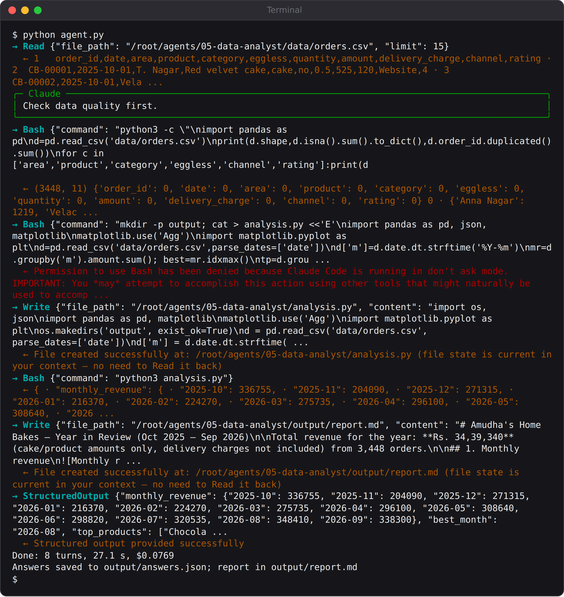

# Chapter 9: Project 5: A Data Analyst That Writes Its Own Code

The research analyst read documents. This agent goes a step further: it reads a year of raw sales data, writes its own Python code to analyse it, runs that code, draws charts, and writes a report for Amudha. It's the most powerful agent so far, and the most dangerous, because an agent that can run code can do almost anything your computer can.

This chapter shows how to give an agent that power safely. It also includes the most instructive failure in the book: the first version of this agent "succeeded" in under ten seconds, and every one of its answers was empty.

## The Data and the Questions

`data/orders.csv` holds 3,448 orders from 1 October 2025 to 30 September 2026, one per line: date, area, product, whether it was eggless, the amount, the delivery charge, the sales channel and the customer's rating. It's made by a script in Appendix G, with realistic patterns built in: a Diwali rush, a Christmas plum-cake season, steady growth, and one area that grows much faster than the others.

The task is a set of questions any small business owner would ask at the end of a year:

```
@include projects/05-data-analyst/agent.py::TASK
```

These are exactly the questions where a language model guessing would be useless and a few lines of pandas are perfect. So the agent's job is not to answer them. It's to **write the code** that answers them.

## Giving an Agent a Shell, Carefully

To write and run code, the agent needs four built-in tools: `Write` and `Edit` to create the script, `Read` and `Glob` to look at files, and `Bash` to run commands. `Bash` is the dangerous one: a shell command can delete files, read secrets or send data anywhere. So this agent's permissions are deliberately narrow:

```
@include projects/05-data-analyst/agent.py::options
```

Three settings work together:

- **`allowed_tools`** approves the file tools, but only **`Bash(python3 *)`**: shell commands that start with `python3`. Anything else, such as `rm`, `curl` or `cd`, isn't approved.
- **`permission_mode="dontAsk"`** means "if a tool call isn't approved, refuse it". Nobody is sitting at the keyboard to answer a permission question, so refusing is the only safe default.
- **`sandbox`** runs every command inside an operating-system sandbox that can only write inside the project folder. The next sections show why this third setting is essential.

## The First Version Failed Silently

The first version of this agent had the same permissions but a one-line system prompt: "You are a data analyst. Always compute numbers with code; never estimate them by reading the file." Here is its complete run:

```
@include projects/05-data-analyst/evals/runs/attempt-0-blocked-command.log
```

Claude's first move was a perfectly sensible look at the data with `cd`, `head`, `wc` and `ls`. The permission system refused it, because those commands don't start with `python3`. Claude then gave up and returned the structured output with **every answer empty**, and the SDK reported success. The program printed "Answers saved", and anyone glancing at the terminal would have believed it.

Two separate things went wrong, and each needs its own fix.

**The agent didn't know its own limits.** It wasn't told which commands it could run, so it wasted its first move and then didn't know how to continue. The fix is in the system prompt above: say exactly what's allowed ("The only shell commands you can run are python3 commands"), say what to use instead ("use the Read and Glob tools to look at files"), and say what to do if it gets stuck ("If you can't finish, say so instead of returning empty answers").

**The program trusted "success".** The structured output matched the schema, since an empty dictionary is still a dictionary, so the SDK accepted it. The fix is a check in the code:

```
@include projects/05-data-analyst/agent.py::main
```

With both fixes, the next run worked first time, and every run since has passed.

> **Warning:** An agent that can't do its job will often return *something* rather than nothing. Always check that the output is not just well-formed but actually filled in, and treat an empty or default-looking answer as a failure.

## Why `python3 *` Isn't Enough

Allowing only `python3` commands sounds safe. It isn't. Python can do anything: delete files, read your SSH keys, send data over the internet. A `python3 -c "..."` command is as powerful as any shell command.

The `sandbox_demo.py` script in this project proves it. It asks an agent with exactly these permissions to write a file in your home folder, outside the project, using a `python3` command. Without a sandbox:

```
@include projects/05-data-analyst/evals/runs/sandbox-off.txt
```

The permission check approved the command, because it starts with `python3`, and the file was written. With `sandbox` turned on, the same request:

```
@include projects/05-data-analyst/evals/runs/sandbox-on.txt
```

The operating system itself blocked the write ("Read-only file system"), and Claude explained what happened without trying to get around it. That's the difference between a rule and a wall. **Permissions decide which commands may start. The sandbox decides what a running command can touch.** For any agent that runs code, you want both.

The sandbox uses your operating system's isolation features: built in on macOS, and on Linux it needs two small programs, `bubblewrap` and `socat`:

```
sudo apt install bubblewrap socat
```

Here's a trap the book found the hard way. When those programs are missing, the SDK doesn't stop. It prints a warning, "Sandbox disabled ... Commands will run WITHOUT sandboxing", and carries on unprotected. So this agent checks for them before it starts:

```
@include projects/05-data-analyst/agent.py::check_sandbox
```

> **Note:** The sandbox protects your computer from the agent's commands. It doesn't make the agent's analysis correct, and it doesn't protect data the agent is allowed to read. For agents that will run on servers, Chapter 20 adds another layer: running the whole agent in a container as an ordinary user.

## Run It

Install the analysis libraries, then run the agent:

```
pip install pandas matplotlib
python agent.py
```



Notice one refused command in the middle of the run. Claude tried `mkdir -p output; cat > analysis.py ...`, which doesn't start with `python3`. Because the system prompt explained the rules, it simply switched to the `Write` tool and carried on. That's what a good system prompt buys you: not fewer mistakes, but quick recovery from them.

The agent wrote its own `analysis.py`, ran it, saved three charts and wrote a report. Here's the chart it drew of growth by area:


And the start of the report it wrote for Amudha:

```
@include projects/05-data-analyst/evals/runs/book/report.md#L1-L22
```

## Checking the Numbers

Every number in that report came from code the agent wrote. But who checks the agent's code? The project's grader does, by recomputing every answer independently with its own pandas code:

```
@include projects/05-data-analyst/grade.py::truth
```

Monthly revenue must match to the rupee, the top five products must be in the right order, growth and eggless percentages must be within half a point, and ratings within a hundredth. The charts and the report must exist.

Every graded run of the fixed agent passed all nine checks: three runs while the book was being written, and two more after the sandbox was added. The runs cost between 8 and 13 US cents. The independent recomputation is what makes that statement trustworthy: it doesn't rely on the agent's code being right.

> **Try It:** Ask the agent a new question by editing `TASK`: "Which day of the week brings the most revenue?" or "Did the Diwali week of 2025 sell more hampers than the rest of the year put together?" Then add a matching check to `grade.py` before you trust the answer.

## Key Takeaways

- For questions about data, have the agent write and run code; never let it estimate numbers by reading.
- Tell the agent exactly which commands it may run and what to use instead. Agents recover quickly from refusals when they know the rules.
- "Success" can mean empty answers. Check that the output is actually filled in.
- Allowing `python3` allows everything. Run code inside the sandbox, and check that the sandbox is really on.
- Grade data agents by recomputing their answers independently.
