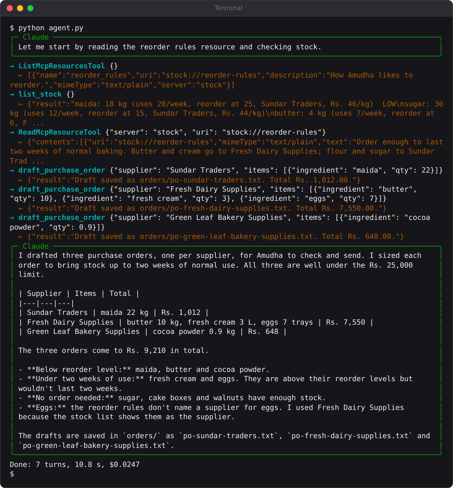
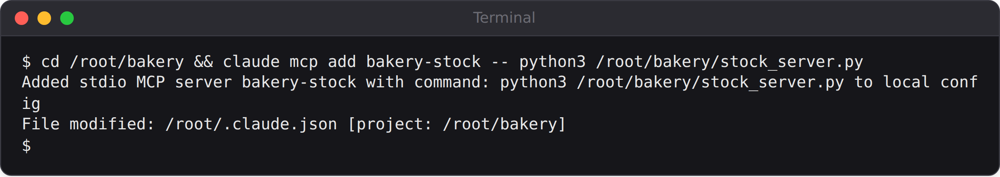
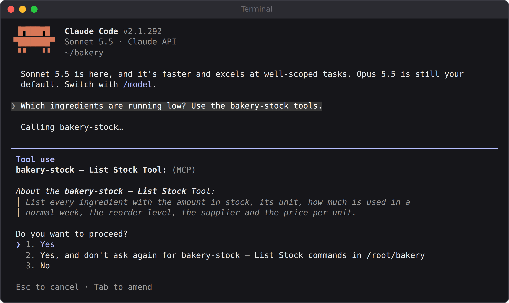
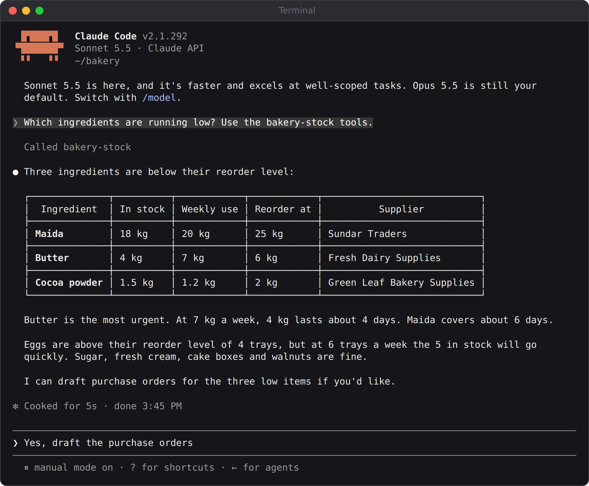
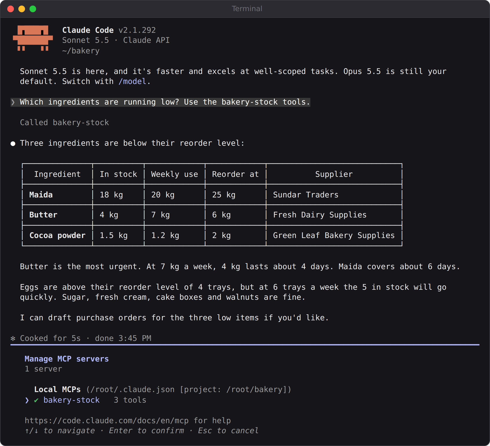

# Part IV: Advanced Agents

# Chapter 13: Project 7: Your Own MCP Server

Every tool so far has lived inside its agent's own program. That's simple, but it means each agent needs its own copy of every tool. What if the bakery's stock records should be available to the Kitchen Manager agent, to ShopMate, to Claude Code on Amudha's laptop, and to any future agent, all through one well-tested piece of code?

That's what the **Model Context Protocol (MCP)** is for. This chapter builds an MCP server for the bakery's ingredient stock, connects an agent to it, connects Claude Code to the very same server, and covers the surprisingly tricky business of making sure the connection really works before an agent relies on it.

## What MCP Is

MCP is an open standard for connecting AI applications to tools and data. It has two sides:

- An **MCP server** offers capabilities: **tools** (actions, like `list_stock`), **resources** (documents to read, like the bakery's reorder rules) and **prompts** (ready-made instructions).
- An **MCP client** connects to servers and makes their capabilities available to a model. The Agent SDK, Claude Code and Claude Desktop are all MCP clients.

Write a server once, and every MCP client can use it. The servers in Chapters 3 to 10 were MCP servers too, but small ones that lived inside one program. This one runs as a **separate program** and talks to its clients over **stdio**, its standard input and output. MCP servers can also run on a web server and be reached over HTTP, which is how remote services offer MCP connections.

## The Stock Server

Install the MCP Python library:

```
pip install mcp
```

The stock data is a JSON file with one entry per ingredient: how much is in stock, its unit, how much the bakery uses in a normal week, the level at which to reorder, the supplier and the price:

```
@include projects/07-stock-mcp/stock.start.json#L1-L9
```

The server is built with **FastMCP**, part of the MCP library, which turns ordinary Python functions into MCP tools. The type hints become the input schema, and the docstring becomes the description:

```
@include projects/07-stock-mcp/stock_server.py::mcp,list_stock
```

That's all a tool takes: a decorator, type hints and a clear docstring. Notice that `list_stock` marks low items with `LOW`, so neither Claude nor a person has to compare numbers to spot them.

The second tool changes data, and checks its inputs carefully:

```
@include projects/07-stock-mcp/stock_server.py::record_usage
```

Raising an exception is how a FastMCP tool reports an error. The client turns it into an error result, and Claude sees the message.

The third tool, `draft_purchase_order`, writes a purchase order to a file for Amudha to check and send. It's a good example of a **workflow tool**: one call does several things in code (looks up prices, multiplies, adds a total, writes a file) that would take an agent several error-prone steps to do by hand:

```
@include projects/07-stock-mcp/stock_server.py::draft_purchase_order
```

Its error messages are the improved ones from Chapter 5: an unknown ingredient gets a list of the valid names, and a wrong supplier gets the right one.

Finally, a **resource**: the bakery's reorder rules, as a document any client can read:

```
@include projects/07-stock-mcp/stock_server.py::reorder_rules
```

You can check the server by itself, without any AI, using its `--check` option:

```
python stock_server.py --check
```

```
Terminal output:
maida: 18 kg (uses 20/week, reorder at 25, Sundar Traders, Rs. 46/kg)  LOW
sugar: 30 kg (uses 12/week, reorder at 15, Sundar Traders, Rs. 44/kg)
butter: 4 kg (uses 7/week, reorder at 6, Fresh Dairy Supplies, Rs. 530/kg)  LOW
...
```

## The Kitchen Manager Agent

Now an agent that uses the server. Instead of an in-process server, its options describe a **stdio server**: a command to start, which the SDK runs as a separate program:

```
@include projects/07-stock-mcp/agent.py::options
```

Look at the permissions. The agent may read the stock list, read resources and draft purchase orders. But `record_usage` is in `disallowed_tools`, so this agent can never change the stock, even though the server offers that tool. **Connecting to a server doesn't mean using all of it.** Choose the tools each agent needs, and deny the rest.

`ListMcpResourcesTool` and `ReadMcpResourceTool` are built-in tools that let the agent discover and read the server's resources. The system prompt tells it to read the reorder rules before planning.

## When the Server Isn't There

The first time this agent ran five times in a row, one run failed in a worrying way. Claude replied:

```
Claude's reply:
I can't plan the orders yet because I don't have access to the
reorder rules or your stock data in this session. No file, resource,
or inventory tools are available to me here, so I can't read the
rules, as I'm required to do before planning, or check current
stock. I don't want to guess at quantities or suppliers and hand you
purchase orders built on made-up numbers.
```

Good behaviour from Claude: it refused to invent numbers. But the program had no idea anything was wrong. The stock server simply hadn't connected in time, so the agent started without its tools.

The investigation found the cause. To keep the start of a session fast, the SDK doesn't always wait for MCP servers to connect before the first turn, especially when **tool search** is on, as it is by default, which loads tools on demand. This agent's `tools` list didn't include the tool-search tool, so tools that hadn't arrived yet could never be found. In tests, the server often showed as `pending` instead of `connected` when the session started: in one set of eight test runs, seven times.

Two changes fixed it. First, `"alwaysLoad": True` in the server's configuration tells the SDK to load this server's tools before the first turn. After that change, the server connected in six runs out of six, and then in every graded run. Second, the agent checks for itself:

```
@include projects/07-stock-mcp/agent.py::main
```

The first message of every run is a `SystemMessage` with the subtype `init`, which lists every MCP server and its status. If the stock server isn't `connected`, the agent stops with a clear error instead of starting a run that can't succeed. **Check your dependencies before you start, not after something goes wrong.**

## Run It

```
python agent.py
```



The agent read the reorder rules, listed the stock, and drafted three purchase orders: maida from Sundar Traders; butter, fresh cream and eggs from Fresh Dairy Supplies; and cocoa from Green Leaf. Each order was sized so that stock plus the order covers two weeks of normal use, and each was well under the Rs. 25,000 limit in the rules. One of the drafts:

```
@include projects/07-stock-mcp/evals/po-fresh-dairy-supplies.txt
```

The project's grader works out what each ingredient really needs (twice the weekly use, minus the stock) and checks every purchase order against it: everything needed is ordered, in at least the needed amount, from the right supplier, with nothing extra and no order over Rs. 25,000. With the improved server and `alwaysLoad`, **five runs out of five passed**, each costing about three US cents.

## The Same Server in Claude Code

Because this is a standard MCP server, Claude Code can use it too. In a terminal, add it with one command:

```
claude mcp add bakery-stock -- python3 /path/to/stock_server.py
```



Then start Claude Code in that folder and ask about the stock. The first time it uses a tool from a new server, Claude Code asks your permission, and shows you the tool's description:



After you approve, it answers from the live stock data:



The `/mcp` command shows every connected server and how many tools each one offers:



One server, two very different clients: an unattended planning agent and an interactive coding assistant. That's the point of MCP.

## Testing an MCP Server

Because the server is a separate program, you can test it the way a client would use it, with no model involved. The book's tests start the server, connect to it with the MCP library's own client, and check every tool and the resource:

```
@include tests/test_guardrails.py::test_stock_server_over_real_mcp
```

It checks that the server lists exactly three tools, that the stock list marks butter as low, that recording an impossible amount fails while a sensible one succeeds and changes the file, and that the reorder rules mention the Rs. 25,000 limit. It runs in about a second.

## Using Other People's MCP Servers

Many companies and open-source projects publish MCP servers for their services. They can save a lot of work, but treat them like any software you install:

- **Only connect servers you trust.** A server runs on your computer with your permissions, and its tool descriptions and results go straight to the model. A malicious server could try to instruct your agent through them.
- **Allow only the tools you need**, as the Kitchen Manager does by denying `record_usage`.
- **Watch for changes.** A server update can add tools or change their behaviour. Pin versions, and re-run your evals after upgrading (Chapter 22).

## Key Takeaways

- MCP lets you write tools and resources once and use them from any MCP client: Agent SDK agents, Claude Code, Claude Desktop.
- FastMCP turns Python functions into MCP tools: type hints become the schema, docstrings become the description, and exceptions become error results.
- An agent can connect to a server without using all of it. Deny the tools it doesn't need.
- Don't assume a server connected. Use `alwaysLoad` for servers an agent can't work without, and check the `init` message before the agent starts.
- Test MCP servers with a real MCP client, and only connect servers you trust.
