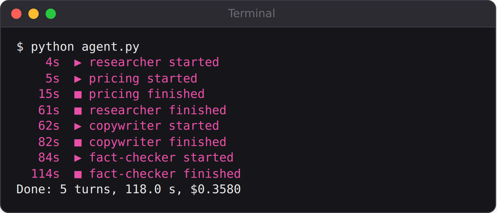

# Chapter 14: Project 8: A Team of Agents

Diwali is the bakery's biggest week of the year, and Amudha wants to launch gift hampers. That means research (what sold last Diwali?), pricing (what should each hamper cost?), marketing copy (Instagram posts, one in Tamil, and a WhatsApp message), and a final check that every number in the copy is true.

You could give all of that to one agent. This chapter gives it to a **team**: a coordinator and four specialists, each with its own instructions and its own tools. Along the way you'll see why teams help, what can go wrong when agents hand work to each other, and how a dedicated fact-checker caught a mistake that would otherwise have gone out to customers.

## Why a Team?

The Agent SDK lets one agent hand a task to another through the built-in `Agent` tool. The agent receiving the task is a **subagent**. It starts with a fresh conversation, does its job with its own tools, and sends back only its final answer. That gives you four benefits:

- **Focus.** Each specialist gets short, specific instructions instead of one enormous prompt that tries to cover everything.
- **Least privilege.** The copywriter can read and write files but can't run code. The fact-checker can read, search and edit, but can't run code either.
- **A clean context.** The researcher may read thousands of rows of data, but only its summary comes back to the coordinator, so the coordinator's conversation stays short and cheap.
- **Parallel work.** Specialists that don't depend on each other can work at the same time.

The cost is more moving parts: more agents, more hand-offs and more places for things to go wrong.

## The Data

The team works from three files in `data/`: the year of orders from Chapter 9, the customer survey from Chapter 8, and a new file with the cost of each hamper item and the pricing rule:

```
@include projects/08-launch-team/data/hamper-costs.json#L1-L3
```

The rule is precise on purpose: at least a 40% margin, then rounded *up* to the next price ending in 49 or 99. It's the kind of rule people get slightly wrong by hand, and code gets right every time.

## The Specialists

Each specialist is an `AgentDefinition`: a description that tells the coordinator when to use it, a prompt that tells the specialist how to work, and a list of tools:

```
@include projects/08-launch-team/agent.py::TEAM
```

Notice how the tools follow the jobs:

| Specialist | Tools | Why |
| --- | --- | --- |
| Researcher | Read, Glob, Write, Bash | Must compute facts from data with Python |
| Pricing | Read, Write, Bash | Must calculate prices with Python |
| Copywriter | Read, Write | Only writes words; never runs code |
| Fact-checker | Read, Grep, Write, Edit | Searches sources, writes its report, fixes the copy |

`SHELL_RULES` is added to the two specialists that run Python. It tells them exactly which commands are allowed, the lesson from Chapter 9. And `background=False` asks for each specialist to run in the foreground, so the coordinator waits for its answer.

## The Coordinator

The coordinator gets the team and a plan:

```
@include projects/08-launch-team/agent.py::options
```

Its system prompt describes the order of work: research and pricing first, at the same time, then the copywriter, then the fact-checker. It also says "Don't do their work yourself", because a capable coordinator is tempted to write the copy itself rather than delegate.

The two hooks print a timeline as specialists start and finish:

```
@include projects/08-launch-team/agent.py::subagent_started,subagent_stopped
```

## What Went Wrong the First Time

The first version of this team taught three lessons in one run.

**Subagents run in the background by default.** The coordinator started the researcher and the pricing specialist, then its own turn ended while they were still working. The SDK delivered their results later as notifications, and the coordinator carried on from there. It worked, but the flow was hard to follow and hard to reason about. Asking for foreground runs, in the prompt ("Wait for each specialist's result before the next step") and with `background=False`, made the order predictable.

**A specialist couldn't write its report.** The fact-checker was first given Read, Grep and Edit. `Edit` changes existing files; it can't create new ones. So it checked everything carefully, and then had no way to save `factcheck.md`. Adding `Write` fixed it. When a specialist has to produce a file, make sure one of its tools can create one.

**The coordinator renamed a file.** It told the copywriter to save its work as `copy.md` instead of `posts.md`, so the fact-checker and the grader looked in the wrong place. "Don't change the file names they use" fixed that. Coordinators pass their own instructions to subagents, and those instructions can quietly override yours.

A fourth problem was the same one the data analyst hit: specialists tried commands like `cd` and `mkdir`, which weren't allowed. The shell rules in their prompts solved it.

## Run It

```
python agent.py
```



A typical timeline from a graded run:

```
Terminal output:
    5s  ▶ researcher started
    6s  ▶ pricing started
   24s  ■ pricing finished
   75s  ■ researcher finished
   79s  ▶ copywriter started
   99s  ■ copywriter finished
  103s  ▶ fact-checker started
  154s  ■ fact-checker finished
Done: 5 turns, 158.0 s, $0.6778
```

Research and pricing ran side by side, so the slower one set the pace. The coordinator itself took only five turns: it delegated, waited, and summarised.

The pricing specialist calculated the prices with a Python script it wrote. Its table, with the item lists left out:

| Hamper | Total cost (Rs) | Price (Rs) | Margin |
| --- | --- | --- | --- |
| Deepam (small) | 425 | 749 | 43.3% |
| Jyothi (medium) | 785 | 1349 | 41.8% |
| Jyothi Eggless (medium) | 805 | 1349 | 40.3% |

And one of the copywriter's Instagram captions:

```
@include projects/08-launch-team/evals/runs/kit-1/posts.md#L13-L22
```

## The Fact-Checker Earns Its Place

In the third graded run, the researcher correctly reported that last Diwali's festive hamper was the top product, with 28 orders adding up to 40 hampers. The copywriter, working from that report, wrote "28 hampers were ordered" in the WhatsApp message. It's an easy slip: orders and hampers aren't the same thing when some customers buy two.

The fact-checker recounted from the original data and caught it:

```
@include projects/08-launch-team/evals/runs/kit-3/factcheck.md#L19-L19
```

Then it fixed the copy and recorded the change:

```
@include projects/08-launch-team/evals/runs/kit-3/factcheck.md#L33-L39
```

That's the value of a separate checker with its own instructions and its own access to the sources. The copywriter's job is to write persuasively; the fact-checker's job is to be suspicious. Giving both jobs to one agent weakens both. And notice that the fact-checker checked against the *original data*, not just the researcher's notes, which is exactly what you'd want from a human fact-checker too.

In another run, the fact-checker flagged something no rule covered: only the brownies were confirmed eggless in the source data, so it warned Amudha not to describe the whole "Jyothi Eggless" hamper as egg-free until she'd checked the other items. For a bakery, that's not a style point; it's an allergy and trust issue.

## Grading the Team

The grader checks the team's output with plain code:

```
@include projects/08-launch-team/grade.py::price,grade
```

It recalculates the correct price for each hamper from the cost file, checks that the pricing table shows those prices, and checks that every hamper price in the posts is one of them. It also checks that the Tamil caption exists (by looking for Tamil script) and that the fact-checker gave a verdict. Three graded runs passed every check, at 68 to 78 US cents each.

> **Note:** The grader checks that the copy's prices are right. It can't check that the copy is persuasive, or that the Tamil reads naturally. The fact-checker said the same in its own report: have a native Tamil speaker read the Tamil caption before posting it. Some judgements still need a person.

## When to Use a Team

Teams are powerful, but they cost more and fail in more ways. A run of this team cost about 70 US cents; most single agents in this book cost under 15 cents a run. Use one when:

- the work has **distinct roles** that need different instructions or different tools;
- one part produces a lot of material that the others don't need to see;
- an **independent check** is worth paying for, as with the fact-checker;
- parts can run **in parallel** and time matters.

Don't use one just because it sounds impressive. The pantry helper, the receipt scanner and the support desk are all better as single agents.

## Key Takeaways

- Subagents give you focused instructions, least-privilege tools, clean context and parallel work.
- Define each specialist with an `AgentDefinition`: a description, a prompt and its tools.
- Subagents run in the background by default. Ask for foreground runs when order matters.
- Check that each specialist's tools can produce what you ask of it, and stop the coordinator from overriding your instructions.
- An independent fact-checker that goes back to the original sources is one of the most valuable roles in any team.
- Teams cost more. Use them when the work really has separate roles.
