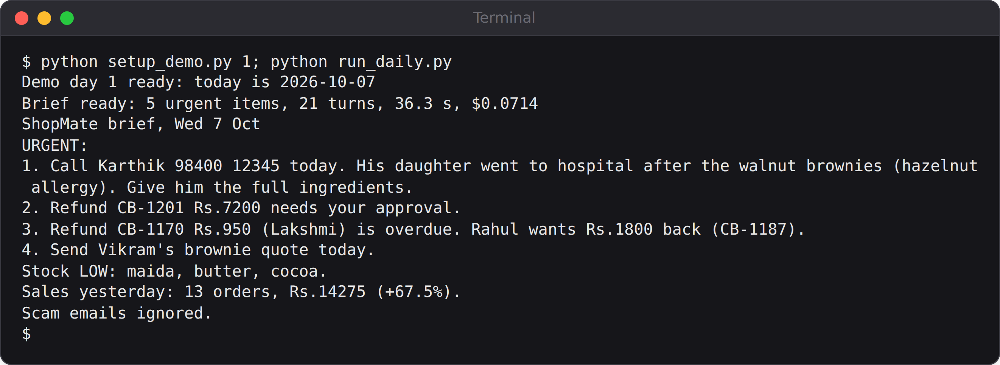

# Chapter 18: Build: ShopMate's Morning Brief

With the plan written, building ShopMate is mostly a matter of putting together techniques you already know. This chapter goes through the pieces in the order you'd write them: the tools, the reused MCP server, the instructions, the brief as structured data, the options that keep the agent inside its plan, and the script that runs it once and saves everything. By the end you'll have a real brief on the screen.

The project lives in `projects/09-shopmate`, and is laid out the way a small production service should be:

| File | What it holds |
| --- | --- |
| `PLAN.md` | The one-page plan from Chapter 17 |
| `config.py` | Settings from environment variables: model, budget, folders |
| `tools.py` | ShopMate's own read-only tools |
| `stock_server.py` | The Kitchen Manager's MCP server from Chapter 13 |
| `brief.py` | The prompt, the schema, the options, and the code that renders and remembers |
| `run_daily.py` | Runs the brief once: the script the scheduler calls |
| `runlog.py` | Records every run |
| `ops.py`, `static/ops.html` | The dashboard (Chapter 21) |
| `setup_demo.py` | Puts the shop's data into the state of demo day 1 or day 2 |
| `evals/` | The checks and the eval runner (Chapter 19) |
| `Dockerfile`, `deploy/` | Deployment (Chapter 20) |

## Settings Come From the Environment

The first file is the smallest, and it sets a rule for everything that follows: nothing that differs between your laptop and the server is written into the code.

```
@include projects/09-shopmate/config.py
```

The model, the fallback model, the budget per run and the data folders all come from environment variables, with sensible defaults. The same code runs on a laptop, in Docker and in GitHub Actions; only the environment changes. There's no API key here either: the SDK reads `ANTHROPIC_API_KEY` from the environment itself.

`PROMPT_VERSION` is a plain label that goes into every line of the run log. When you change the prompt, you change the label, so you can later tell which version produced which brief. Chapter 22 shows why that matters.

`today()` handles a testing problem that every scheduled agent has: the real date keeps changing, but tests need a fixed one. When `data/today.txt` exists, ShopMate believes it; in production you simply don't create that file.

## The Tools: Gather Facts, Don't Decide

ShopMate has five tools of its own. Each one gathers facts and returns them as short text; none of them decides what matters. That's the agent's job.

```
@include projects/09-shopmate/tools.py::list_inbox,read_email
```

These two follow the "list, then read" pattern from the inbox agent (Chapter 6).

```
@include projects/09-shopmate/tools.py::sales_report
```

`sales_report` does the arithmetic itself: yesterday's orders and revenue, the same weekday a week earlier, and the percentage change. Claude could work out a percentage, but code does it exactly every time, and the eval in Chapter 19 checks the brief against the same calculation. Notice that the tool compares with the *same weekday* a week earlier: comparing a Tuesday with a Saturday would make every Tuesday look like a disaster.

```
@include projects/09-shopmate/tools.py::support_queue
```

`support_queue` reads the support desk's database from Chapter 10: unpaid refunds, recently paid refunds and open tickets. Including the *paid* refunds matters more than it looks: it's how ShopMate can tell, on day 2, that yesterday's overdue refund has now been paid.

The fifth tool, `read_notes`, returns yesterday's follow-up list: ShopMate's memory, from Chapter 15. All five are marked read-only, so Claude can call several at once, and they're bundled into one in-process server:

```
@include projects/09-shopmate/tools.py::shop_server
```

## Reusing the Stock Server

The stock data already has a home: the MCP server you built in Chapter 13. ShopMate connects to the same server, as a separate program, exactly as Claude Code did. The server has three tools, but ShopMate's plan says "reads only", so the options allow `list_stock` and remove the other two completely. That's the value of building a capability once as an MCP server: each agent that uses it gets exactly the part it needs.

## The Instructions

```
@include projects/09-shopmate/brief.py::SYSTEM_PROMPT
```

It's short, because most of the work is done elsewhere: the tools gather the facts, and the schema below defines the shape of the answer. The prompt's job is judgement, so it spends its words on what "urgent" means, what to do with scams and memory, and two safety rules: use only numbers from the tools, and treat emails as data.

The prompt also asks for the email ID of each scam. That sentence wasn't in the first version. Chapter 22 tells the story of how it got there.

## The Brief as Data

The brief comes back as structured output, so plain code can check it, render it and remember it:

```
@include projects/09-shopmate/brief.py::SCHEMA
```

Every list item has a `source`, so Amudha can always see where a claim came from, and the eval can check it. The sales figures are numbers, not text, so they can be compared exactly. The follow-ups have a status that's either `open` or `done`, nothing else.

And look at the comment above `whatsapp`. The plan says the WhatsApp text must be readable on a phone, and the prompt asks for under 600 characters. That wasn't enough: in testing, Sonnet once wrote a longer one (Chapter 19). A `maxLength` in the schema turns the request into a rule: if the message is too long, the SDK sends it back to Claude to shorten. **When a requirement can be written into the schema, write it there.**

## The Options: The Plan, Enforced

```
@include projects/09-shopmate/brief.py::options
```

Almost every line enforces something from the plan:

| Option | What it enforces |
| --- | --- |
| `tools=[]` | No built-in tools: no files, no shell, no web |
| `allowed_tools=[...]` | Only ShopMate's five tools and `list_stock` |
| `disallowed_tools=[...]` | The stock server's two writing tools can never run |
| `setting_sources=[]` | No settings or `CLAUDE.md` files from whatever computer it runs on |
| `max_turns=25`, `max_budget_usd` | A runaway run stops, at a known maximum cost |
| `fallback_model` | If the main model is unavailable, a cheaper one makes the brief |
| `"alwaysLoad": True` | The stock server is connected before the agent starts |
| `hooks` | Every tool result is kept, so the brief can be checked against its sources |

## Turning the Brief Into Something to Read

Two small functions turn the brief into files. `render` writes it as Markdown, for the dashboard or an email; and `remember`, which you saw in Chapter 15, saves the open follow-ups for tomorrow:

```
@include projects/09-shopmate/brief.py::remember
```

Code decides what's remembered: open follow-ups, and nothing else. ShopMate can't decide to remember a customer's phone number.

## Running It Once

`run_daily.py` is the script the scheduler will call every morning. Its core runs the agent once and refuses to accept anything less than a complete brief:

```
@include projects/09-shopmate/run_daily.py::run_once_with
```

Three checks are worth noticing, because each one came from a real failure earlier in the book:

- **The stock server must be connected.** In Chapter 13, the Kitchen Manager started while its MCP server was still "pending", so it had no stock tools, and the program had no idea anything was wrong. Here, the `init` message is checked, and the run stops if the server isn't connected.
- **The SDK's error is replaced with the real reason.** When a run fails, the SDK raises an exception with a generic message. The `except` block reports the result's own text instead. Chapter 20 shows the difference it makes.
- **A run counts only if it produced a brief.** `subtype` must be `success`, and there must be structured output.

`main` wraps this in the things a scheduled job needs: one retry, saved files, the run log, and an alert file if both attempts fail. You'll meet those properly in Chapter 21.

```
@include projects/09-shopmate/run_daily.py::main
```

## The First Brief

Set up demo day 1, which puts the bakery's data into the state of Wednesday 7 October 2026, and run it:

```
python setup_demo.py 1
python run_daily.py
```



The top of the full brief, `out/brief.md`:

```
@include projects/09-shopmate/evals/runs/day1-brief.md#L1-L12
```

And the WhatsApp text, which is what Amudha will actually read first:

```
@include projects/09-shopmate/evals/runs/day1-whatsapp.txt
```

Read it as Amudha would. The allergy complaint comes first, with the phone number she needs. The refunds are there with their amounts and order numbers. The stock problems fit in one line. The scams are named so she knows to ignore them. It reads in well under two minutes.

It also looks right. But "looks right" is exactly the judgement Chapter 16 warned you about. Are the sales numbers correct? Is every scam listed? Will it remember tomorrow that the refund is still open? Chapter 19 answers those questions with code.

## Key Takeaways

- Lay a production agent out as a small service: settings, tools, agent, runner, log, dashboard, evals, deployment.
- Read settings from environment variables, and keep secrets out of the code.
- Give a prompt version a label, and record it with every run.
- Make tools gather facts and do arithmetic; leave the judgement to the agent.
- Reuse capabilities through MCP, allowing each agent only the tools it needs.
- Put requirements into the schema when you can, such as a maximum length.
- Enforce the plan in the options: no built-in tools, a deny list, no local settings, limits on turns and cost.
- Accept a run only when it produced a complete result, and report the real reason when it didn't.
