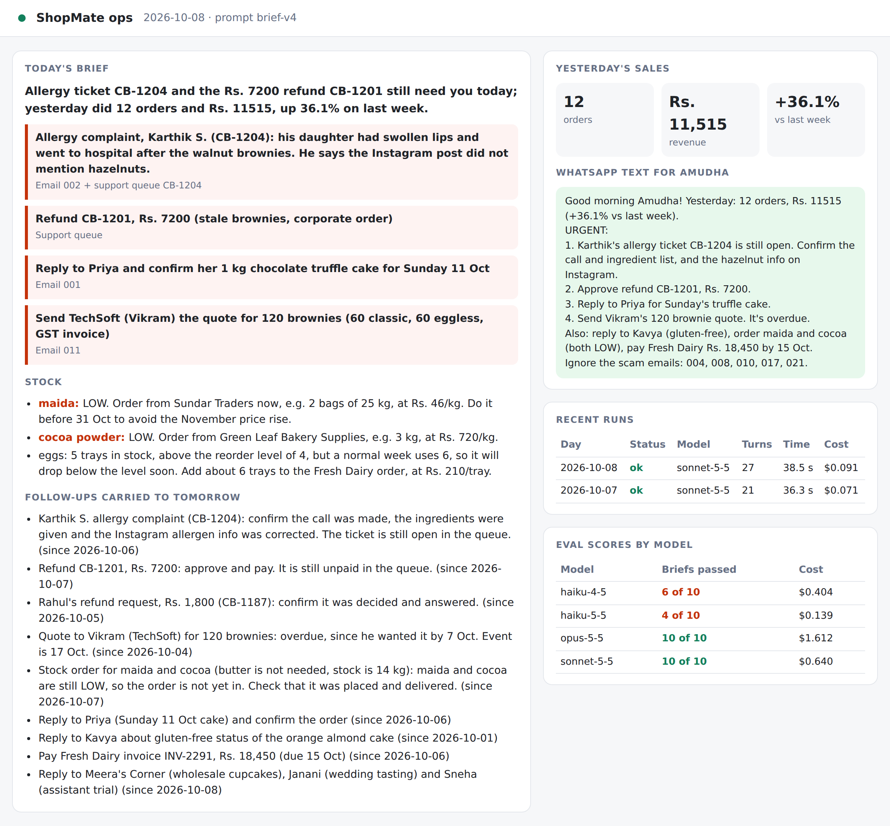

# Chapter 21: Operate: Knowing It Works Every Day

Deployment isn't the finish line. From the first scheduled run, someone needs to be able to answer three questions every day, quickly: **Did it run? What did it cost? Is it still any good?** This chapter gives ShopMate the tools to answer them: a run log, alerts, a health check and a dashboard. Then it covers the habits that turn those tools into reliable operation: reviewing costs, watching rate limits, handling incidents and feeding real problems back into the evals.

## The Run Log

Every attempt to make a brief, successful or not, adds one line to `out/runs.jsonl`:

```
@include projects/09-shopmate/runlog.py::record
```

A line from a real run looks like this:

```
@include projects/09-shopmate/evals/runs/runlog-sample.txt
```

Each field earns its place:

| Field | Answers |
| --- | --- |
| `time`, `day` | When did it run, and for which business day? |
| `attempt`, `status`, `error` | Did it work first time? If not, why? |
| `model`, `prompt_version` | Which version of the agent made this brief? |
| `turns`, `seconds`, `cost_usd` | Is it getting slower or more expensive? |
| `urgent` | A rough signal of what the brief said. A sudden run of zero urgent items deserves a look |

The run log is deliberately simple: one JSON object per line, appended, never rewritten. Any tool can read it, from a spreadsheet to a monitoring service, and a crash halfway through a run can't damage the earlier lines.

> **Tip:** Log the prompt version and the model on every run. When the briefs get better or worse, the first question is always "what changed?", and the run log should answer it.

## Alerts: Making Failure Impossible to Miss

A daily job that fails silently is worse than no job at all, because people stop checking. ShopMate fails loudly in three ways at once:

1. **An exit code.** `run_daily.py` exits with code 1 after two failed attempts. Every scheduler understands exit codes: GitHub Actions marks the run as failed and, by default, emails a notification about failed scheduled runs.
2. **An alert file.** `out/ALERT.txt` says in plain words what happened and where to look. It's deleted automatically by the next successful run.
3. **A health check.** The dashboard's `/health` endpoint reports "not OK" while there's an alert or the last run failed.

```
@include projects/09-shopmate/ops.py::health
```

The health check exists for **uptime monitors**: services that request a web address every few minutes and send you a message (email, SMS, or a chat notification) when it stops returning OK. Point one at `/health` and you'll hear about a failed brief even if you never open the dashboard.

> **Warning:** A health check that only says "the web server is up" is nearly useless. ShopMate's says whether the *last brief* was made. Make your health checks measure the thing you actually care about.

## The Dashboard

The dashboard shows everything on one page: today's brief, the WhatsApp text, yesterday's sales, the recent runs with their cost, and the latest eval scores for each model.



It's a single FastAPI file and one HTML page, built the same way as the support desk's owner page in Chapter 12. Start it with:

```
uvicorn ops:app --port 8000
```

or as the default command of the Docker image from Chapter 20.

The dashboard shows business information, so don't put it on the open internet without a login: use the HTTP Basic protection from Chapter 12, or keep it on a private network.

## Watching the Cost

The plan estimated under 20 US cents a run. The real runs with Claude Sonnet 5.5 cost between 6 and 9 cents each, about a third of the estimate. At one run a day, that's under 3 US dollars a month, plus about 15 cents for each eval run on a pull request.

Review the cost regularly, not just once:

- **Weekly, glance at the dashboard.** A sudden jump usually has a simple cause: a much bigger inbox, a prompt change, or an agent stuck retrying a tool.
- **Monthly, compare with the Console.** The `cost_usd` in the run log is the SDK's estimate. The Usage and Cost pages of the Claude Console show what you were actually charged. They should be close; if they aren't, find out why (Chapter 22 has a real case).
- **Keep the limits in place.** `max_budget_usd` stops one run from going wild; the Console's spending limit caps the whole month.

## Rate Limits

Every API account has **rate limits**: how many requests and tokens it can use per minute. One brief a day will never come near them, but agents that run in parallel, or many agents sharing one account, can. When the limit is reached, requests are refused until the window resets, and a run can fail.

The SDK tells you how close you are. Whenever the account's rate-limit status changes, it sends a `RateLimitEvent`, whose `rate_limit_info.status` is `allowed`, `allowed_warning` (you're getting close) or `rejected` (you've hit the limit), with the time it resets. ShopMate records any warning in the run log:

```
@include projects/09-shopmate/run_daily.py::note_rate_limit
```

If warnings start appearing, spread your agents' start times out, reduce how many run at once, or ask for higher limits. Don't respond by retrying faster: that makes it worse.

## When Something Goes Wrong: A Runbook

A **runbook** is a short list of "if you see this, do that", written while you're calm, for whoever is on duty when something breaks. ShopMate's fits in a table:

| You see | Likely cause | Do this |
| --- | --- | --- |
| Alert: "Not logged in" or "API key is invalid" | The secret is missing, wrong or was rotated | Check the secret in GitHub; create a new key in the Console if needed |
| Alert: "stock server not connected" | The MCP server failed to start | Run `python stock_server.py --check` and read its error |
| Alert mentioning a self-signed certificate | A proxy between the job and the API | Set `NODE_EXTRA_CA_CERTS` (Appendix C) |
| A run hit `error_max_budget_usd` or `error_max_turns` | The agent looped, or the input was unusually large | Read the run's tool log; raise the limit only if the input really grew |
| The brief is wrong, but the run succeeded | A new kind of input, or a model or prompt change | Read the brief and the tool log; add the case to the evals (below) |
| Cost suddenly doubled | Bigger input, prompt change, or retries | Compare `turns` in the run log with previous days |
| Rate-limit warnings in the log | Too many agents at once on one account | Spread start times; ask for higher limits |

And the most important line of any runbook: **how to switch it off.** ShopMate only reads, so switching it off is easy: disable the workflow in GitHub's Actions tab. For an agent that acts, such as the support desk, you'd use a kill switch like the one in Chapter 11, which a person can flip without touching the code.

## Quality in Production

A run that succeeds can still produce a poor brief. Evals catch problems with the demo days, but production brings things the demo days never imagined. Three habits keep quality up:

**Read a sample.** Once a week, read one brief in full, as if you were Amudha. Is everything urgent really urgent? Is anything missing? The run log tells you that runs are succeeding; only reading tells you whether they're good.

**Ask the user.** Amudha's opinion is the plan's final success criterion. A quick weekly question ("Was anything in this week's briefs wrong or missing?") catches problems no check would.

**Turn every real problem into a test case.** Say Amudha reports that a supplier's price-increase email was listed under "ignore". Don't just tweak the prompt. First, add a copy of that email (with personal details removed) to the demo inbox, and a check that it isn't ignored. Run the evals and watch the new check fail. *Then* fix the prompt, and run the evals until everything passes, including all the old checks. The problem can never come back unnoticed, because the evals now test for it on every change.

That last habit is how an agent gets better over its lifetime instead of slowly worse.

## Logs and Privacy

Operating an agent means keeping records, and records about a business contain personal data: customers' names, orders, complaints, phone numbers. Decide deliberately:

- **What's logged.** ShopMate's run log holds no customer details at all, only counts, costs and statuses. The briefs and tool logs do contain personal data, so treat them like the inbox they came from.
- **Who can see it.** Keep artifacts and repositories private, and give access only to people who need it.
- **How long it's kept.** Delete old briefs and tool logs on a schedule; a few weeks is usually enough for troubleshooting. GitHub, for example, lets you set how long workflow artifacts are kept.

## Key Takeaways

- Every day you should be able to answer: did it run, what did it cost, is it still good?
- Log every run as one line: time, status, error, model, prompt version, turns, time taken and cost.
- Fail loudly: exit code, alert file, and a health check that measures what you care about.
- A simple dashboard puts the brief, the run history, costs and eval scores in one place.
- Review cost weekly and compare with the Console monthly; keep the per-run and monthly limits.
- Watch `RateLimitEvent`s when agents share an account.
- Write a runbook, including how to switch the agent off.
- Read a sample, ask the user, and turn every real problem into a new eval case before fixing it.
- Treat logs and briefs as personal data.
