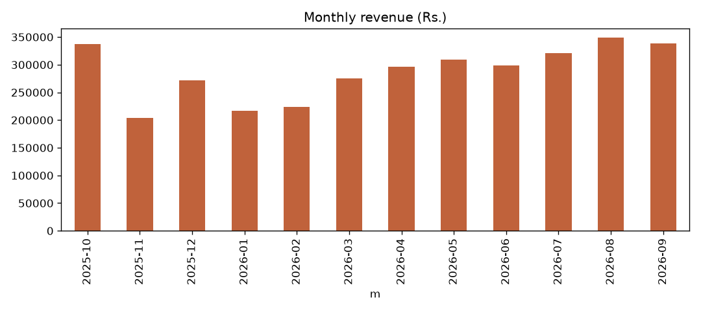
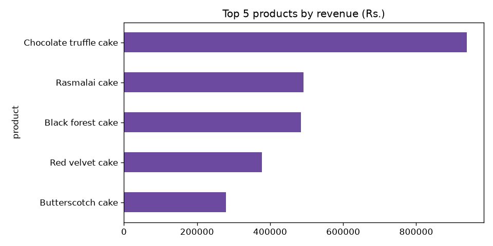
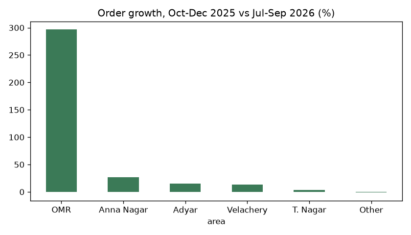

# Amudha's Home Bakes – Year in Review (Oct 2025 – Sep 2026)

Total revenue for the year: **Rs. 34,39,340** (cake/product amounts only, delivery charges not included) from 3,448 orders.

## 1. Monthly revenue

Best month: **August 2026 – Rs. 3,48,410**. October 2025 (Rs. 3,36,755, the festive season) was close behind. The weakest was November 2025 (Rs. 2,04,090). Revenue dipped in Jan–Feb, then climbed steadily from March and stayed above Rs. 2,95,000 every month from April onward.

## 2. Top 5 products by revenue

1. Chocolate truffle cake – Rs. 9,38,000
2. Rasmalai cake – Rs. 4,91,050
3. Black forest cake – Rs. 4,83,825
4. Red velvet cake – Rs. 3,77,150
5. Butterscotch cake – Rs. 2,78,775

Chocolate truffle alone brings in more than a quarter of all revenue.

## 3. Which area grew fastest?

Comparing orders in Oct–Dec 2025 with Jul–Sep 2026, **OMR grew fastest: +296.7%** (30 → 119 orders). Next: Anna Nagar +26.7%, Adyar +15.1%, Velachery +13.2%, T. Nagar +3.3%. "Other" was flat (−1.1%). OMR started from a small base, but it is now a real market.

## 4. Eggless cakes
Eggless share of cake orders rose from **31.3%** (Oct–Dec 2025) to **34.7%** (Jul–Sep 2026).

## 5. Average rating by channel
Walk-in 4.47 · Instagram 4.42 · WhatsApp 4.41 · Website 4.31 (out of 5). All are good; the website is slightly lowest.

## Three suggestions
1. **Push OMR.** It nearly quadrupled in orders. Consider an OMR delivery day or a small promotion there while it is growing.
2. **Prepare for the festive peak and fill the quiet months.** October and December are strong while November and Jan–Feb are weak. Offer hampers or special deals in the slow months.
3. **Grow eggless options and check the website experience.** Eggless demand is rising, so add eggless versions of top sellers like Chocolate truffle. The website has the lowest rating, so check delivery times and ordering steps there.
