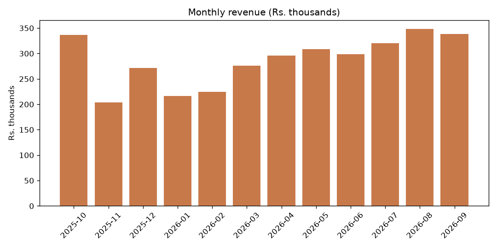
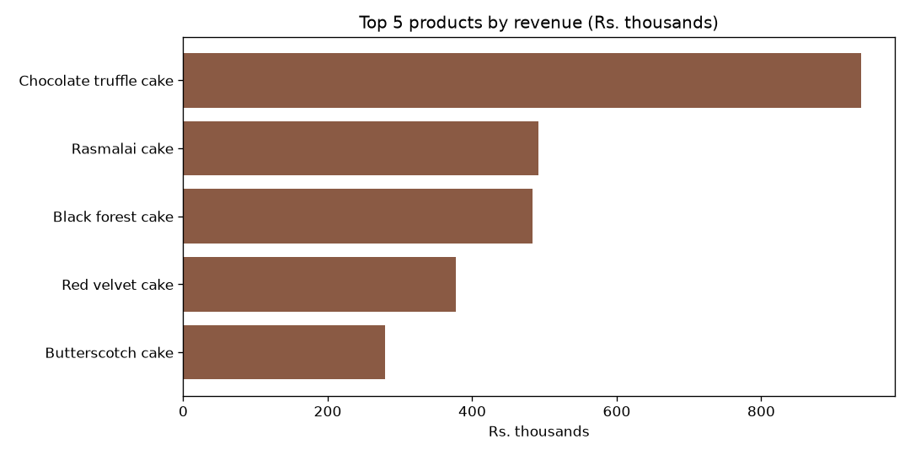
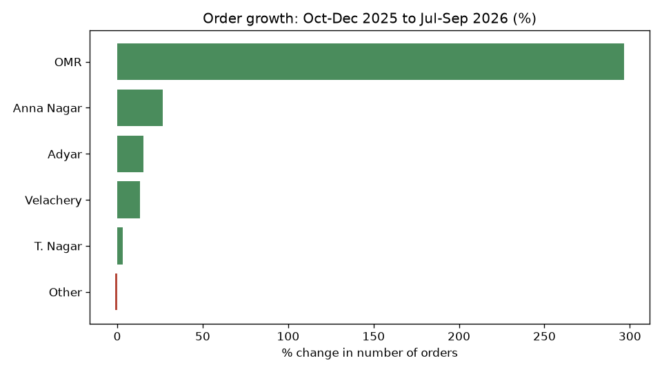

# Amudha's Home Bakes: Year in Review (Oct 2025 – Sep 2026)

Total revenue for the year was **Rs. 34,39,340** (cake, brownie, cupcake and hamper sales; delivery charges not included).

## 1. Monthly revenue

| Month | Revenue |
|---|---|
| Oct 2025 | Rs. 3,36,755 |
| Nov 2025 | Rs. 2,04,090 |
| Dec 2025 | Rs. 2,71,315 |
| Jan 2026 | Rs. 2,16,370 |
| Feb 2026 | Rs. 2,24,270 |
| Mar 2026 | Rs. 2,75,735 |
| Apr 2026 | Rs. 2,96,100 |
| May 2026 | Rs. 3,08,640 |
| Jun 2026 | Rs. 2,98,820 |
| Jul 2026 | Rs. 3,20,535 |
| **Aug 2026** | **Rs. 3,48,410** (best month) |
| Sep 2026 | Rs. 3,38,300 |

October 2025 was strong, November was the weakest month, and sales have climbed steadily since February. August 2026 beat even last October.

## 2. Top 5 products by revenue

1. Chocolate truffle cake: Rs. 9,38,000
2. Rasmalai cake: Rs. 4,91,050
3. Black forest cake: Rs. 4,83,825
4. Red velvet cake: Rs. 3,77,150
5. Butterscotch cake: Rs. 2,78,775

Chocolate truffle brings in almost twice as much as any other product.

## 3. Which area grew fastest?

Comparing the number of orders in Oct–Dec 2025 with Jul–Sep 2026:

| Area | Orders then | Orders now | Change |
|---|---|---|---|
| **OMR** | 30 | 119 | **+296.7%** |
| Anna Nagar | 288 | 365 | +26.7% |
| Adyar | 119 | 137 | +15.1% |
| Velachery | 182 | 206 | +13.2% |
| T. Nagar | 90 | 93 | +3.3% |
| Other | 92 | 91 | -1.1% |

OMR is the clear winner: nearly four times as many orders as before, though it started from a small base. Anna Nagar is still your biggest area overall.

## 4. Eggless cakes

Eggless orders were **31.3%** of cake orders in Oct–Dec 2025 and **34.7%** in Jul–Sep 2026. About one in three cakes is now eggless, and the share is rising.

## 5. Average rating by channel

| Channel | Average rating (out of 5) |
|---|---|
| Walk-in | 4.47 |
| Instagram | 4.42 |
| WhatsApp | 4.41 |
| Website | 4.31 |

Customers are happy everywhere. The differences are small, but the website is the lowest.

## Three suggestions

1. **Invest in OMR.** Orders there have almost quadrupled. Consider OMR-specific delivery slots or a small launch offer, and check whether delivery charges there are putting people off or are set right.
2. **Plan for the Oct–Nov swing and the winter dip.** Sales fell from Rs. 3,36,755 in October to Rs. 2,04,090 in November, and stayed low until February. Run festive hampers or pre-order offers in November and January to smooth this out.
3. **Lean on chocolate truffle and eggless options.** Keep chocolate truffle always available and promote it. Since eggless share is growing, offer eggless versions of your top cakes (Rasmalai, Black Forest, Red Velvet) clearly on Instagram and the website. Also look at why website ratings trail the others, for example by checking delivery time or packaging for web orders.
