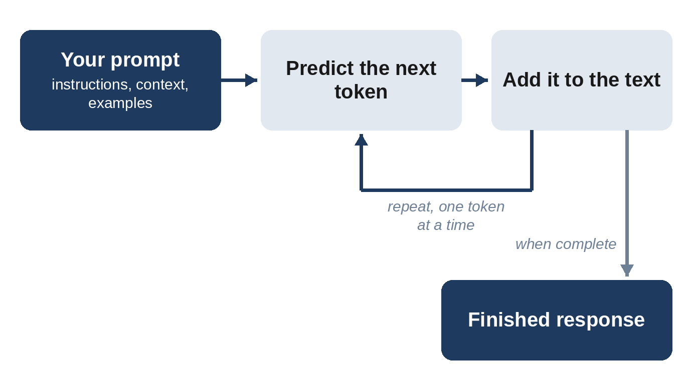
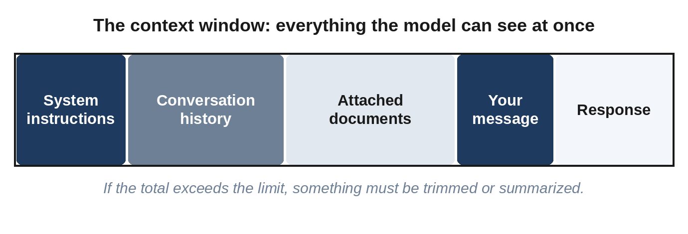

# Chapter 2: How Language Models Read Your Prompt

You can drive a car without knowing how an engine works, but knowing a little about the engine makes you a better driver. In the same way, a basic mental model of how large language models work will explain why some prompts succeed and others fail. This chapter gives you that mental model without any mathematics.

## Next-Word Prediction at Enormous Scale

A **large language model (LLM)** is a program trained on a vast amount of text: books, websites, articles, code, and conversations. During training, it learned to do one thing extremely well: given some text, predict what comes next.

When you send a prompt, the model reads it and predicts the most fitting next piece of text, adds it, then predicts the next piece, and so on, one step at a time, until the response is complete. Everything an AI assistant does, from writing poems to debugging code to planning a trip, emerges from this repeated prediction.

Modern assistants go through additional training after this initial phase. They are taught to follow instructions, hold conversations, refuse harmful requests, and give helpful answers. That is why they respond to "Summarize this article" with a summary rather than with more article. But underneath, the prediction mechanism remains, and it has practical consequences:

- **The model continues the pattern you set.** Formal prompts tend to produce formal answers. Sloppy prompts tend to produce sloppy answers. Examples in your prompt strongly shape the style of the output.
- **The model leans toward the typical.** Without specific guidance, the model often produces a relatively typical or generic answer based on patterns learned during training. Specific details pull it away from the average.
- **The model does not "look things up" by default.** It generates text from patterns learned during training. Unless the tool is connected to search or documents, it may produce plausible but invented facts.

## Tokens: How Models See Text

Models don't read words the way people do. They break text into **tokens**, which are chunks of characters. A common English word is often one token; a long or rare word may be several. As a rough guide, 1,000 tokens is about 750 English words.

Tokens matter for three reasons:

1. **Limits are measured in tokens.** Every model has a maximum amount of text it can process at once.
2. **Costs are measured in tokens.** If you use AI through an API, you pay per token for both input and output.
3. **Tokens explain some odd failures.** Because models see chunks rather than letters, tasks like counting letters in a word, reversing strings, or precise character-level edits can trip them up.

## The Context Window: The Model's Working Memory

The **context window** is the total amount of text a model can consider at once, including your prompt, any documents you attach, the conversation history, and the response it is writing.

 Context windows have grown dramatically, and many current models can handle hundreds of thousands of tokens, equivalent to several long books.

Some key facts about context:

- **The model only knows what is in the context window plus what it learned in training.** It does not remember previous separate chats unless the app has a memory feature that inserts saved information into the context.
- **Long conversations can degrade.** As a chat grows, early instructions become a small part of a large context and may receive less attention. If quality drops in a long session, start a new chat and restate the key instructions.
- **Position can matter.** Models generally handle long contexts well, but very long inputs can still cause details to be missed. Putting the most important instructions clearly at the beginning or end, and asking specific questions about long documents, improves results.

> **Tip:** If the model "forgot" something you said 40 messages ago, it probably didn't forget in a human sense. The instruction is simply buried. Restate it, or start fresh with a summary.

## Training Data and Knowledge Cutoffs

Each model is trained on data up to a certain date, called its **knowledge cutoff**. It knows nothing about events after that date unless the app provides current information, for example through web search. Many assistants now include search, but not all, and not in every mode. When you need current information, either use a search-enabled tool or paste in the relevant facts yourself.

## Temperature and Randomness

When the model predicts the next token, it has a range of possible choices with different probabilities. A setting called **temperature** controls how adventurous it is in choosing:

- **Low temperature** (close to 0) makes the model pick the most likely options. Output is more focused, consistent, and repeatable. Good for facts, extraction, classification, and code.
- **Higher temperature** makes less likely choices more probable. Output is more varied and creative but also less predictable. Good for brainstorming, fiction, and generating alternatives.

In consumer chat apps you usually can't change temperature directly, but you can achieve similar effects with words: "Give me the single most standard answer" versus "Give me ten unusual, surprising ideas." Through APIs, temperature and related settings are directly adjustable. Note that some reasoning-focused models fix these settings or ignore them.

Because of this randomness, the same prompt can produce different outputs each time. That is normal. It also means you should test important prompts several times, not just once.

## Hallucinations: Confident and Wrong

A **hallucination** is when a model states something false as if it were true: an invented statistic, a fake quotation, a nonexistent research paper, a wrong legal citation. Hallucinations happen because the model generates plausible text, and plausible is not the same as true.

You can reduce hallucinations significantly with prompting:

- **Provide the source material** and instruct the model to answer only from it.
- **Give permission to say "I don't know."** For example: "If the answer is not in the document, say so instead of guessing."
- **Ask for quotes or citations** from the provided material so you can check them.
- **Use search-enabled tools** for current or niche facts, and check the linked sources.
- **Ask the model to separate facts from assumptions** in its answer.

But you cannot eliminate hallucinations entirely with prompting. Verification remains your responsibility.

> **Warning:** Never publish, submit, or act on AI-generated facts, numbers, quotes, citations, or legal, medical, or financial advice without checking them against a reliable source.

## Instructions, Roles, and Messages

Most chat-based models organize the conversation into messages with different roles:

- **System message (or system prompt):** Instructions that set the model's overall behavior, persona, and rules. In apps, this is often written by the developer and hidden. Features like custom instructions, ChatGPT plugins, Claude Projects, and Gemini Gems let you write your own persistent instructions that work similarly.
- **User messages:** What you type.
- **Assistant messages:** What the model replies.

The model reads the entire sequence each time it responds. This is why you can refer back to earlier messages, and why persistent instructions shape every answer in a session.

## Reasoning Models

A newer category of models is designed to "think" before answering. These **reasoning models** spend extra computation working through a problem internally, considering approaches, checking their work, and only then producing a final answer. Many assistants offer a reasoning or "thinking" mode, sometimes with an adjustable amount of effort.

Reasoning models are especially strong at mathematics, logic, complex coding, planning, and multi-step analysis. They change prompting somewhat: you generally don't need to tell them to think step by step, and overly detailed instructions about how to reason can even get in the way. Instead, focus on describing the goal, the constraints, and what a good answer looks like. Chapter 5 covers this in detail.

## What This Means for Your Prompts

Everything in this chapter leads to a few practical principles:

1. **Give the model the context it can't know**, such as private facts, recent events, your preferences, and your audience.
2. **Set the pattern you want continued** through tone, structure, and examples.
3. **Be specific to escape the generic average.**
4. **Ground factual answers in provided sources** and allow "I don't know."
5. **Keep long sessions focused**, and restart with a summary when they drift.
6. **Expect variation**, and test important prompts more than once.

## Key Takeaways

- LLMs generate text by repeatedly predicting what comes next, shaped by training to follow instructions.
- Text is processed as tokens; limits and costs are measured in tokens.
- The context window is the model's working memory. It knows only what's in the context plus its training.
- Temperature controls consistency versus creativity.
- Hallucinations are plausible but false statements; grounding and verification reduce the risk.
- Reasoning models think before answering and need clear goals more than step-by-step instructions.
