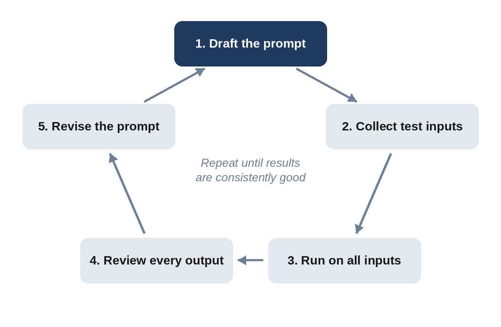

# Chapter 7: Debugging and Improving Prompts

Every prompt engineer writes prompts that fail. What separates experts from beginners isn't avoiding failure; it's diagnosing failures quickly and fixing them systematically. This chapter gives you a troubleshooting method and a catalog of common failure modes with their fixes.

## The Debugging Mindset

When output disappoints, resist the urge to rephrase randomly. Instead, ask: **What exactly is wrong, and what in my prompt allowed it?** Most failures trace back to one of four root causes:

1. **Missing information:** The model didn't have what it needed.
2. **Ambiguous instructions:** The prompt could reasonably be read in more than one way.
3. **Conflicting instructions:** Two requirements pull in opposite directions.
4. **Task overload:** Too many things requested at once.

A useful exercise is to imagine handing your prompt to a smart human contractor who has never met you. Would they know exactly what to do? If they'd need to ask questions, the model is guessing at the answers.

## A Systematic Debugging Process

**Step 1: Name the failure precisely.** "It's bad" is not actionable. "It's 600 words when I need 200," "it invented a statistic," or "it ignored the third requirement" is.

**Step 2: Find the cause in the prompt.** Was the length specified? Was the source material provided? Was the third requirement buried in a long paragraph?

**Step 3: Make one change at a time.** If you change five things and the output improves, you won't know which change mattered. For important prompts, change one thing, test, and note the result.

**Step 4: Test several times.** Because outputs vary, a single good result could be luck. Run the prompt three to five times, ideally on different inputs.

**Step 5: Keep a record.** Save working versions with notes about what changed and why. This becomes invaluable as your prompt library grows.

## Ask the Model to Help

One underused technique is asking the model to diagnose its own failures:

```
I asked you to write a summary under 100 words that focused on
financial risks, but your summary was 250 words and focused on
the company history. Looking at my original prompt, what about
it might have led to that result? Suggest a revised prompt that
would prevent it.
```

```
Example output:
Two things in your original prompt pulled me off course:
1. "Summarize this report" came first and the focus on financial
   risks came only at the end, after the full report, so I
   treated it as secondary.
2. "Keep it short" is vague, so I sized the summary to the long
   report.

Revised prompt:
"Summarize ONLY the financial risks in the report below, in
under 100 words, as 3-5 bullet points. Ignore company history.
<report>...</report>"
```

Models are often surprisingly good at spotting ambiguity in prompts. You can also ask a model to improve a prompt before you use it:

```
Here is a prompt I plan to use. Identify any ambiguities, missing
context, or conflicting instructions, then rewrite it to be
clearer. <prompt>...</prompt>
```

## Common Failure Modes and Fixes

### The output is too generic

**Symptoms:** Bland, could-apply-to-anyone content full of clichés.

**Fixes:** Add specific context about your situation, audience, and goals. Include concrete details, facts, and examples. Ban specific clichés by name. Show an example of the voice you want. Ask for "specific, concrete, surprising" ideas and specify what to avoid.

### The output is too long or too short

**Fixes:** Specify length in structural units, such as sentences, bullets, or paragraphs. Give a range. Show an example of the right length. Remove phrases like "comprehensive" or "detailed" if you want brevity, and "brief" if you want depth.

### The model ignores an instruction

**Fixes:** Move the instruction to a prominent position, at the start or end, or under its own heading. Make it specific and positive. Explain why it matters. Reduce the total number of instructions so important ones aren't diluted. Check whether another instruction conflicts with it.

### The model makes things up

**Fixes:** Provide source material and say "answer only from the provided text." Explicitly allow "I don't know" or "Not stated." Ask for quotes supporting each claim. Use a search-enabled mode for current facts. Lower the creativity: "Be precise; do not speculate."

### The format is inconsistent

**Fixes:** Provide an exact template or schema. Add a complete example of the desired output. Use structured output features in APIs. State what to do for edge cases, such as empty fields or multiple values.

### The tone is wrong

**Fixes:** Describe tone with multiple adjectives plus an analogy: "confident but not arrogant, like a trusted senior colleague." Provide a sample paragraph in the right tone. Specify the audience's relationship to the writer.

### The model refuses a legitimate request

**Fixes:** Add legitimate context explaining the purpose. For example, a security professional asking about vulnerabilities, a nurse asking about medication doses, or a novelist writing a crime scene should state their purpose. Clarify the scope. Rephrase ambiguous wording that might sound harmful out of context. Note that models are designed to decline genuinely harmful requests regardless of framing, and that is appropriate.

### The model is too agreeable

**Symptoms:** It praises your work, agrees with your assumptions, or reverses a correct answer when you push back.

**Fixes:** Ask for critique explicitly: "Identify the three weakest points." Assign a critical role. Ask it to argue the opposite position. When challenging an answer, ask for re-verification instead of asserting it's wrong.

### Quality degrades in a long conversation

**Fixes:** Start a new conversation. Ask the model to summarize the current state, decisions, and requirements, then paste that summary into a fresh chat. Put stable instructions in persistent settings such as custom instructions or project instructions.

### The model copies examples too closely

**Fixes:** Use more varied examples. Explicitly say that the examples demonstrate style or format only. Describe the underlying pattern in words in addition to showing examples.

## The Prompt Improvement Loop

For prompts you'll reuse, follow this loop:




1. **Draft** the prompt using the six-part blueprint.
2. **Collect test inputs** that represent the range of real cases, including tricky ones.
3. **Run** the prompt on all test inputs.
4. **Review** outputs and note every failure.
5. **Revise** the prompt to address the most common or serious failure.
6. **Repeat** until results are consistently good.

This is a lightweight version of the evaluation process that professionals use, which Chapter 21 covers in depth.

> **Try It:** Take a prompt you use regularly. Create five varied test inputs, including at least one unusual case. Run the prompt on all five and write down every problem. Fix the most common problem and rerun. You've just done prompt engineering the way professionals do it.

## Key Takeaways

- Diagnose before rephrasing: name the failure, then find its cause in the prompt.
- Most failures come from missing information, ambiguity, conflicts, or overload.
- Change one thing at a time and test multiple times.
- Use the model to critique and improve your prompts.
- For reusable prompts, iterate against a set of realistic test inputs.
