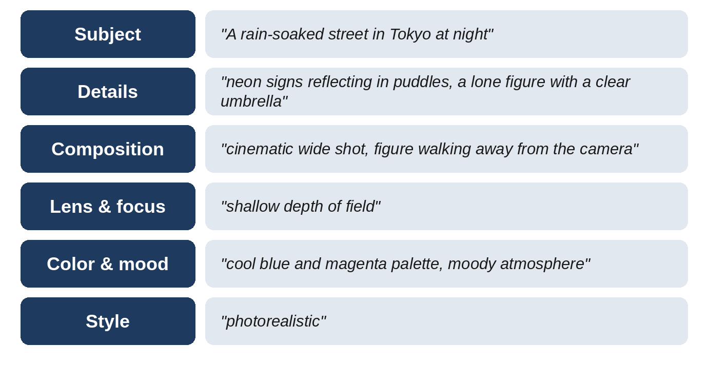
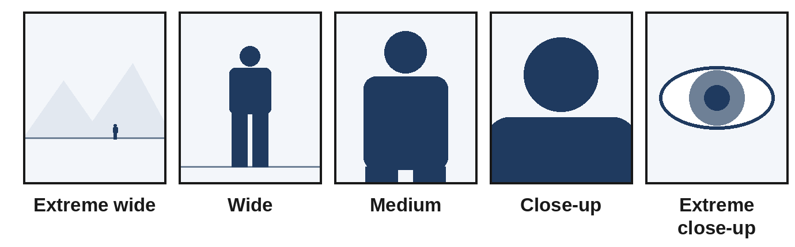

# Chapter 14: Prompt Engineering for Images

Image generators turn words into pictures. Tools such as Midjourney, the image features in ChatGPT and Gemini, Adobe Firefly, Ideogram, Stable Diffusion, and Flux can produce photographs, illustrations, logos, posters, and product shots in seconds. But they also expose bad prompting instantly: a vague prompt gives you a generic picture, and there's no paragraph of text to hide behind. This chapter teaches you to describe images the way photographers, illustrators, and art directors do.

## How Image Prompting Differs from Text Prompting

A chat assistant follows **instructions**. Many image models respond better to **descriptions** of the finished picture. Instead of "Can you make me a picture of a cat?", describe what the image contains: "A ginger cat asleep on a sunlit windowsill, soft morning light, cozy, photorealistic."

Three other differences matter:

- **Every word competes for attention.** Image models have no room for politeness or explanation. Words like "please" and "I would like" add nothing; concrete visual words do all the work.
- **Order matters.** Many image models weight the start of the prompt most heavily. Put the subject and the most important details first.
- **You judge by eye, then iterate.** Expect to generate several versions, pick the closest, and refine by changing one thing at a time.

Newer image models built into chat assistants understand natural conversational language well, including requests to edit an image step by step. Descriptive, specific prompts still produce better results everywhere.

## The Anatomy of an Image Prompt

A strong image prompt usually covers seven elements, roughly in this order:

1. **Subject:** What is the main focus? Be specific about appearance, action, and expression.
2. **Setting:** Where is it? What surrounds the subject?
3. **Style or medium:** Photograph, oil painting, watercolor, 3D render, flat vector illustration, anime, pencil sketch.
4. **Composition:** Close-up, wide shot, aerial view, symmetrical, rule of thirds, low angle.
5. **Lighting:** Golden hour, soft diffused light, dramatic side lighting, neon, overcast.
6. **Color and mood:** Pastel palette, muted earth tones, vibrant, moody, serene.
7. **Details and technical settings:** Textures, materials, camera and lens descriptions for photos, and the aspect ratio.



**Weak:**

```
a city at night
```

**Strong:**

```
A rain-soaked street in Tokyo at night, neon signs reflecting in
puddles, a lone figure with a clear umbrella walking away from the
camera, cinematic wide shot, shallow depth of field, cool blue and
magenta color palette, moody atmosphere, photorealistic.
```

The weak prompt leaves every decision to the model, which produces the most average city at night it can imagine. The strong prompt makes the decisions an art director would: what to show, where to put it, how to light it, and how it should feel.

## The Visual Vocabulary

You don't need to be a photographer, but borrowing a photographer's vocabulary gives you precise control. These terms are understood by nearly every image model.

### Shot Size and Framing



| Term | What it shows | Use it for |
| --- | --- | --- |
| Extreme wide shot | A tiny subject in a vast setting | Scale, loneliness, landscapes |
| Wide shot | The whole subject and surroundings | Establishing a scene |
| Medium shot | The subject from the waist up | People, conversations, products in use |
| Close-up | A face or a single object filling the frame | Emotion, product detail |
| Extreme close-up | One detail: an eye, a texture, a drop of water | Drama, texture, macro |

### Camera Angle

- **Eye level:** Neutral and natural.
- **Low angle:** Looking up at the subject, which makes it look powerful or heroic.
- **High angle:** Looking down, which makes the subject look small or vulnerable.
- **Overhead or flat lay:** Directly above; ideal for food, desks, and product arrangements.
- **Aerial or drone view:** High above a landscape or city.

### Lens and Focus (for Photographic Images)

- **Wide-angle lens (16-35mm):** Expansive scenes, dramatic perspective.
- **Standard lens (50mm):** Natural, human-eye perspective.
- **Portrait or telephoto lens (85-200mm):** Flattering portraits, compressed backgrounds.
- **Macro lens:** Extreme close-up detail.
- **Shallow depth of field:** A sharp subject with a blurred background ("bokeh").
- **Deep focus:** Everything sharp, front to back.

### Lighting

- **Golden hour:** Warm, low sunlight just after sunrise or before sunset.
- **Blue hour:** Cool, soft light just before sunrise or after sunset.
- **Soft diffused light:** Even and flattering, like an overcast day or a softbox.
- **Hard light:** Strong shadows and contrast, like midday sun.
- **Rim or back lighting:** Light outlining the subject from behind.
- **Studio lighting:** Clean and controlled, as in product photography.
- **Neon, candlelight, or moonlight:** Strong color and mood.

### Style and Medium

Name the medium as precisely as you can: "watercolor on textured paper," "flat vector illustration with bold outlines," "35mm film photograph with natural grain," "isometric 3D render," "charcoal sketch," "children's picture-book illustration." Describe a style with its characteristics rather than by naming a living artist; many platforms restrict artist names, and describing the qualities you want gives you more control anyway.

## Iterating: A Worked Example

Professional results come from deliberate refinement. Here is how one product image evolves over four rounds.

**Round 1: the first attempt**

```
a coffee mug
```

Result: a plain white mug on a plain background, centered, flat lighting. Technically correct and completely forgettable.

**Round 2: add setting, light, and purpose**

```
Product photo of a matte black ceramic coffee mug on a light oak
table, morning sunlight from a window on the left, steam rising,
minimal Scandinavian kitchen in the soft-focus background.
```

Result: a much more attractive, realistic image. But the mug is small in the frame, and the handle faces away from the camera.

**Round 3: fix composition**

```
Product photo of a matte black ceramic coffee mug on a light oak
table, close-up, mug filling the right third of the frame, handle
facing the camera, morning sunlight from the left, gentle steam,
minimal Scandinavian kitchen softly blurred behind, empty space on
the left for text. Aspect ratio 4:5.
```

Result: the mug is prominent, the handle is visible, and there is clean space on the left for a headline, which is exactly what an online advertisement needs.

**Round 4: polish with an edit**

```
Keep everything the same, but make the steam more visible and add
a small plate with a croissant at the back left, out of focus.
```

Result: the final image, with the story of a cozy breakfast and room for text.

Notice the pattern: each round fixed one specific problem. Changing one thing at a time tells you what each change does.

## Prompting Specific Tools

### Midjourney

Midjourney is known for its striking aesthetic quality. Key concepts:

- **Concise, evocative descriptions** often work better than long instructions. Focus on what you want to see.
- **Parameters** appended to the prompt control output. Common ones include aspect ratio (`--ar 16:9`), stylization (`--stylize`), variety (`--chaos`), and exclusions (`--no`). Parameters change between versions, so check the current documentation.
- **Image references** let you guide the style, character, or composition using existing images.
- **Iterate with variations, upscaling, and region editing** rather than rewriting from scratch.

```
editorial portrait of an elderly fisherman mending nets on a
wooden dock, weathered hands, overcast morning light, muted blue
and grey tones, 85mm lens, shallow depth of field --ar 4:5
```

### Chat Assistants (ChatGPT, Gemini, and Others)

Image generation inside chat assistants has three big advantages:

- **Natural language understanding:** You can describe complex scenes, layouts, and relationships between objects in ordinary sentences.
- **Text in images:** Newer models render words on posters, labels, and infographics much more accurately than older ones. Put the exact text in quotation marks.
- **Conversational editing:** "Make the sky more dramatic," "change her jacket to red," "remove the car in the background."

```
Create a poster for a community bake sale. Title at the top in a
playful hand-lettered style: "Sweet Saturday Bake Sale". Below it,
an illustration of cupcakes, pies, and cookies on a checkered
tablecloth. At the bottom, the text: "June 14, 10am-2pm, Maple
Street Library". Warm pastel colors, friendly and inviting.
Portrait orientation.
```

### Stable Diffusion and Flux

Stable Diffusion and Flux can run on your own computer or through many online services, offering deep control:

- **Negative prompts:** List what to exclude, such as "blurry, extra fingers, watermark, text."
- **Weighting:** Some interfaces let you emphasize terms with special syntax.
- **Settings:** Steps, guidance scale (how strictly to follow the prompt), seed (for reproducible results), and sampler all affect the result.
- **Extensions:** ControlNet (pose and composition control), LoRAs (small add-on models for a specific style or character), and inpainting (regenerating part of an image).
- **Model-specific prompt styles:** Some models prefer natural sentences, others comma-separated tags. Check the model's documentation or community examples.

## Ready-to-Use Image Prompts

The following prompts cover the most common practical uses. Replace the parts in angle brackets.

**Product photography:**

```
Professional product photo of <product> on <surface>, <lighting>,
clean <color> background, sharp focus on the product, subtle
reflection, commercial catalog style, aspect ratio 1:1.
```

**Social media or blog header:**

```
Wide banner image showing <scene related to topic>, <style>,
<color palette> that matches a <brand mood> brand, generous empty
space on the <left/right> for a headline, aspect ratio 16:9.
```

**Infographic or diagram:**

```
Clean flat infographic titled "<exact title>" showing <number>
steps in a horizontal row: "<step 1>", "<step 2>", "<step 3>".
Simple icons for each step, <2-3 colors>, white background, large
readable sans-serif text.
```

**Children's book illustration:**

```
Gentle children's picture-book illustration in soft watercolor:
<character description> <action> in <setting>. Warm, cozy colors,
rounded friendly shapes, lots of small details to discover.
```

**Consistent character across a series:**

```
Character sheet for <name>: <age>, <hair>, <clothing with exact
colors>, <distinctive feature>. Show front view, side view, and
three facial expressions (happy, surprised, thinking) on a plain
white background, <style>.
```

Then reuse the character sheet as a reference image, and repeat the same exact description in every later prompt.

**Editing an existing image:**

```
Edit this photo: replace the grey sky with a warm sunset, keep the
people, buildings, and lighting direction unchanged, and make sure
the reflections in the windows match the new sky.
```

## Common Image Problems and Fixes

| Problem | Fix |
| --- | --- |
| Image looks generic | Add specific details: materials, lighting, setting, era, mood |
| Wrong number of objects | State the count plainly ("exactly three apples") and simplify the scene |
| Garbled text | Put exact text in quotes, keep it short, use a model known for text rendering |
| Extra fingers or odd hands | Regenerate, hide hands in the pose, or fix with inpainting |
| Subject too small | Specify shot size: "close-up," "fills the frame" |
| Wrong style | Name the medium precisely and describe its characteristics |
| Inconsistent character | Use a character sheet, reference images, and identical descriptions |
| Unwanted elements | Use a negative prompt or "--no", or remove them with an edit |
| Cluttered composition | Ask for "minimal," "plenty of empty space," "simple background" |

## Rights, Safety, and Disclosure

> **Warning:** Respect copyright, trademarks, and people's likenesses. Don't generate images of real people without consent, don't recreate logos or copyrighted characters, and don't present AI images as real photographs where that could mislead. Check each tool's terms for commercial use. If you publish AI images in a book, for example on Amazon KDP, disclose them as AI-generated when asked.

## A Visual Prompt Worksheet

Before writing an image prompt, answer these:

- What is the subject, and what is it doing?
- Where is it, and when (time of day, era, season)?
- What style or medium?
- What shot size and camera angle?
- What lighting and color palette?
- What mood should the viewer feel?
- What must be excluded?
- What aspect ratio does the final use need?

> **Try It:** Choose a simple subject, such as "a cup of coffee." Write five prompts that change only one element each time: style, lighting, shot size, mood, and setting. Compare the results to learn how each element shapes the image.

## Key Takeaways

- Image prompts describe the finished picture: subject, setting, style, composition, lighting, mood, and technical details.
- Put the most important elements first, and drop words that don't describe something visible.
- Borrow the vocabulary of photography and illustration: shot sizes, angles, lenses, lighting, and media.
- Iterate deliberately, changing one thing at a time, and use edits to polish.
- Use quotation marks for text, character sheets for consistency, and negative prompts or edits for unwanted elements.
- Respect rights and likenesses, and disclose AI images where required.
