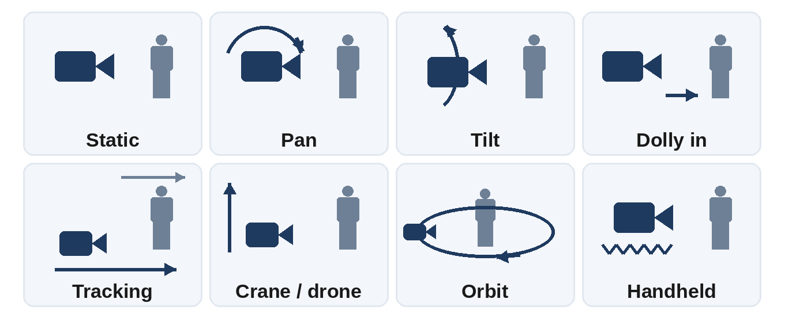
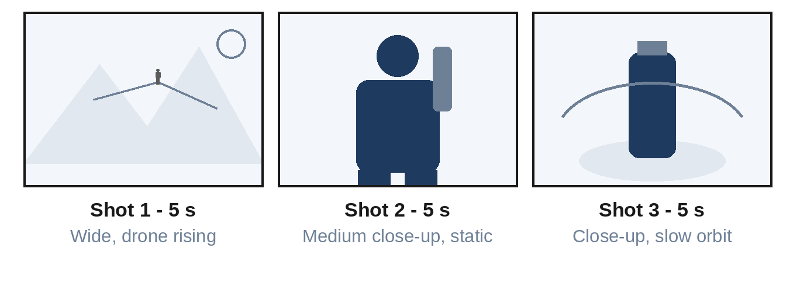

# Chapter 15: Prompt Engineering for Video and Audio

AI video generators such as OpenAI's Sora, Google's Veo, Runway, Kling, Luma, and Pika turn text or images into moving footage, and some now generate synchronized sound and dialogue too. Audio tools such as Suno, Udio, and ElevenLabs create music and lifelike voices. These tools reward a different kind of prompting: you are no longer describing a single frame but directing a short scene. This chapter teaches you to think like a film director.

## From Picture to Scene

Everything from Chapter 14 still applies: subject, setting, style, lighting, and mood. Video adds three new dimensions:

- **Action:** What happens during the clip?
- **Camera:** How does the viewpoint move?
- **Time:** How long is the clip, how fast does it move, and what changes from start to finish?

Where the tool supports sound, there is a fourth:

- **Audio:** Dialogue, sound effects, ambient noise, and music.

## The Video Prompt Formula

A reliable structure for video prompts is:

1. **Shot type and camera:** "Slow dolly-in, medium close-up."
2. **Subject:** Who or what, described precisely.
3. **Action:** One clear main action, described with strong verbs.
4. **Setting and time:** Where and when.
5. **Style and lighting:** Cinematic, documentary, animated, and so on.
6. **Pacing:** Slow motion, real time, or time-lapse.
7. **Audio:** Dialogue in quotation marks, sound effects, and music.

**Weak:**

```
a chef cooking
```

**Strong:**

```
Medium close-up, slow dolly-in. A young chef in a white jacket
flips vegetables in a flaming wok; flames briefly light up her
focused face. Busy restaurant kitchen at night, warm orange light,
steam in the air. Cinematic, shallow depth of field, real-time
speed. Audio: sizzling oil, clattering pans, distant kitchen
chatter.
```

The weak prompt gives the model nothing to direct. The strong one specifies the shot, the action, the light, the speed, and the sound, which is everything a camera crew would need.

## Camera Movement Vocabulary

Of everything you can add to a video prompt, camera direction does the most to make a clip feel deliberately filmed. Use these standard terms:

| Movement | What the camera does | Effect |
| --- | --- | --- |
| Static | Stays still | Calm, observational |
| Pan | Turns left or right from a fixed spot | Reveals a scene |
| Tilt | Turns up or down from a fixed spot | Reveals height |
| Dolly in / out | Moves toward or away from the subject | Builds intensity or reveals context |
| Tracking | Moves alongside a moving subject | Energy, following action |
| Crane or drone | Rises, descends, or flies over | Scale, establishing shots |
| Orbit | Circles around the subject | Showcases a product or hero moment |
| Handheld | Slight natural shake | Realism, documentary feel |



Use one main camera movement per clip. "Pan left while zooming in and then orbiting" usually produces chaos.

## Plan with a Shot List

AI video tools produce short clips, typically a few seconds to around a minute depending on the tool. Longer videos are built by planning a sequence of shots, generating each one, and editing them together. Plan first:



You can ask a chat assistant to create the shot list for you:

```
I'm making a 15-second vertical video ad for a reusable water
bottle aimed at hikers. Create a shot list of 3 shots. For each
shot give: duration, shot type, camera movement, action, setting,
and a ready-to-use video generation prompt.
```

```
Example output:
Shot 1 (5 s) - Wide, drone rising
Prompt: Aerial drone shot rising over a misty mountain trail at
sunrise, a lone hiker in a red jacket walking along the ridge,
golden light breaking through clouds, cinematic, 9:16.

Shot 2 (5 s) - Medium close-up, static
Prompt: The hiker stops, pulls a matte green steel water bottle
from a backpack side pocket and drinks, mountains softly blurred
behind, morning light, natural colors, 9:16.

Shot 3 (5 s) - Close-up, slow orbit
Prompt: Slow orbit around the green water bottle standing on a
mossy rock, droplets on its surface, sunrise backlight, shallow
depth of field, empty space at the top for text, 9:16.
```

Each prompt can now go into a video tool separately, and the clips can be joined in any video editor with a logo and text added at the end.

## Keeping Shots Consistent

The biggest challenge in multi-shot AI video is consistency: the same character, the same product, and the same look across clips. Techniques that help:

- **Repeat the exact same description** of each character and product in every prompt: "a hiker in a red jacket and grey beanie," never "the hiker" alone.
- **Start from images (image-to-video).** Generate or photograph a key frame first, then animate it. This gives you precise control over the look.
- **Use reference features** that many tools offer for characters, products, or styles.
- **Fix the style words** ("cinematic, natural colors, soft morning light") and reuse them in every shot.
- **Keep the same aspect ratio** across all shots.

## Image-to-Video Prompting

In image-to-video, your starting image has already settled the subject, the setting, and the style. So the prompt should cover only what changes over time, the **motion**:

```
The woman slowly turns her head toward the window and smiles;
her hair moves gently in the breeze; curtains sway; the camera
pushes in slightly. Keep her face and clothing unchanged.
```

Describing the whole scene again can make the model change details you wanted to keep.

## Prompting Dialogue and Sound

Some video models generate synchronized audio, including speech. To control it:

- **Put spoken lines in quotation marks** and say who speaks: `The barista smiles and says, "Your usual, oat latte?"`
- **Describe the voice:** "a calm, deep voice," "an excited child's voice."
- **List sound effects and ambience:** "rain on the window, a distant train horn."
- **Specify music or its absence:** "soft piano in the background" or "no music."
- **Keep dialogue short:** one or two lines per clip sync far better than a paragraph.

## Common Video Problems and Fixes

| Problem | Fix |
| --- | --- |
| Objects morph or melt | Simplify the action; use one main motion; shorten the clip |
| Extra limbs or distorted hands | Choose poses where hands are less visible; regenerate |
| Character changes between shots | Repeat the exact description; use image-to-video and references |
| Motion is too fast or chaotic | Ask for "slow, smooth motion," a single camera move, slow motion |
| Physics look wrong | Describe the motion precisely, e.g. "liquid pours in a steady stream" |
| On-screen text is garbled | Add text later in a video editor instead of generating it |
| Camera ignores instructions | Put the camera direction first, using standard terms |
| Lip sync is off | Shorten the dialogue; use a close-up; regenerate |

## Prompting Music

Music generators such as Suno and Udio create full songs from a description. Describe:

- **Genre and subgenre:** "1970s funk," "lo-fi hip hop," "Carnatic fusion."
- **Mood and energy:** "upbeat and triumphant," "melancholic and slow."
- **Tempo:** "slow, around 70 BPM" or "fast and driving."
- **Instruments:** "acoustic guitar, upright bass, brushed drums."
- **Vocals:** "warm female vocals," "instrumental only," "male choir."
- **Structure and lyrics:** Write your own lyrics with section labels for best results.

```
Style: uplifting acoustic pop, 100 BPM, acoustic guitar,
hand claps, light percussion, warm male vocals, singalong chorus.

[Verse]
Early light on the kitchen floor,
Little footsteps by the door...

[Chorus]
This is home, this is where we grow...
```

## Prompting Voice

Voice tools such as ElevenLabs turn text into natural speech, and some can design new voices from a description. Tips:

- **Describe the voice:** "a warm, friendly narrator in her thirties with a light Indian English accent, calm pace."
- **Use punctuation to shape delivery.** Commas and full stops create pauses; question marks lift the end of a sentence.
- **Spell out tricky words** phonetically, and write numbers the way they should be spoken ("twenty twenty-six").
- **Generate a short sample first,** check the pronunciation and pace, then produce the full script.

## Rights, Consent, and Disclosure

> **Warning:** Never clone a real person's voice or generate video of a real person without their clear consent. Don't create content that could be mistaken for real news or real events. Label AI-generated video and audio where platforms require it or viewers could be misled, and check each tool's terms for commercial use.

## Key Takeaways

- Video prompts direct a scene: shot type, camera movement, subject, action, setting, style, pacing, and audio.
- Use standard camera terms and one main movement per clip.
- Plan longer videos as a shot list, generate each shot, and edit them together.
- Keep characters and products consistent with identical descriptions, image-to-video, and references.
- For image-to-video, describe only the motion.
- Put dialogue in quotation marks and keep it short; add on-screen text in editing.
- For music, describe genre, mood, tempo, instruments, and vocals, and write your own lyrics; for voice, describe the speaker and use punctuation to shape delivery.
- Get consent for real people's likeness or voice, and disclose AI media where required.
