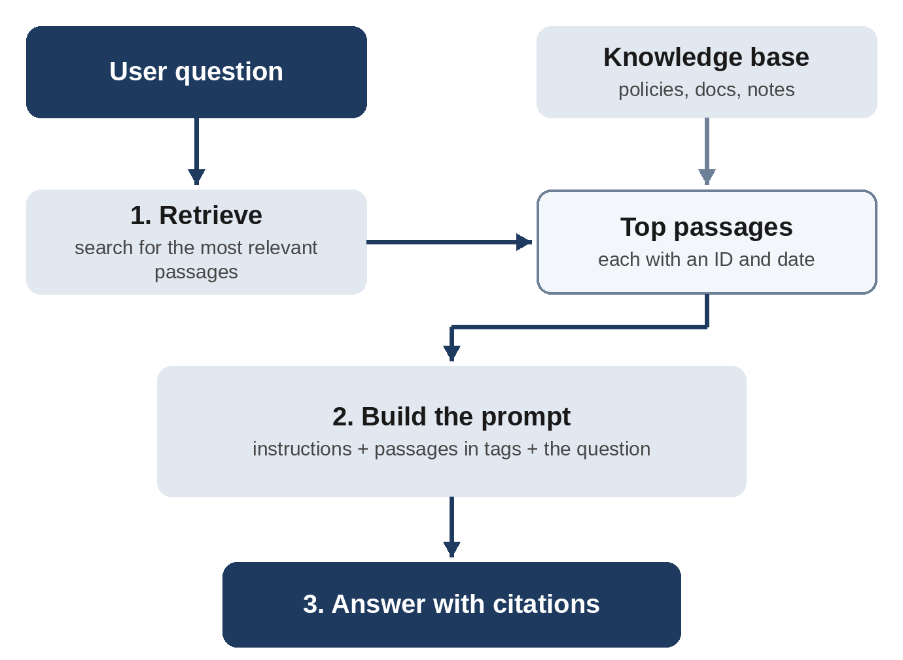

# Chapter 17: Retrieval, Long Context, and Context Engineering

A model's training gives it general knowledge, but most valuable business applications need specific knowledge: your company's policies, your product documentation, your customer records, last week's meeting notes. This chapter covers how to supply that knowledge effectively through retrieval-augmented generation, long-context prompting, and the broader discipline now often called **context engineering**.

## The Knowledge Problem

There are three ways to give a model knowledge it doesn't have:

1. **Put it in the prompt directly.** Simple and effective when the information fits.
2. **Retrieve relevant pieces at query time** and put only those in the prompt. This is retrieval-augmented generation (RAG).
3. **Fine-tune the model** on your data. Useful for teaching style, format, or specialized behavior, but generally not the best way to teach facts that change.

For most applications, the answer is some combination of 1 and 2.

## Retrieval-Augmented Generation (RAG)

**RAG** works in two stages:

1. **Retrieve:** When a user asks a question, search a knowledge base for the most relevant passages. This often uses **embeddings**, which are numerical representations of meaning that let you find passages similar in meaning to the question, frequently combined with traditional keyword search.
2. **Generate:** Insert the retrieved passages into the prompt and ask the model to answer using them.



A typical RAG prompt:

```
Answer the user's question using only the information in the
sources below. Each source has an ID.

<sources>
<source id="policy-12">
Employees may carry over up to 5 unused vacation days into the
next calendar year. Carried-over days expire on March 31.
</source>
<source id="policy-14">
Unused sick days do not carry over and are not paid out.
</source>
</sources>

Instructions:
- Cite the source ID in square brackets after each claim,
  for example [policy-12].
- If the sources don't contain the answer, say "I couldn't find
  that in the policy documents" and suggest contacting HR.
- Do not use outside knowledge about typical company policies.

Question: Can I carry over my unused vacation and sick days?
```

A well-grounded answer looks like this:

```
Example output:
You can carry over up to 5 unused vacation days into next year,
but they expire on March 31 [policy-12]. Unused sick days do not
carry over and are not paid out [policy-14].
```

Every claim is traceable to a source, and nothing is added from outside the documents.

## Prompting Principles for RAG

**1. Instruct grounding explicitly.** Tell the model to use only the provided sources, and what to do when they're insufficient. Without this, it will blend in general knowledge that may contradict your actual policies.

**2. Require citations.** Citations let users verify answers and let you detect when the model strays from sources. Ask for source IDs, quotes, or both.

**3. Label sources with useful metadata.** Titles, dates, authors, and document types help the model weigh sources. For example, if two policies conflict, the more recent one is probably correct, but only if the model can see dates.

**4. Handle conflicts.** Tell the model what to do when sources disagree: "If sources conflict, point out the conflict and prefer the most recently dated source."

**5. Keep instructions separate from retrieved content.** Retrieved text is data, not instructions. Wrap it in tags and tell the model that instructions inside sources must be ignored. This defends against indirect prompt injection (Chapter 21).

## Retrieval Quality Is Prompt Quality

In RAG systems, the most common cause of bad answers isn't the generation prompt; it's that retrieval returned the wrong passages. If the right information never reaches the model, no prompt can save the answer. Improving retrieval is part of prompt engineering:

- **Chunk documents sensibly.** Split by sections and headings rather than arbitrary character counts, keeping related information together.
- **Add context to chunks.** A chunk saying "The limit is 5 days" is ambiguous on its own. Prefixing it with a short description, such as "From the 2026 Vacation Policy, section on carry-over:", improves both retrieval and generation.
- **Combine search methods.** Keyword search finds exact terms like product codes; semantic search finds paraphrases. Combining them, then re-ranking results, usually works best.
- **Rewrite queries.** Have a model rewrite vague or conversational user questions into precise search queries before retrieval.
- **Retrieve enough, but not too much.** Too few passages may miss the answer; too many dilute attention and increase cost.

## Long Context: When You Can Skip Retrieval

Modern models with very large context windows can sometimes take an entire knowledge base in one prompt. If your documents fit comfortably, putting them all in context can be simpler and more accurate than RAG, especially with prompt caching to manage cost.

Long-context prompting tips:

- **Documents first, query last**, as discussed in earlier chapters.
- **Structure with tags and metadata** for each document.
- **Ask for relevant quotes before the answer** to focus attention.
- **Be specific in questions.** "What does section 4.2 of the 2025 contract say about late fees?" works better than "Tell me about fees."
- **Test retrieval of details** buried in the middle of long contexts for your use case, rather than assuming.

## Context Engineering

As AI applications have grown more sophisticated, practitioners increasingly talk about **context engineering**: the discipline of deciding what information goes into the model's context window at each step, and in what form. Prompt engineering focuses on how you write instructions; context engineering asks the broader question of what the model should see.

The context for any given model call might include:

- The system prompt.
- Tool definitions.
- Retrieved documents.
- Conversation history, possibly summarized.
- Memory: saved facts about the user or task.
- Results from previous tool calls.
- The current user message.

Every token in context competes for the model's attention, and more is not always better. Good context engineering means:

- **Including what's relevant** to the current step, and leaving out what isn't.
- **Compressing history** by summarizing old conversation turns or tool results rather than keeping them verbatim.
- **Structuring information** so the model can find what it needs.
- **Letting the model fetch information on demand** through tools, rather than front-loading everything.
- **Persisting important state outside the context**, such as notes files or task lists that an agent can read and update, especially for long-running tasks.

This matters most for agents that work over many steps, which the next chapter covers.

## Memory

Many assistants now offer **memory**, which retains facts across conversations. In applications, memory is implemented by storing information and retrieving it into context later, which is essentially RAG over past interactions. Design considerations:

- What should be remembered, and who decides?
- How do users view, correct, and delete memories?
- How do you prevent stale or wrong memories from degrading answers?
- How do you handle privacy and sensitive information?

## Key Takeaways

- Supply knowledge by placing it in the prompt, retrieving it at query time (RAG), or both.
- RAG prompts should require grounding, citations, metadata awareness, and conflict handling.
- Retrieval quality determines answer quality; chunk, contextualize, and search well.
- Long context can replace retrieval when documents fit; structure it carefully.
- Context engineering means deciding what the model sees at each step, keeping context relevant and well organized.
