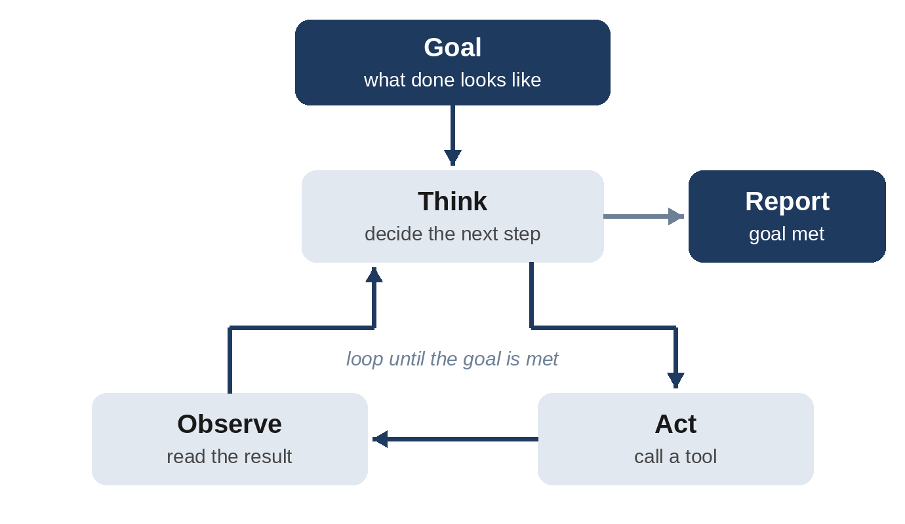

# Chapter 19: Agents and Tool Use

An **AI agent** is a system in which a model doesn't just answer once but works toward a goal over multiple steps: deciding what to do, using tools such as web search, code execution, databases, or APIs, observing the results, and continuing until the task is complete. Agents power coding assistants, research tools, customer service systems, and workflow automation. This chapter explains how to prompt and design them.

## From Chat to Agents

A chat assistant follows a simple loop: user asks, model answers. An agent follows a longer loop:

1. **Receive a goal.**
2. **Think:** decide what to do next.
3. **Act:** call a tool.
4. **Observe:** read the tool's result.
5. **Repeat** steps 2-4 until the goal is met.
6. **Report** the outcome.



This **think-act-observe** loop is sometimes called **ReAct** (Reasoning and Acting), after an influential research approach. Modern models are trained specifically to work in this loop, deciding when and how to call tools.

## Tool Use (Function Calling)

**Tool use**, also called **function calling**, lets a model request that your application run a function. You describe each tool with a name, a description, and a schema for its inputs. When the model decides a tool is needed, it outputs a structured request, your code executes it, and you return the result to the model.

A tool definition looks something like this, expressed in JSON:

```
{
  "name": "get_weather",
  "description": "Current weather for a city. Not for forecasts.",
  "input_schema": {
    "type": "object",
    "properties": {
      "city": {
        "type": "string",
        "description": "City name, e.g. 'Paris'"
      },
      "units": {
        "type": "string",
        "enum": ["celsius", "fahrenheit"]
      }
    },
    "required": ["city"]
  }
}
```

## What a Tool Call Looks Like

When the user asks "Do I need an umbrella in Paris today?", the model doesn't guess. It replies with a structured tool request instead of text:

```
{
  "type": "tool_use",
  "id": "toolu_01A",
  "name": "get_weather",
  "input": {"city": "Paris"}
}
```

Your code runs the real function and sends the result back, labeled with the same ID:

```
{
  "type": "tool_result",
  "tool_use_id": "toolu_01A",
  "content": "Paris: 18 C, light rain, wind 20 km/h"
}
```

The model then writes its final answer using that result:

```
Example output:
Yes, take an umbrella. It's 18 C in Paris with light rain and a
20 km/h wind, so a compact umbrella that handles wind is a good
choice.
```

The model never runs anything itself. It only asks; your application decides whether and how to carry out each request. That is what makes tool use safe to control.

## Tool Use in Code: A Complete Example

Here is the whole exchange as a short Python program using Anthropic's official SDK (installed with `pip install anthropic`). Other providers' SDKs follow the same pattern: define tools, send the message, run any requested tools, send the results back, and repeat until the model gives its final answer.

```
import anthropic

client = anthropic.Anthropic()  # reads ANTHROPIC_API_KEY

tools = [{
    "name": "get_weather",
    "description": "Get today's weather for a city. Use this when "
                   "the user asks about current conditions.",
    "input_schema": {
        "type": "object",
        "properties": {
            "city": {"type": "string",
                     "description": "City name, e.g. 'Paris'"},
        },
        "required": ["city"],
    },
}]


def get_weather(city):
    # A real app would call a weather service here.
    return f"{city}: 18 C, light rain, wind 20 km/h"


messages = [{"role": "user",
             "content": "Do I need an umbrella in Paris today?"}]

while True:
    response = client.messages.create(
        model="claude-opus-5-5",  # check docs for current models
        max_tokens=16000,
        tools=tools,
        messages=messages,
    )
    if response.stop_reason != "tool_use":
        break
    messages.append({"role": "assistant",
                     "content": response.content})
    results = []
    for block in response.content:
        if block.type == "tool_use":
            results.append({
                "type": "tool_result",
                "tool_use_id": block.id,
                "content": get_weather(**block.input),
            })
    messages.append({"role": "user", "content": results})

for block in response.content:
    if block.type == "text":
        print(block.text)
```

The `while` loop matters. A model may call several tools in sequence, for example looking up the weather in two cities before comparing them, so the program keeps sending results back until the model stops asking for tools.

## Writing Great Tool Descriptions

Tool descriptions are prompts. The model decides which tool to use, when, and with what inputs based almost entirely on them. Good descriptions:

- **Explain what the tool does and when to use it**, and when not to.
- **Describe each parameter**, with formats and examples.
- **State limitations**, such as "returns at most 20 results" or "data is updated daily."
- **Describe the output**, so the model knows what to expect.
- **Distinguish similar tools clearly.** If you have `search_orders` and `get_order`, explain exactly when to use each.

Poor tool descriptions are one of the most common causes of agent failures. When an agent misuses a tool, improve the description first.

> **Tip:** Design tools to be easy for a model to use correctly. Fewer, well-designed tools with clear purposes outperform dozens of overlapping ones. Return helpful error messages, such as "Date must be in YYYY-MM-DD format," so the agent can correct itself.

## The Model Context Protocol (MCP)

The **Model Context Protocol (MCP)** is an open standard, introduced by Anthropic and now widely adopted across the industry, for connecting AI applications to tools and data sources. Instead of building custom integrations for each tool and each AI app, developers create MCP servers that any MCP-compatible application can use. As a prompt engineer, the same principles apply: the tool names and descriptions an MCP server exposes are effectively prompts, and their quality determines how well agents use them. MCP is now so central to practical AI work that the next chapter is devoted to it, with step-by-step setups for browsers, files, and other everyday tools.

## Prompting Agents

An agent's system prompt needs everything a regular system prompt does, plus guidance about autonomous work.

### Define the Goal and Success Criteria

Agents need to know when they're done. Vague goals lead to agents that stop too early or never stop.

```
Your task is to find and fix the cause of the failing checkout
tests. You're done when all tests in tests/checkout pass and you
have not modified any test files. Summarize the root cause and
your fix when finished.
```

### Specify Autonomy and Permissions

Be explicit about what the agent may do on its own and what requires confirmation:

```
You may read any file and run tests freely.
Ask for confirmation before: deleting files, installing new
dependencies, modifying database schemas, or sending any email
or message to a customer.
```

### Guide Planning and Persistence

```
For complex tasks, start by making a short plan. Work through it
step by step, updating the plan as you learn more. If an approach
fails twice, step back and consider a different approach instead
of repeating the same action.
```

### Encourage Verification

```
After making changes, verify them: run relevant tests, check the
output, and confirm the result matches the goal. Don't report
success until you have evidence.
```

### Ask for Honest Reporting

Agents can be tempted to report success optimistically. Counter this explicitly:

```
In your final report, state clearly what you completed, what you
verified and how, and anything you couldn't finish or are unsure
about. Never claim something works unless you tested it.
```

## A Worked Example: Watching an Agent Work

Here is an abridged trace of a coding agent given the task above, finding and fixing the failing checkout tests. It shows the think-act-observe loop in action.

```
Think:   First, see which tests fail and why.
Act:     run_command("npm test -- tests/checkout")
Observe: 2 failed. "Expected total 107.00, received 107.0000001"

Think:   Looks like a floating-point rounding issue. Find where
         the total is calculated.
Act:     search_code("calculateTotal") in src/checkout
Observe: total.ts, line 18: return subtotal * (1 + tax)

Think:   Money should be rounded to cents. Fix there, not in tests.
Act:     edit_file("src/checkout/total.ts", round the result to
         2 decimal places)
Act:     run_command("npm test -- tests/checkout")
Observe: All 14 tests passed.

Report:  Root cause: the order total wasn't rounded, so tax
         calculations produced values like 107.0000001. Fixed by
         rounding to 2 decimal places in total.ts. All checkout
         tests now pass; no test files were changed.
```

Notice that the agent verified its fix by rerunning the tests, respected the rule not to modify test files, and reported the root cause honestly. Those behaviors came directly from the prompt.

## More Tool-Use Examples

The pattern is always the same, but the possibilities are wide. Here are four common situations, with the kind of exchange you'll see.

### Several Tools in One Request

Given `get_calendar` and `get_weather` tools, a planning request triggers both:

```
User: Find a free 2-hour slot this weekend for a picnic in
Chennai, when it won't rain.

Tool calls (made in parallel):
  get_calendar(start="Sat 08:00", end="Sun 20:00")
  get_weather(city="Chennai", days=2)

Tool results:
  Calendar: busy Sat 09:00-14:00 and Sun 09:00-11:00
  Weather: Sat rain after 15:00; Sun clear all day

Example output:
Sunday from 11:30 to 13:30 works best. You're free after your
morning commitment ends at 11:00, and Sunday is forecast to stay
clear all day. Saturday doesn't work: your only free time is one
hour before 9:00 and one hour before the rain starts at 3 pm.
```

The model combined two sources and explained its reasoning, which is exactly what you want to verify.

### Recovering from a Tool Error

Good tools return helpful errors, and good models use them:

```
Tool call:   book_meeting_room(date="05/11", room="Lotus")
Tool result: ERROR: date must be in YYYY-MM-DD format.
Tool call:   book_meeting_room(date="2026-11-05", room="Lotus")
Tool result: Booked Lotus, 2026-11-05, 10:00-11:00. Ref B-7781.

Example output:
Done. The Lotus room is booked for 5 November 2026, 10:00 to
11:00 (reference B-7781).
```

A vague error such as "Invalid input" would have left the model guessing. The specific message let it fix the call on its own.

### A Write Action That Needs Approval

For tools that change things, design the flow so the model proposes and a person confirms:

```
User: Email the client that the delivery moves to Friday.

Example output:
Here's the email I'd send. Shall I send it?

To: priya.nair@example.com
Subject: Updated delivery date
Hi Priya, a quick update: your delivery will now arrive on
Friday rather than Thursday. Sorry for the change, and let me
know if Friday doesn't work for you.

[Send] [Edit] [Cancel]
```

The `send_email` tool runs only after the person clicks Send. This is the human-confirmation safeguard from Chapter 23, built into the product.

### Built-in Tools in Chat Apps

You also use tool calling every time an assistant searches the web or analyzes a file. When you upload a spreadsheet and ask a question, the assistant writes and runs code behind the scenes:

```
User: Here are our 2026 monthly sales (sales.csv). Which month
grew the most compared with the month before?

Code the assistant ran:
  df = pandas.read_csv("sales.csv")
  df["growth"] = df["revenue"].pct_change()
  df.loc[df["growth"].idxmax(), ["month", "growth"]]

Example output:
April grew the most: revenue rose 23% over March, from $41,200
to $50,700. The next-best month was September at +11%.
```

Because a real calculation produced the number, it is far more reliable than arithmetic done in the model's head. Most assistants let you expand the tool step to see the code; check it when the numbers matter.

## Multi-Agent Systems

Complex workflows sometimes use multiple agents working together:

- **Orchestrator and workers:** A lead agent breaks a task into subtasks and delegates each to specialized sub-agents, then combines the results. This works well for research across many sources or parallel investigation.
- **Pipelines:** Agents hand work along a sequence, such as researcher to writer to editor.
- **Generator and critic:** One agent produces work while another reviews it against criteria.

When one agent delegates to another, the delegation message is a prompt, and it needs full context. Sub-agents don't know what the orchestrator knows. A common failure is vague delegation such as "research the competitors," which leads to duplicated or misdirected work. Good delegation specifies the objective, the scope, the expected output format, and what other agents are covering.

Multi-agent systems are powerful but add cost and complexity. Start with a single agent and add more only when the task clearly benefits. Chapter 21 shows step by step how to design custom agents and choose among these architectures.

## Long-Running Agents

For tasks that take many steps or span multiple sessions, the context window becomes a constraint. Techniques include:

- **External memory:** The agent keeps notes, progress logs, or task lists in files that it reads and updates.
- **Context summarization:** Older steps are summarized to free up space.
- **Checkpoints:** Work is committed or saved regularly so progress isn't lost.
- **Structured state:** Progress tracked in a structured file, such as a JSON list of tests passing and failing, rather than only in conversation.

## Agent Safety

Agents act in the world, so mistakes have consequences. Build in safeguards:

- **Least privilege:** Give agents only the permissions they need.
- **Human approval** for irreversible or high-impact actions, such as payments, deletions, and external communications.
- **Sandboxing:** Run code and browsing in isolated environments.
- **Logging:** Record every action for review.
- **Injection awareness:** Content the agent reads, such as web pages, emails, and documents, may contain malicious instructions. Chapter 23 covers this in depth.

## Key Takeaways

- Agents loop through thinking, acting with tools, and observing results until a goal is met.
- Tool descriptions are prompts; write them clearly, with usage guidance and limitations.
- MCP standardizes how AI applications connect to tools and data.
- Agent prompts must define success, permissions, planning, verification, and honest reporting.
- Use multi-agent designs only when needed, delegate with full context, and build in safety controls.
