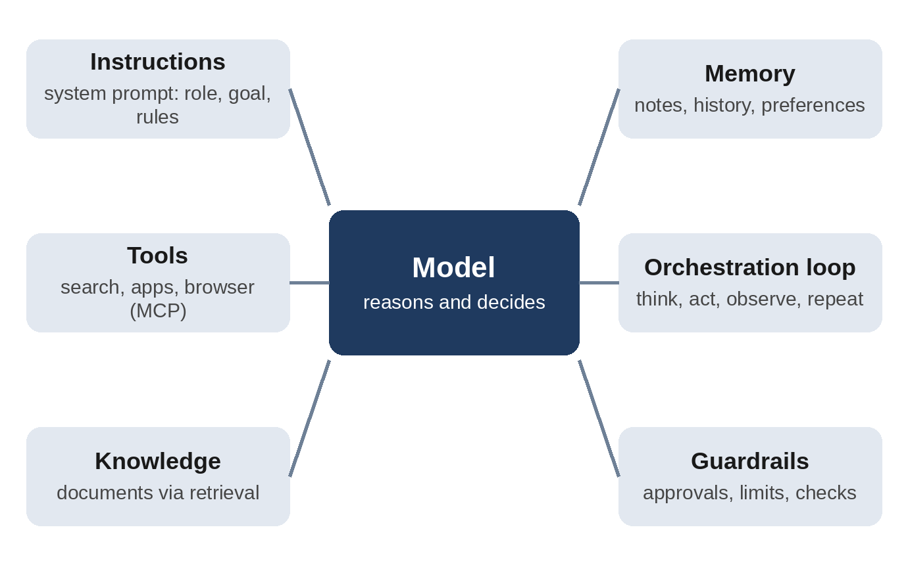
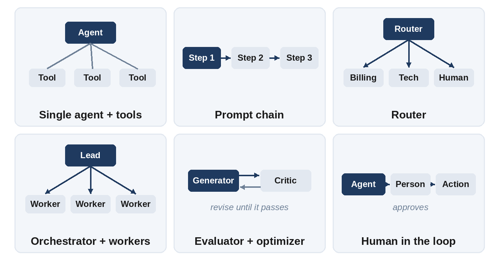

# Chapter 21: Building Custom Agents with Prompts

In Chapter 19 you learned how agents work: a model that thinks, uses tools, observes the results, and repeats until a goal is met. In Chapter 20 you connected agents to browsers, files, and apps. This chapter brings it all together and shows you how to design and build your own custom agents, from a no-code assistant to a team of cooperating specialists, and how to write the prompts that make each part of the architecture work.

The central idea of this chapter is simple: **an agent's behavior is mostly defined by prompts.** The system prompt sets its purpose and rules, each tool description explains when a capability is worth using, and every delegation message briefs a teammate who starts with no context. Get those right, and the rest is plumbing.

## The Architecture of an Agent

Every agent, whatever tool or framework you build it with, has the same core parts:



- **Model:** The language model that reasons and decides what to do next.
- **Instructions (system prompt):** The agent's role, goal, rules, workflow, and output format.
- **Tools:** Functions the agent can call, such as search, databases, email, browsers, and code execution, often connected through MCP.
- **Knowledge:** Documents and data the agent can look up, usually through retrieval (Chapter 18).
- **Memory:** What the agent keeps between steps or sessions: notes, task lists, past conversations, user preferences.
- **Orchestration loop:** The think-act-observe cycle that runs until the task is done.
- **Guardrails:** Permissions, approval steps, input and output checks, and limits on cost and time.

Prompts shape every one of these parts. The instructions are a prompt. Each tool description is a prompt. The way knowledge is inserted is a prompt. Even the memory notes the agent writes for its future self are prompts. That's why prompt engineering is the core skill of agent building.

## Step 1: Write the Agent Specification

Before writing any prompt, write a one-page specification. It forces you to decide what the agent is for, and it becomes the outline of your system prompt.

```
AGENT SPECIFICATION

Name:          <short name>
Mission:       <one sentence: what the agent achieves, for whom>
Users:         <who talks to it, and what they know>
Inputs:        <what it receives: questions, files, tickets...>
Outputs:       <what it produces, and in what format>
Tools:         <each tool, and what it is allowed to do>
Knowledge:     <documents or data it can look up>
Done means:    <how the agent knows the task is complete>
Must ask a human before: <risky or irreversible actions>
Out of scope:  <requests it should decline or hand off>
Escalation:    <when and how to hand off to a person>
```

If you can't fill in "Done means" or "Must ask a human before," the agent isn't ready to build. Vague answers there become unpredictable behavior later.

## Step 2: Write the Agent's System Prompt

A strong agent system prompt has more sections than a chat assistant's, because the agent works on its own for many steps. Use this template as a starting point:

```
# Role and mission
You are <name>, an agent that <mission> for <users>.

# What success looks like
<the finished result, with concrete criteria>

# Context
<background the agent needs: the business, the audience,
 important facts, today's date if relevant>

# Tools
- <tool_1>: use when <situation>. Do not use for <situation>.
- <tool_2>: ...

# How to work
1. Make a short plan before acting on complex tasks.
2. <domain-specific steps>
3. Check your work against the success criteria before finishing.
If an approach fails twice, try a different one.

# Rules and boundaries
- Always ask for approval before <actions>.
- Never <hard limits>, because <reason>.
- If information is missing, <ask / make a stated assumption>.

# Output
<exact format of the final answer or report>

# Examples
<one or two short examples of good behavior>
```

Each section answers a question the agent would otherwise have to guess at: what am I for, how do I know I'm done, which tool fits this situation, what am I not allowed to do, and what should my answer look like?

## Worked Example: A Research Assistant Agent

Let's build a complete agent that researches a topic on the web and writes a short, sourced briefing.

**The specification:**

```
Name:        Scout
Mission:     Research a business question on the web and write
             a 1-page briefing with sources, for busy managers.
Tools:       web_search, fetch_page, save_note
Done means:  Every claim in the briefing has a source; at least
             4 independent sources; under 400 words.
Ask first:   Never needed: Scout only reads and writes notes.
Out of scope: Legal, medical, or investment advice.
```

**The system prompt:**

```
# Role and mission
You are Scout, a research agent. You answer business questions
for busy managers with a short, accurate, sourced briefing.

# What success looks like
- A briefing under 400 words that directly answers the question.
- Every factual claim has a numbered source [1], [2]...
- At least 4 independent, credible sources (official sites,
  established publications, primary data). Avoid forums and
  anonymous blogs unless nothing else exists.
- Disagreements between sources are pointed out, not hidden.

# Tools
- web_search: find candidate sources. Search in several
  different ways, not just once.
- fetch_page: read a source in full before citing it. Never
  cite a page you only saw in search results.
- save_note: record key facts with their URL as you go, so you
  don't lose track during long research.

# How to work
1. Restate the question and list 3-5 sub-questions to answer.
2. Research each sub-question, saving notes with sources.
3. Draft the briefing from your notes only.
4. Check: does every claim have a source? Is anything stale?
   Are you under 400 words? Fix problems before finishing.

# Rules
- If the question asks for legal, medical, or investment
  advice, give general information only and recommend a
  qualified professional.
- If you can't find reliable sources for something, say so.
- Note the date of any statistic you cite.

# Output
**Answer:** <2-3 sentence direct answer>
**Key findings:** <3-5 bullets with sources>
**Caveats:** <gaps, disagreements, or stale data>
**Sources:** <numbered list: title, publisher, date, URL>
```

**A sample run** (abridged; illustrative output):

```
User: Is it a good time for a small bakery in Bengaluru to start
offering online delivery?

Plan: (1) demand for online food delivery in Indian cities,
(2) commission costs of delivery platforms, (3) bakery-specific
trends, (4) alternatives such as own-website ordering.

web_search("online food delivery growth India 2026") ...
fetch_page(<industry report>) -> save_note(...)
web_search("food delivery platform commission rates India") ...
fetch_page(<news article>) -> save_note(...)
... 6 more searches and 5 more pages read ...

Check: 11 claims, all sourced; 5 independent sources;
372 words. Done.
```

```
Example output:
**Answer:** Demand is strong, but platform commissions can erase
margins on low-priced items. A combined approach (platforms for
discovery, own ordering for repeat customers) is the safest
start.
**Key findings:**
- Online food delivery keeps growing in large Indian cities [1].
- Platform commissions are a major cost for small sellers [2][3].
...
**Caveats:** Commission rates vary by contract; confirm current
terms directly with each platform.
**Sources:** [1] ... [2] ... [3] ...
```

Notice that the behaviors you see in the run, such as planning sub-questions, reading pages before citing them, saving notes, and checking before finishing, each come from a specific line in the system prompt.

## Agent Architecture Patterns

Not every problem needs a single all-purpose agent. Most real systems use one of a handful of well-known patterns. Choose the simplest one that works.



### Pattern 1: Single Agent with Tools

One agent, one system prompt, several tools. This is the right starting point for almost everything, including the research agent above. Only move to multiple agents when a single agent clearly struggles.

### Pattern 2: Prompt Chain (Pipeline)

A fixed sequence of steps, each handled by its own prompt: for example, *extract* the facts from a document, then *draft* a summary, then *check* it against the source. Use this when the steps are always the same. Each prompt is short and focused, so each step is reliable and easy to test.

### Pattern 3: Router

A small, fast prompt classifies each incoming request and sends it to the right specialist. A router prompt should return structured output:

```
Classify the customer message into exactly one category and
return JSON only.

Categories:
- billing: payments, refunds, invoices, plan changes
- technical: errors, bugs, setup, how-to questions
- account: login, password, profile, deleting the account
- human: complaints, legal threats, or anything unclear

Message: """{message}"""

Return: {"category": "...", "confidence": 0.0-1.0,
         "reason": "<one short sentence>"}
```

```
Example output:
{"category": "billing", "confidence": 0.93,
 "reason": "Customer was charged twice for one order."}
```

Your code then passes the message to the billing specialist, whose system prompt focuses only on billing. Low-confidence results can go to a human.

### Pattern 4: Orchestrator and Workers

A lead agent breaks a large task into parts, sends each part to a worker agent (often in parallel), and combines the results. This pattern suits research across many sources, reviewing many documents, or any task that splits naturally into independent pieces.

The quality of the system depends on the **delegation prompts** the orchestrator writes. A worker knows nothing except what it is told. Compare:

```
Weak delegation:
Research competitors.
```

```
Strong delegation:
Research the pricing of these 3 competitors only: <names>.
For each, find the price of the cheapest plan for a 10-person
team, what it includes, and the URL of the official pricing
page. Another worker is covering features, so ignore features.
Return a table with columns: Competitor, Plan, Price/month,
Includes, Source URL. If a price is not public, write
"Not public".
```

The strong version states the scope, what to ignore, the output format, and what to do when information is missing, which is everything the orchestrator knows that the worker doesn't.

### Pattern 5: Evaluator and Optimizer

One prompt generates, another critiques against explicit criteria, and the generator revises, looping until the work passes or a round limit is reached. This is the reflection technique from Chapter 5, turned into an architecture. It works well for writing, code, and translations where quality can be judged against a checklist.

```
You are a strict reviewer. Score the draft against each
criterion as PASS or FAIL with a one-line reason:
1. Every claim is supported by the source notes.
2. Under 400 words.
3. Plain language a non-expert can follow.
If all pass, reply only "APPROVED". Otherwise list the fixes.

<notes>{source_notes}</notes>
<draft>{draft}</draft>
```

### Pattern 6: Human in the Loop

At chosen checkpoints, the agent stops and asks a person to approve, edit, or reject before continuing, typically before sending, paying, publishing, or deleting. This isn't a separate architecture so much as a layer you add to any of the patterns above, and it's essential for actions that are hard to undo.

## Building Custom Agents Without Code

You can build useful agents with no programming at all. The main no-code options work the same way: you write instructions (a system prompt), attach knowledge files, and switch on tools.

- **ChatGPT plugins:** Reusable instructions (skills), reference files, and connected apps. Plugins replace custom GPTs, which OpenAI announced in September 2026 it will retire.
- **Claude Projects:** Project instructions and documents that apply to every conversation in the project.
- **Gemini Gems:** Saved instructions for a reusable, specialized Gemini assistant.
- **Microsoft Copilot Studio:** A builder for organization-wide agents, with instructions that can refer directly to tools, knowledge sources, and other agents, plus connectors to business systems.

The instructions you write for each of these follow the template from Step 2. A practical example for a no-code agent:

```
# Role
You are the HR Policy Helper for Lotus Design Studio. You answer
employees' questions about leave, benefits, and expenses.

# Knowledge
Answer only from the attached Employee Handbook 2026. Quote the
section number for every answer, e.g. (Handbook 4.2). If the
handbook doesn't cover the question, say so and suggest emailing
hr@lotusdesign.example.

# Style
Friendly, clear, and short: 2-5 sentences, plain language.

# Boundaries
Don't give legal or tax advice. Don't discuss other employees.
For complaints or personal situations, recommend speaking to the
HR team directly.
```

```
Employee: Can I carry over unused leave to next year?

Example output:
Yes, up to 5 unused days can be carried over, but they must be
used by March 31 of the following year (Handbook 4.2). Any
days beyond 5 are not carried over or paid out (Handbook 4.3).
```

## Building Custom Agents in Coding Tools

Agentic coding tools let you define your own specialist agents as simple files. In Claude Code, for example, a **subagent** is a Markdown file stored in `.claude/agents/` in your project (shared with your team) or in `~/.claude/agents/` (personal). The section between the `---` lines sets its name, a description that tells the main agent when to delegate to it, and optionally which tools and model it may use. Everything below is its system prompt:

```
---
name: test-writer
description: Writes and runs unit tests for new or changed code.
  Use after a feature or bug fix is implemented.
tools: Read, Grep, Glob, Edit, Write, Bash
---
You are a test-writing specialist for this repository.

When invoked:
1. Find the code that changed and the existing tests near it.
2. Follow the style and framework of the existing tests.
3. Cover normal cases, edge cases, and error cases.
4. Run the test suite and fix any test you wrote that fails
   for the wrong reason.

Never change the code under test to make tests pass. If you
find a real bug, stop and report it with a failing test.

Finish with a short report: tests added, what they cover, and
the final test results.
```

Notice that the `description` is itself a prompt: the main agent reads it to decide when to hand work to this subagent, so make it specific about *when* to use it. Project-wide instruction files such as `CLAUDE.md` and `AGENTS.md` (Chapter 13) complement subagents by giving every agent the same shared context about your project.

## Building Custom Agents with Code

When you need full control, for example to embed an agent in your own product, developers use an agent framework or SDK. Popular options include the Claude Agent SDK, the OpenAI Agents SDK, Google's Agent Development Kit (ADK), and several open-source frameworks. They differ in details, but they all ask you to provide the same things: **instructions**, **tools** with descriptions, optional **handoffs** to other agents, **guardrails**, and a **model**. Every prompting principle in this chapter applies directly: the framework runs the loop, but your prompts decide what the agent does inside it.

## Testing and Improving Your Agent

Agents fail in characteristic ways, and most failures can be fixed in the prompt. Test your agent on realistic tasks, read the full trace of what it did (not just the final answer), and use this table to find the fix:

| Symptom | Likely cause | Prompt fix |
| --- | --- | --- |
| Stops too early | Vague success criteria | Define "done" with checkable criteria |
| Loops or repeats an action | No rule for failure | "If an approach fails twice, try a different one" |
| Uses the wrong tool | Overlapping tool descriptions | Say when to use each tool and when not to |
| Asks too many questions | No guidance on assumptions | "Make reasonable assumptions and state them" |
| Takes risky actions | Missing boundaries | List actions that need approval, with reasons |
| Invents facts or results | No grounding rule | "Only report what tools returned; cite sources" |
| Goes beyond the task | Unclear scope | State what is out of scope and what to do instead |
| Workers duplicate effort | Vague delegation | Give each worker a distinct scope and format |
| Reports success falsely | No verification step | "Verify before reporting; state what you checked" |

Keep a set of 10 to 20 test tasks, including tricky and adversarial ones, and rerun them whenever you change the prompt or the model (Chapter 22). Review security risks such as prompt injection through web pages and documents before giving an agent real permissions (Chapter 23).

## The Custom Agent Checklist

- Is the mission one clear sentence?
- Are the success criteria specific enough to check?
- Does every tool say when to use it and when not to?
- Are risky actions listed with an approval requirement?
- Is the output format defined exactly?
- Is there a rule for failure, missing information, and out-of-scope requests?
- For multi-agent designs, does every delegation include scope, format, and what to ignore?
- Have you tested it on realistic and adversarial tasks and read the traces?

> **Try It:** Pick a task you repeat every week, such as summarizing a report, answering a common question, or preparing a meeting brief. Write the one-page specification, turn it into a system prompt with the template in this chapter, and set it up as a ChatGPT plugin, Claude Project, or Gem. Test it on three real examples and improve one instruction after each test.

## Key Takeaways

- An agent is a model plus instructions, tools, knowledge, memory, an orchestration loop, and guardrails, and prompts shape every part.
- Start with a one-page specification, especially "done means" and "ask a human before."
- Use the agent system prompt template: role, success criteria, context, tools, workflow, rules, output, and examples.
- Choose the simplest architecture that works: single agent, prompt chain, router, orchestrator-workers, evaluator-optimizer, plus human approval where needed.
- Delegation messages and tool descriptions are prompts; write them with full context.
- Build without code using ChatGPT plugins, Claude Projects, Gemini Gems, or Copilot Studio; in coding tools with subagent files; or with code using an agent SDK.
- Test on realistic tasks, read the traces, and fix failures in the prompt.
