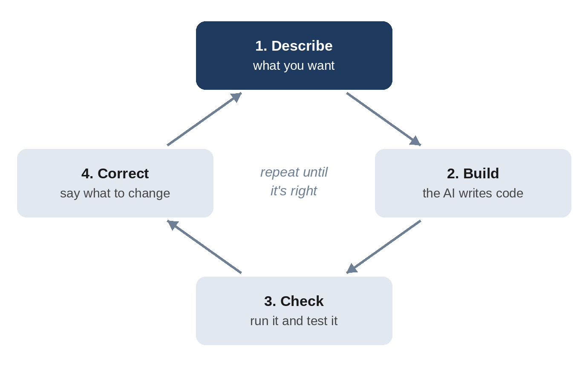

# Part I: Getting Started

# Chapter 1: What Is Vibe Coding?

In February 2025, the AI researcher Andrej Karpathy described a new way he had started building small projects: he talked to an AI, accepted the code it wrote without reading it closely, ran the result, and pasted any error messages back in until things worked. He called it "vibe coding," because you follow the vibe of what you want rather than the details of how it's built.

The name stuck because it described something millions of people were discovering at the same time. You no longer have to speak a programming language to make a computer do new things. You can describe the result you want in plain English and let an AI handle the translation.

## From Writing Code to Directing It

Traditional programming looks like this: you learn a language such as Python or JavaScript, you plan how the program should work, you type every line, and you fix your own mistakes. It takes months to become productive and years to become good.

Vibe coding changes your role. Instead of writing the code, you **direct** it:

1. You describe what you want.
2. The AI writes the code and explains what it did.
3. You run the result and see whether it does what you wanted.
4. You describe what to change, and the cycle repeats.

This loop is the heart of the whole book. Every technique you'll learn is a way to make one of those four steps better: clearer descriptions, smarter building, more reliable checking, and faster correction.

## A Spectrum, Not a Switch

People use "vibe coding" to mean different things, and it helps to see them as points on a spectrum:

| Style | What it looks like | Good for |
| --- | --- | --- |
| Pure vibe coding | Accept everything, never read the code, paste errors back in | Throwaway experiments, games, personal toys |
| Guided vibe coding | Describe clearly, test every change, ask questions about what you don't understand | Personal tools, prototypes, small apps you'll share |
| AI-assisted engineering | Plan first, write tests, review every change, follow team practices | Software other people depend on |

This book starts you in the middle and moves you toward the right. You'll still work at the speed of vibe coding, but with the habits that make the results trustworthy: a plan before big changes, a test for every important behavior, a way to undo anything, and a habit of asking "how do I know this works?"

> **Note:** Nothing is wrong with pure vibe coding for a weekend toy. The trouble starts when a toy quietly becomes something real: a tool your team uses every day, an app that stores people's personal information, or a website that takes payments. That's when the habits in this book start to matter.

## What Is Claude Code?

**Claude Code** is an AI coding tool made by Anthropic, the company that makes the Claude AI models. You can think of it as a skilled programmer who lives inside your computer and works in whatever folder you point it at.

What makes it different from asking a chatbot for code is that Claude Code can **act**, not just answer:

- It **reads your files** to understand your project.
- It **writes and edits files** directly, so you don't copy and paste code.
- It **runs commands**: it can start your app, install software, and run tests.
- It **checks its own work** by running the code and reading the results.
- It **uses tools** you connect to it, such as a web browser or GitHub.

This is what people mean when they call Claude Code an **agent**: a system that takes a goal, decides which steps to take, carries them out with tools, observes what happened, and keeps going until the job is done or it needs your input.

> **Tip:** Claude Code runs in several places: in your computer's terminal, as a desktop app, inside code editors such as Visual Studio Code and JetBrains IDEs, and on the web at claude.ai/code. This book uses the terminal version because it works everywhere and shows you exactly what's happening, but everything you learn applies to the other versions too.

## What You Can Build

With Claude Code and the skills in this book, you can build:

- **Web pages and web apps**: calculators, dashboards, portfolios, booking forms, games.
- **Command-line tools**: scripts that rename files, process spreadsheets, or automate repetitive work.
- **Full-stack applications**: apps with a database, user data, and a server, which you can put online.
- **AI-powered apps**: tools that use Claude itself to summarize, generate, or analyze.
- **Mobile apps**: apps for iPhone and Android that you can publish in the app stores.
- **Automations**: scripts that run on a schedule, or AI assistants that review your code whenever you change it.

You'll build one of each of the first five kinds in this book, and learn the basics of the last.

## What Vibe Coding Can't Do (Yet)

It's worth being honest about the limits from the start.

**The AI can be confidently wrong.** It may write code that looks perfect and fails on an edge case, such as a date at midnight, an empty list, or a name with an apostrophe. You'll see a real example of this in Chapter 11. The defense is testing, which you'll learn in Chapter 12.

**It doesn't know what you didn't say.** If you ask for "a to-do app" and expected it to sync between your phone and laptop, you'll be disappointed. The AI fills gaps with reasonable guesses, and reasonable guesses aren't always your guesses.

**It can't take responsibility.** If your app leaks someone's data or charges a customer twice, "the AI wrote it" isn't an answer anyone will accept. You are the one shipping the software, so you need to understand enough to check it.

**Some software needs experts.** Medical devices, car braking systems, banking cores, and aircraft controls are built under strict safety standards for good reason. Vibe coding is a wonderful way to learn and to build tools, prototypes, and everyday apps. It is not a replacement for engineering discipline where lives or livelihoods depend on the code.

## The Skills That Matter Now

If the AI writes the code, what do you need to know? Five things, and they map onto the rest of this book:

1. **Describing clearly**: turning a fuzzy idea into a precise request (Chapters 5 to 7).
2. **Understanding the shape of software**: knowing what files, servers, databases, and APIs are, so you can ask for the right things and spot nonsense (Chapter 2).
3. **Verifying**: testing that the code does what you meant (Chapters 11 and 12).
4. **Staying in control**: saving versions, undoing mistakes, and limiting what the AI is allowed to do (Chapters 13 and 18).
5. **Staying safe**: protecting secrets, users, and money (Chapters 14, 15, and 31).

Notice that none of these is "memorize Python syntax." You'll pick up a lot of programming knowledge along the way, because you'll see and question real code, but you'll learn it in context, when you need it.

> **Try It:** Think of three small apps you wish existed: something for your work, your home, and your hobbies. Write each one down in a single sentence. Keep the list; you'll turn one of them into a real app by the end of this book.

## Key Takeaways

- Vibe coding means building software by describing what you want and letting an AI write the code.
- The core loop is: describe, build, check, and correct.
- Claude Code is an agent: it reads files, writes code, runs commands, and checks its own work.
- Vibe coding sits on a spectrum. This book teaches the habits that make AI-built software trustworthy.
- Your job shifts from typing code to describing clearly, verifying results, and staying in control.
