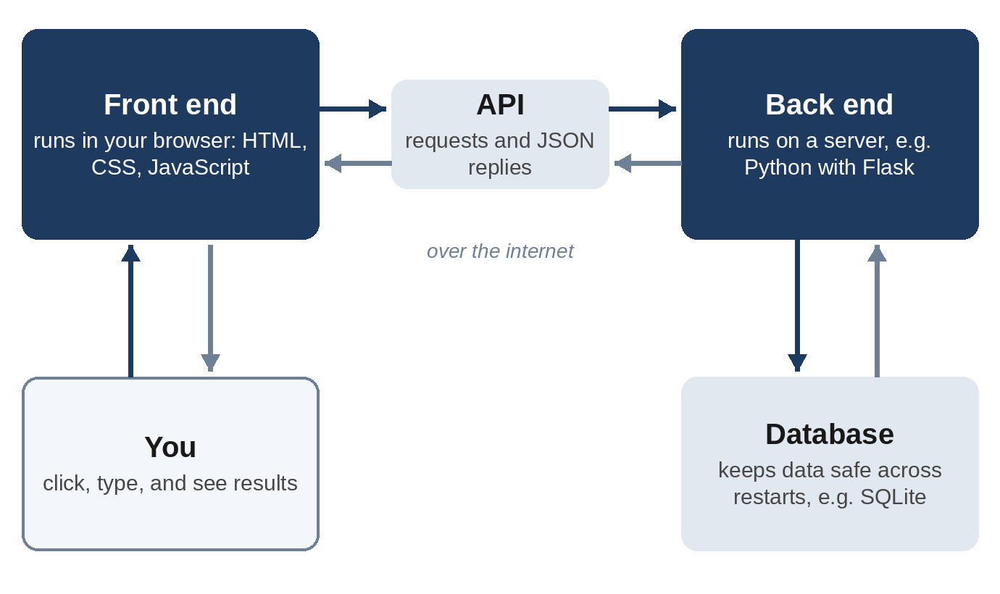

# Chapter 2: How Software Works (Just Enough)

You don't need to become a programmer to vibe code, but you do need a mental map. When Claude says "I added a route to the Flask back end and a migration for the database," you should know roughly what that means, and when you want a feature, you should know what to ask for. This chapter gives you that map in plain language.

## Files and Folders

All software is made of **files**: plain text documents that contain instructions. A project is just a **folder** of files, often with folders inside it. When you vibe code, the AI creates and edits these files for you, but they are ordinary files on your computer. You can open them, read them, copy them, and delete them like any document.

A file's **extension** (the part after the dot) tells you what kind of file it is:

| Extension | What it is |
| --- | --- |
| `.html` | The structure and content of a web page |
| `.css` | The look of a web page: colors, fonts, layout |
| `.js` | JavaScript, the language that makes web pages interactive |
| `.py` | Python, a popular language for tools, servers, and data |
| `.json` | Structured data in a format both people and programs can read |
| `.md` | Markdown, formatted notes and documentation |
| `.csv` | A simple spreadsheet, one row per line |
| `.db` | A database file |

## Programming Languages

A **programming language** is a precise way of writing instructions for a computer. There are hundreds, but you'll meet four in this book:

- **HTML** describes what's on a web page: headings, buttons, text boxes.
- **CSS** describes how it looks.
- **JavaScript** describes how a web page behaves when you click, type, or scroll. It runs inside your web browser.
- **Python** is a general-purpose language that's easy to read. You'll use it for command-line tools and for the "server side" of web apps.

You don't need to write any of these by hand. But you'll see them, and by the end of this book you'll be able to read simple code and recognize what each part does.

## The Front End and the Back End

Most apps you use every day have two halves.

The **front end** is the part you see and touch: the web page or app screen. It runs on your device, inside your browser.

The **back end** is the part that runs somewhere else, on a computer called a **server**. It stores data, enforces rules (such as "you can't see other people's messages"), and does work that shouldn't happen on your device.

The front end and back end talk to each other over the internet using an **API** (application programming interface): a set of agreed requests and responses, such as "give me this user's habits" or "add a new habit called Drink water."

Not every app needs both halves. Your first two projects are **front-end only**: everything runs in the browser, and the data stays on your device. Project 4 has both halves, and you'll see exactly why it needs them.

## Databases

A **database** is an organized place to store data so it survives when the app restarts. Think of it as a set of spreadsheets that a program can search and update very quickly. Each "spreadsheet" is called a **table**, each row is a **record**, and each column is a **field**.

In Project 4 you'll use **SQLite**, a database that lives in a single file. It's built into Python, so there's nothing extra to install, and it's ideal for small apps.

## The Terminal

The **terminal** (also called the command line, console, or shell) is a text window where you type commands to your computer instead of clicking. On macOS it's an app called Terminal. On Windows you can use PowerShell or Windows Terminal. On Linux it's usually called Terminal.

The terminal looks intimidating, but you'll only need a handful of commands, and Claude Code can run most of them for you. Here are the ones worth knowing:

| Task | macOS and Linux | Windows (PowerShell) |
| --- | --- | --- |
| Show which folder you're in | `pwd` | `pwd` |
| List files in this folder | `ls` | `ls` or `dir` |
| Move into a folder | `cd my-project` | `cd my-project` |
| Move up one folder | `cd ..` | `cd ..` |
| Make a new folder | `mkdir my-project` | `mkdir my-project` |
| Clear the screen | `clear` | `cls` |

> **Tip:** Press the Tab key while typing a file or folder name and the terminal will complete it for you. Press the Up arrow to bring back your previous command.

## Packages and Dependencies

Programmers rarely build everything from scratch. They use **packages** (also called libraries): ready-made code written by others. For example, **Flask** is a Python package for building web servers, and **pytest** is a package for testing Python code.

Your project's **dependencies** are the packages it needs. They're usually listed in a file, such as `requirements.txt` for Python or `package.json` for JavaScript, so anyone can install them with one command. A **package manager** does the installing: `pip` for Python, `npm` for JavaScript.

> **Warning:** Packages are code written by strangers, and they run with the same access as your own code. Stick to well-known packages, and be suspicious if the AI suggests one you can't find much information about. Chapter 21 explains why.

## Where Apps Run: Local and Online

When you build an app, it first runs **locally**, on your own computer. You'll see addresses like `http://localhost:5000` or `http://127.0.0.1:5000`. "Localhost" means "this computer," and the number after the colon is the **port**, a numbered door the app listens on. Only you can see a local app.

To let other people use your app, you **deploy** it: copy it to a server that's always on and reachable from the internet. Chapter 14 shows you how.

## Version Control

**Version control** keeps a history of every change to your project, so you can see what changed, when, and why, and go back to any earlier version. The standard tool is **Git**, and the most popular website for storing Git projects online is **GitHub**.

For vibe coders, Git is a safety net. The AI will sometimes make a change that breaks things, and Git lets you say "take me back to how it was an hour ago." You'll set it up in Chapter 4 and master it in Chapter 12.

## Tests

A **test** is a small piece of code that checks whether other code works. For example, a test might say, "if the bill is $100 with an 18% tip split 3 ways, each person should pay $39.33." When you change the code later, you run the tests, and if one fails, you know you broke something.

Tests matter even more when an AI writes your code, because they let the AI check its own work. Telling Claude "write tests and make sure they pass" is one of the most powerful prompts in this book.

## How an AI Writes Code

Finally, it helps to know a little about the AI itself. Claude is a **large language model**: a system trained on enormous amounts of text, including a great deal of code, that predicts what should come next in a piece of writing. Because it has seen so much code, it's very good at producing code that fits a description.

But it doesn't run your app in its head. It writes code that is *likely* to be correct based on patterns it has learned. That's why Claude Code's ability to actually run the code, read the results, and fix problems is so important, and why your own checking still matters.

Two more terms you'll hear often:

- **Context window**: everything the AI can "see" at once: your conversation, the files it has read, and the results of commands. It's large, but not infinite, and Chapter 20 shows you how to manage it.
- **Token**: the unit AI models use to measure text. A token is roughly three-quarters of a word. Usage and pricing are measured in tokens.

> **Try It:** Open your computer's terminal now. Type `pwd` and press Enter to see where you are, then type `ls` (or `dir` on Windows) to list the files there. That's it: you've used the command line.

## Key Takeaways

- A project is a folder of text files. Extensions such as `.html`, `.js`, and `.py` tell you what each file is.
- The front end runs in the browser; the back end runs on a server; they talk through an API.
- Databases store data so it survives restarts. SQLite keeps a whole database in one file.
- The terminal is a text window for commands. A handful of commands is all you need.
- Packages are other people's code. Your project's dependencies are listed in a file.
- Git keeps a history of your project so you can undo mistakes.
- Tests check that code works, and they let the AI check its own work.
