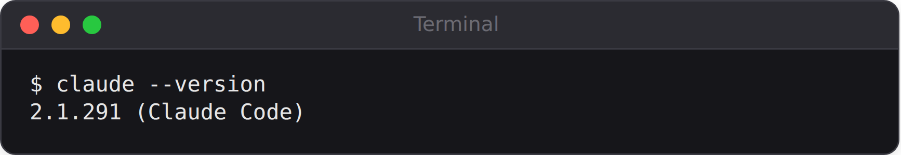
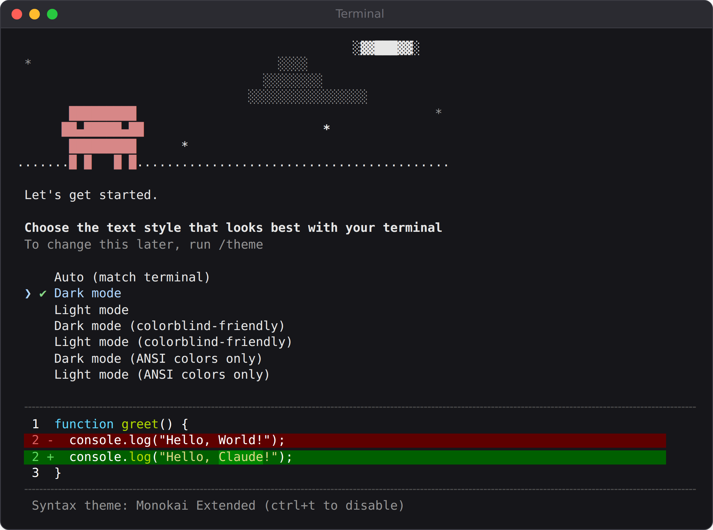
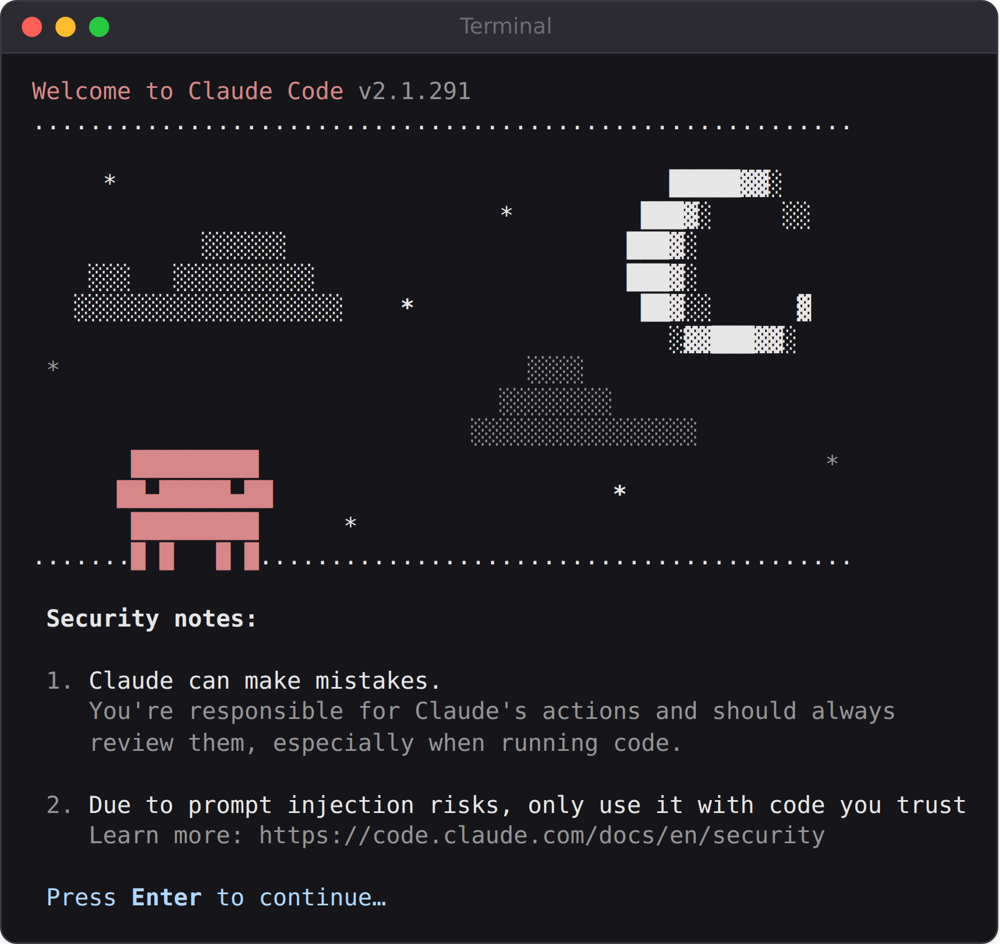
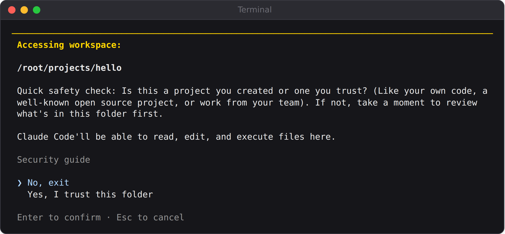
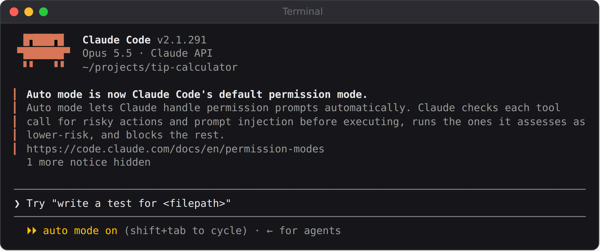
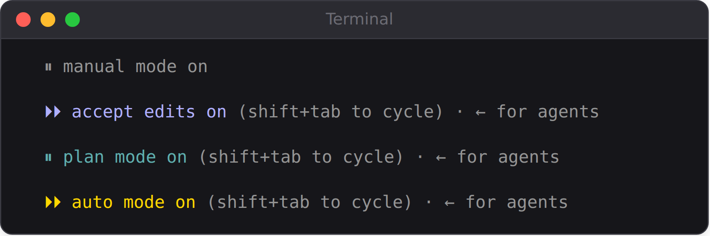

# Chapter 3: Setting Up Your Workshop

In this chapter you'll install everything you need: Claude Code itself, plus three free tools that every project in this book uses. It takes about thirty minutes, and you only do it once.

## Step 1: Choose How to Pay for Claude Code

Claude Code needs an account. There are two main ways to get one:

- **A Claude subscription** (Pro, Max, Team, or Enterprise). You pay a fixed monthly price, and your Claude Code usage counts against your plan's usage limits. This is the simplest choice for most beginners, because your cost is predictable.
- **An Anthropic Console account** (at platform.claude.com). You buy API credits and pay for exactly what you use, measured in tokens. This suits people who use Claude Code only occasionally, or who also want to build AI-powered apps (Chapter 14 needs a Console account anyway).

Companies can also use Claude Code through cloud providers such as Amazon Bedrock, Google Cloud, and Microsoft Foundry, but that's beyond the needs of most readers.

> **Note:** For a sense of scale, all the Claude Code sessions recorded while writing this book (about seventy sessions, including a model-comparison experiment) would have cost about $100 in total at API list prices. Three-quarters of that was the production app in Part V, built mostly with the most capable model; the first six projects together cost about $16. A subscription covers small projects easily, but a large project on the strongest model can reach your plan's usage limits, as happened twice while writing this book. Chapters 22 and 30 show how to choose models and keep usage efficient.

Plans and prices change, so check claude.com/pricing for the current options before you sign up.

## Step 2: Install the Basic Tools

You'll need three free tools besides Claude Code.

**Git** (version control, Chapter 13). On macOS, open Terminal and type `git --version`; if Git isn't installed, macOS offers to install it. On Windows, download **Git for Windows** from git-scm.com and accept the default options. It also gives Claude Code a better shell to work with on Windows. On Linux, Git is usually already installed, or available through your package manager.

**Python** (Projects 3, 4, and 5). Download the latest version from python.org. On Windows, tick the box labeled **"Add python.exe to PATH"** on the first screen of the installer; forgetting this is the most common setup problem. On macOS and Linux, use the installer from python.org or your package manager.

Later in the book, the MCP browser server (Chapter 19) and the mobile app (Chapter 20) also need **Node.js**, which runs JavaScript tools on your computer. You can install it when you get there: download the LTS version from nodejs.org.

**A code editor** (optional but recommended). You don't need one to vibe code, but it's much easier to look at your project's files in an editor than in the terminal. **Visual Studio Code** (code.visualstudio.com) is free, popular, and has an official Claude Code extension.

Check that everything worked by opening a *new* terminal window and typing:

```
git --version
python3 --version
```

On Windows, type `python --version` instead of `python3 --version`. Each command should print a version number. If you see "command not found" or "is not recognized," close the terminal, open a new one, and try again; if it still fails, see Appendix C.

## Step 3: Install Claude Code

The recommended way to install Claude Code is the **native installer**, which also keeps Claude Code updated automatically. Open a terminal and run the command for your system.

On **macOS, Linux, or WSL** (the Windows Subsystem for Linux):

```
curl -fsSL https://claude.ai/install.sh | bash
```

On **Windows PowerShell**:

```
irm https://claude.ai/install.ps1 | iex
```

On **Windows Command Prompt (CMD)**:

```
curl -fsSL https://claude.ai/install.cmd -o install.cmd && install.cmd && del install.cmd
```

> **Warning:** Only run install commands copied from the official documentation at code.claude.com. A command that pipes a download straight into your shell, like the ones above, runs whatever the website sends, so the address matters. Check that it says `claude.ai` exactly.

When the installer finishes, **open a new terminal window** and check the installation:

```
claude --version
```



You should see a version number followed by `(Claude Code)`. If your terminal says `claude` isn't found, the install folder isn't on your PATH yet. Closing and reopening the terminal usually fixes this; if not, Appendix C has the steps.

> **Tip:** If you use Homebrew on a Mac, `brew install --cask claude-code` works too, and on Windows, `winget install Anthropic.ClaudeCode` does the same. These versions don't update themselves, so upgrade them from time to time.

## Step 4: Start Claude Code and Log In

Make a folder for your first experiments and start Claude Code inside it:

```
mkdir my-first-project
cd my-first-project
claude
```

The first time you run `claude`, it walks you through a short setup. First, it asks you to choose a text style that suits your terminal; the default is fine, and you can change it later with `/theme`.



Next, it asks you to log in. Choose your account type, and a browser window opens to complete the sign-in. Your login is saved, so you only do this once. To switch accounts later, type `/login` inside Claude Code. Then it shows two security notes worth reading: Claude can make mistakes, and you should only use it with code you trust.



Claude Code also asks whether you trust the files in this folder. Because Claude Code can read and run things in the folder you start it in, only say yes for folders whose contents you know. Your own new project folder is fine: press the down arrow to choose "Yes, I trust this folder" and press Enter.



Once you're in, you'll see a prompt box with the version, the model, and your current folder above it.



The box in the middle is where you type. Type `/help` and press Enter to see the available commands, and `/exit` (or press Ctrl+D twice) to leave.

## Step 5: Understand Permission Modes

Before you ask Claude to do anything, it's worth understanding how much freedom it has. Claude Code uses **permission modes** to decide which actions it can take without asking you first:

| Mode | What Claude does without asking | Use it when |
| --- | --- | --- |
| Manual | Reads files only; asks before editing or running anything | You want to approve every step |
| Accept edits | Reads and edits files, and runs simple file commands | You're reviewing changes as they happen |
| Plan | Reads and explores, but doesn't change your files until you approve a plan | You want to think before building |
| Auto | Most routine actions, while a separate safety checker reviews the riskier ones | Longer tasks, once you're comfortable |

Recent versions of Claude Code start in **auto mode** by default. In auto mode, a second AI model (a "classifier") reviews applicable actions before they run and blocks the risky ones, such as deleting files outside your project or sending data somewhere unexpected. Most routine work, like reading and editing files in your project, goes ahead without prompting you.

Press **Shift+Tab** at any time to cycle between modes; the current mode appears in the status bar.



If a session starts in a different mode than you expect, for example because of a setting chosen by your organization, the status bar tells you, and Shift+Tab changes it. While you're learning, it's worth spending your first session or two in **Manual** mode, so you see every action Claude wants to take and approve it yourself. You'll learn a lot about how Claude works just by reading its requests.

> **Warning:** You may come across a flag called `--dangerously-skip-permissions`. It turns off all permission checks. As the name says, it's dangerous: use it only inside a disposable, isolated environment such as a container, never on your everyday computer.

## Other Ways to Use Claude Code

Everything in this book works in the terminal, but you have options:

- **The desktop app** gives you a visual interface, lets you run several sessions side by side, and can preview web apps.
- **The Visual Studio Code and JetBrains extensions** put Claude Code inside your editor, so you can see changes right next to your files.
- **Claude Code on the web** (claude.ai/code) runs sessions in the cloud, connected to your GitHub repositories, so you can work from any computer or even your phone.

You can switch between them freely; they're all Claude Code underneath.

## Keeping an Eye on Usage

Type `/usage` inside Claude Code at any time to see your usage. On a subscription plan, it shows how much of your plan's limits you've used; with API credits, it shows an estimated cost for the current session. Get into the habit of checking it after big tasks, so you develop a feel for what different kinds of work cost.

> **Try It:** Start Claude Code in your `my-first-project` folder, press Shift+Tab a few times and watch the mode change in the status bar, then type `/usage` and `/help` to explore. Exit with `/exit`.

## Key Takeaways

- You need a Claude subscription or an Anthropic Console account. Subscriptions give predictable costs.
- Install Git, Python, and optionally Visual Studio Code before you start.
- Install Claude Code with the native installer from the official documentation, then check it with `claude --version`.
- Start Claude Code inside a project folder by typing `claude`. Log in once; it remembers you.
- Permission modes control how much Claude can do without asking. Shift+Tab switches modes. Try Manual mode first to learn how Claude works.
- Check your usage with `/usage`.
