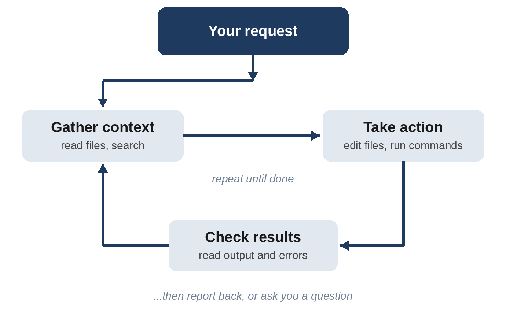

# Chapter 4: Your First Conversation with Claude Code

Claude Code is installed, you're logged in, and you have an empty folder. Now let's make something, and learn how to steer, stop, and undo along the way.

## How Claude Code Works on a Request

When you send Claude Code a request, it works in a loop. It **gathers context** (reads files, looks around your project), **takes action** (writes files, runs commands), and **checks the results** (reads the output, looks for errors). Then it decides whether the job is done or whether to go around again. A simple request might take one trip around the loop; a complex one might take dozens.



You can watch this happen. As Claude works, it shows each step: "Read app.py," "Edit index.html," "Bash: python3 -m pytest." That running log is your window into what it's doing, and reading it is one of the best ways to learn.

## Your First Request

Start Claude Code in your `my-first-project` folder:

```
cd my-first-project
claude
```

Type this request and press Enter:

```
Create a web page called hello.html that greets me by name (Sam)
and shows today's date. Then tell me how to open it, and explain
what each part of the file does as if I have never seen code
before. Keep the explanation short.
```

Replace "Sam" with your own name. Here's what Claude replied when this request was run for this book:

```
Claude's reply:
I created hello.html in your working directory. I haven't opened
it in a browser to check it.

How to open it: Find the file and double-click it. It opens in
your web browser (Chrome, Safari, Edge or Firefox).

What each part does:
- <!DOCTYPE html> tells the browser "this is a web page."
- <html> ... </html> wraps everything on the page.
- <head> holds behind-the-scenes info that isn't shown on the
  page itself.
- <body> holds everything you actually see on the page.
  - <h1> is a big heading, here "Hello, Sam!".
  - <p> is a paragraph: "Today is ___." The <span id="date"> is
    an empty slot with the name "date", where the date will be
    filled in.
- <script> holds a small program that runs when the page loads.
  It asks your computer for today's date and puts it into the
  "date" slot. Because it asks each time, the date is always
  current.
```

And here is the file it created:

**`hello.html`**

```
@include projects/00-hello/hello.html
```

Open the file by double-clicking it in your file browser, or by typing `open hello.html` on macOS or `start hello.html` on Windows. You should see your greeting and today's date.

Notice two things about Claude's reply. First, it told you plainly that it **hadn't tested the page in a browser**. Claude is generally honest about what it has and hasn't checked, and you should read these statements carefully: they tell you what *you* need to verify. Second, it explained the code at the level you asked for. You can always ask for more or less detail.

## Approving Actions

If you're in Manual mode (press Shift+Tab until the status bar says so), Claude stops and asks before creating or changing a file or running a command. You'll see what it wants to do, such as the full content of a new file or the exact command, followed by choices along these lines:

- **Yes**: allow this one action.
- **Yes, and don't ask again** for this kind of action (for example, all file edits during this session).
- **No**: decline. You can press Tab to add a note telling Claude what to do instead.

Read each request before you approve it. Early on, you'll learn a lot about how software is built just by watching what Claude wants to do. Later, once you trust the pattern, you can switch to Accept edits or Auto mode and let it work more freely.

## Talking to Claude Code

The prompt box understands a few special characters that make conversations faster:

| Type | What it does | Example |
| --- | --- | --- |
| `/` at the start | Runs a command or skill | `/help`, `/clear`, `/usage` |
| `@` | Points Claude at a specific file | `explain @hello.html` |
| `!` at the start | Runs a terminal command yourself and shows Claude the output | `!ls` |

For a long request, press Shift+Enter (in most terminals), or type `\` and then press Enter, to start a new line without sending. You can also paste text, error messages, and even images: copy a screenshot and press Ctrl+V (on Windows and WSL, Alt+V also works) to paste it, then ask Claude about it.

## Asking Questions

Claude Code isn't only for making changes. It's a patient tutor who can see your files. Try questions like these:

```
What does the <script> part of hello.html do, line by line?
```

```
If I wanted the date in the format 06/10/2026, what would I
change?
```

```
What files are in this folder and what is each one for?
```

Asking questions costs nothing but a little usage, and it's how you build the understanding you need to check the AI's work. A good rule: if Claude makes a change you don't understand, ask about it before moving on.

## Stopping and Steering

You're always in control of a running task:

- **Esc** stops Claude mid-step. Your conversation and the work done so far are kept, so you can redirect: "Stop, don't add a database. Keep everything in one file."
- **Typing while Claude works** queues your message, and Claude reads it as soon as it can. Use this to add details you forgot.
- **Ctrl+C** interrupts too; pressed when nothing is running, it clears your input, and pressing it again exits.

Don't hesitate to interrupt. A quick correction early saves a lot of untangling later.

## Undoing Changes with Checkpoints

Claude Code saves a **checkpoint** every time you send a message: a snapshot of the files it is about to change. If Claude heads in a wrong direction, press **Esc twice** (with an empty prompt box) or type `/rewind` to open the rewind menu. Pick an earlier message, and choose whether to restore the code, the conversation, or both.

This makes experiments cheap. You can say "Try a dark theme," look at the result, and rewind if you don't like it.

> **Warning:** Checkpoints only track changes Claude makes with its own file-editing tools. Changes made by terminal commands (for example, a script that deletes files) aren't captured. Checkpoints are a convenience, not a backup. Your real safety net is Git.

## Your Real Safety Net: Git

Git keeps a permanent history of your project, independent of Claude Code. Let's set it up now, so every project starts with a safety net.

If you've never used Git on this computer, tell it your name and email first. These are attached to each saved version:

```
git config --global user.name "Your Name"
git config --global user.email "you@example.com"
```

Then, in your project folder, you can simply ask Claude:

```
Set up Git for this folder and save the current files as the
first version, with a short description.
```

Claude will run `git init` (which starts tracking the folder) and `git commit` (which saves a snapshot, called a **commit**). From now on, any time things are working, say "commit this" or "save a version," and you'll always have a known-good state to return to. Chapter 13 covers Git properly.

## Sessions: Clearing, Continuing, and Resuming

Each conversation with Claude Code is a **session**. A few commands help you manage them:

- `/clear` starts a fresh conversation in the same folder. Use it when you switch to an unrelated task, because a long conversation full of old details can distract Claude.
- `claude -c` (typed in the terminal) continues your most recent conversation in this folder.
- `claude -r`, or `/resume` inside Claude Code, shows a list of past conversations to pick from.
- `/rename` gives the current session a memorable name, such as "dark-theme-experiment."

> **Try It:** In your `my-first-project` folder, ask Claude to change `hello.html` so the background color changes with the time of day: light in the morning, dark at night. Open the page to check it. Then press Esc twice and rewind the change. Finally, ask Claude to set up Git and commit the original version.

## Key Takeaways

- Claude Code works in a loop: gather context, act, check, and repeat.
- Read Claude's replies carefully, especially what it says it hasn't tested.
- Use `@` to point at files, `!` to run commands yourself, and `/` for commands.
- Ask questions freely. Understanding the code is how you check it.
- Esc stops Claude; Esc twice or `/rewind` undoes changes from checkpoints.
- Checkpoints are convenient, but Git is your real safety net. Commit whenever things work.
- Use `/clear` between unrelated tasks, and `claude -c` to continue where you left off.
