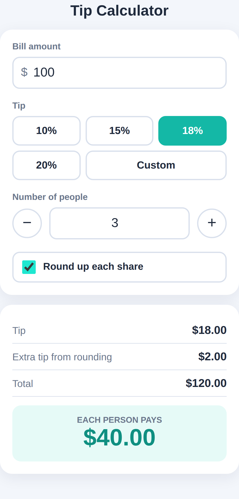

# Part II: Building Real Apps

# Chapter 5: Project 1: A Tip Calculator

Your first real project is small enough to finish in one sitting and useful enough to keep on your phone: a calculator that splits a restaurant bill, including the tip, between friends. Along the way you'll learn the most important skill in vibe coding: writing a request that gets you what you actually want.

## Start with a Clear Picture

Before you type anything, picture the finished app. Who uses it? On what device? What goes in, and what comes out? For the tip calculator:

- **Who and where**: me, at a restaurant table, on my phone.
- **Inputs**: the bill amount, a tip percentage, the number of people.
- **Outputs**: the tip, the total, and what each person pays.
- **Constraints**: it must work offline and load instantly, so a single file with no external libraries.

Thirty seconds of thinking like this turns a vague wish into a precise request.

## The First Prompt

Make a new folder, start Claude Code in it, and set up Git (as in Chapter 4). Then send this prompt:

```
Create a tip calculator as a single file called index.html.

It should let me enter the bill amount, pick a tip percentage
(10%, 15%, 18%, 20%, or a custom amount), and enter how many
people are splitting the bill. Show the tip, the total, and how
much each person pays, updating instantly as I type.

Use a clean, friendly design that works well on a phone.
Don't use any external libraries or frameworks.
```

Look at how this prompt is built. Each sentence does a job:

| Part of the prompt | Why it's there |
| --- | --- |
| "a single file called index.html" | Says exactly what to create and keeps it simple |
| The inputs: bill, tip choices, people | Defines what the user can do |
| The outputs: tip, total, each person | Defines what the app must show |
| "updating instantly as I type" | Describes the behavior, not just the screen |
| "works well on a phone" | Names the device, which shapes the whole design |
| "Don't use any external libraries" | A constraint that keeps the app fast and self-contained |

Here's the reply Claude gave when this prompt was run for this book. It took about twenty seconds:

```
Claude's reply:
I created index.html in the project directory. I haven't opened
it in a browser, so it's untested.

- Inputs: a bill amount field, tip buttons for 10%, 15%, 18% and
  20%, and a "Custom" button that reveals a percent field. The
  tip starts at 18%. The number of people has a field with - and
  + buttons, starting at 1.
- Results: it shows the tip, the total, and a large "each person
  pays" figure. These update on every keystroke or tap.
- Phone use: the layout is a single column with large touch
  targets. The number fields bring up the numeric keypad.
- Looks: a teal, card-based design that also switches to a dark
  theme if your device is set to dark mode.
- Dependencies: none. It's plain HTML, CSS and JavaScript in one
  file.
- Bad input: negative or empty values count as zero, and the
  number of people is never less than 1.
```

Claude made several sensible decisions you didn't ask for: a default tip of 18%, plus and minus buttons for the number of people, a numeric keypad on phones, dark mode, and protection against nonsense input such as a negative bill. This is typical. The AI fills gaps with reasonable choices, and it tells you what it chose. If you disagree with a choice, just say so.

And once again, notice the honesty: **"I haven't opened it in a browser, so it's untested."** That's your cue.

## Check It Yourself

Open `index.html` in your browser. On a computer, you can make the browser window narrow to see roughly how it looks on a phone. Better still, email the file to yourself and open it on your phone.

Now test it like a suspicious customer. Don't just try one easy number:

- $100 with an 18% tip for 1 person should be $118.00.
- $100 with an 18% tip for 3 people should be $39.33 each.
- What happens with an empty bill? With 0 people? With a custom tip of 12.5%?

The second test shows a real problem. Three shares of $39.33 add up to $117.99, not $118.00. That missing cent is a classic money bug, and in real life someone at the table has to cover it. A good fix is to round each share up to a friendly number.

## Iterating: Your Second Prompt

Vibe coding is a conversation, so describe the problem and the improvement:

```
When the total doesn't divide evenly, each share gets rounded,
so the shares might not add up to the total. Add a checkbox
called "Round up each share" that rounds each person's share up
to the next whole dollar, and show how much extra tip that adds.

Before you finish, check your math with a few examples, such as
a $100 bill with an 18% tip split 3 ways, and tell me the results.
```

The last sentence matters most. You've asked Claude not just to write code but to **verify it and show you the evidence**. Here's an abridged version of the reply:

```
Claude's reply:
I added the "Round up each share" checkbox to index.html. When
it's on, each person's share rounds up to the next whole dollar.
A new "Extra tip from rounding" row appears, and the total
includes that extra.

I checked the math by running the file's own calculation
function on a set of examples, not just the headline one. I did
not open the page in a browser, so the checkbox and layout are
untested visually.

$100 bill, 18% tip, 3 people (the example you asked for)
- Unchecked: tip $18.00, total $118.00, each pays $39.33. Three
  shares of $39.33 add up to $117.99, which is the 1 cent
  mismatch you described.
- Checked: tip $18.00, extra tip $2.00, total $120.00, each pays
  $40. The shares add up to exactly $120.00.

Other cases (all checked)
- $85.50, 20%, 2 people: $51.30 each rounds up to $52, so the
  extra is $1.40 and the total is $104.00.
- $33.33, 10%, 7 people: $5.24 each rounds up to $6, so the
  extra is $5.34 and the total is $42.00.
- Already whole dollars: $100 at 18% for 1 person is $118 each.
  It shows $0.00 extra, so nothing is added when there's
  nothing to round.

I also changed the calculation to work in whole cents instead of
decimals. This prevents an amount like $59.00000001 from wrongly
rounding up to $60.
```

Claude didn't just add a checkbox. It tested several cases, including the tricky one where nothing needs rounding, and it fixed a deeper problem you didn't mention: computers store decimal money values slightly imprecisely, so a share of exactly $59.00 might be stored as $59.00000001 and wrongly rounded up to $60. Working in whole cents avoids that.

When the finished page was opened in a real browser for this book, every one of those numbers matched.



## Reading the Code (Just a Little)

You don't have to read the code, but a quick look at the heart of it is worthwhile. Here is the calculation Claude wrote, taken directly from the tested file:

```
@include projects/01-tip-calculator/index.html#L218-L233
```

Even without knowing JavaScript, you can follow the story. Everything becomes cents (`* 100`). The tip is the bill times the percentage. If rounding is on, each share becomes the next whole dollar, and the extra is the difference. At the end, everything is turned back into dollars (`/ 100`). The comment on the first line tells you *why* it uses cents. Good code explains its reasons, and you can always ask Claude to add comments like this.

> **Tip:** When you don't understand a piece of code, select a few lines in your editor and ask Claude, "Explain these lines in plain English." It's one of the fastest ways to learn programming without a course.

## Save Your Work

The calculator works, so save a version:

```
Commit this with a message describing the round-up feature.
```

## What You Learned

This small project shows the whole vibe coding loop:

1. **Picture the result** before you prompt: who, where, inputs, outputs, constraints.
2. **Write a prompt where every sentence does a job.**
3. **Read the reply**, especially the choices Claude made and what it says it hasn't tested.
4. **Test like a skeptic**, with awkward inputs, not just easy ones.
5. **Iterate by describing the problem** and the improvement you want.
6. **Ask for evidence**: "check your math and tell me the results."
7. **Commit** when it works.

> **Try It:** Add one more feature of your own choosing. Ideas: a currency selector, a button that copies "Each person pays $40.00" to the clipboard, or a "service was great" button that bumps the tip by 2%. Describe it, test it with awkward numbers, and commit it.

## Key Takeaways

- Picture the finished app first: who uses it, where, with what inputs and outputs.
- Every sentence in a good prompt does a job: what to build, how it behaves, and what constraints apply.
- Claude fills gaps with sensible defaults and tells you what it chose. Push back on choices you don't like.
- "Untested" in a reply means *you* need to test. Test with awkward inputs.
- Ask Claude to verify its work and show you the results, not just to write code.
- Commit every time things work.
