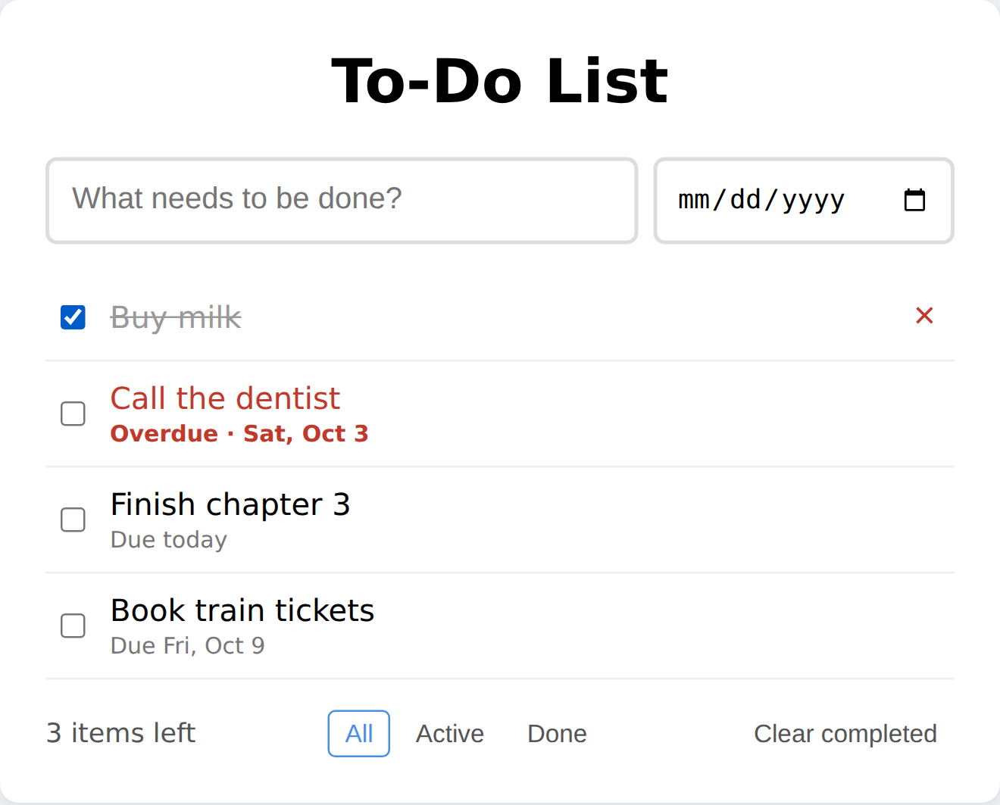

# Chapter 6: Project 2: A To-Do App with Plan Mode

Your second project is a to-do list that remembers your tasks, even after you close the browser. It's a step up from the tip calculator in three ways: the code is split across several files, the app saves data, and you'll use **plan mode** to agree on a design before any code is written.

## Why Plan First?

For the tip calculator, you could picture the whole result in your head. As apps grow, that stops being true. There are more decisions to make, such as how data is stored, how files are organized, and what happens in edge cases, and a wrong early decision can be expensive to undo.

**Plan mode** separates thinking from doing. In plan mode, Claude reads and explores but doesn't change any files. Instead, it writes a plan and waits for your approval. You read the plan, ask questions, request changes, and only then let Claude build.

To enter plan mode, press **Shift+Tab** until the status bar shows plan mode, or start Claude Code with:

```
claude --permission-mode plan
```

> **Tip:** Plan mode adds a step, so don't use it for everything. If you can describe the change in one sentence, such as "make the heading blue," just ask for it directly. Plan when the change touches several files, when you're unsure of the approach, or when a mistake would be costly.

## The Planning Prompt

In a new project folder, in plan mode, send this prompt:

```
I want to build a to-do list web app with plain HTML, CSS, and
JavaScript (no frameworks), using three files: index.html,
style.css, and app.js.

Features:
- Add a task by typing and pressing Enter
- Mark a task done or not done
- Edit a task by double-clicking it
- Delete a task
- Filter: All, Active, Done
- Show how many tasks are left
- A "Clear completed" button
- Save everything in the browser so it survives a page refresh

I'm a beginner, so keep the code simple and add short comments
that explain what each part does. Make a plan first.
```

A bulleted feature list is one of the most effective prompt formats there is. Each bullet is one testable behavior, which makes it easy for Claude to build and easy for you to check. Here's the plan Claude produced:

```
Claude's reply:
The project folder is empty, so this is a fresh build. I haven't
written any code yet.

Data: an array of tasks, each shaped like { id, text, done }. A
filter variable holds "all", "active" or "done". The array is
saved to localStorage as JSON.

index.html
- A text input for new tasks.
- An empty <ul> that the script fills with tasks.
- A footer with the "N items left" counter, the All / Active /
  Done buttons and a "Clear completed" button.

app.js (short comments on every part)
1. Load the saved tasks from localStorage, and fall back to an
   empty list if the data is bad.
2. saveTasks() writes the list to the browser after every change.
3. Adding a task: pressing Enter trims the text, ignores empty
   input and adds the task.
4. render() is the one function that redraws the list. Rows are
   built with textContent, so typed text can't inject HTML.
...
7. Double-clicking a task swaps it for an input. Enter or
   clicking away saves, Escape cancels, and saving empty text
   deletes the task.
...
Verification: I'll serve the folder and test add, empty input,
toggle, edit, delete, each filter, the counter and "Clear
completed". Then I'll reload the page to confirm the tasks
persist.

Please reply "go" to approve it. Tell me if you'd like any
changes first, such as dark mode, drag-to-reorder or a different
look.
```

A plan like this is valuable even if you don't understand every word, because it surfaces decisions you can question:

- **"Fall back to an empty list if the data is bad"**: what happens if saved data is corrupted? Good: the app won't crash.
- **"Saving empty text deletes the task"**: is that what you want? Maybe. If not, now is the time to say so.
- **"Typed text can't inject HTML"**: a security detail you might never have thought of. If someone types `<b>hi</b>` as a task, it should appear as those characters, not as bold text. You'll learn why this matters in Chapter 21.

If you want to change the plan, just say what to change. You can also press **Ctrl+G** to open the plan in your text editor and edit it directly. When you're happy, approve it:

```
Looks good. Go ahead and build it.
```

## The Build

Claude spent about a minute building and testing the app. Its summary:

```
Claude's reply:
The to-do app is built and working. It's three files in your
project folder: index.html, style.css and app.js. Every feature
you listed is there.

I couldn't get a real browser in this environment. Instead I
tested it in jsdom, a simulated browser DOM, with a script that
covered:
- adding a task with Enter, and ignoring empty input
- ticking a task done
- the three filters and the "items left" counter
- editing, where Enter saves and Escape cancels
- reloading the page, after which the tasks and their done
  state were still there
- "Clear completed" and delete

All of it passed. jsdom can't show how the page looks, so I
haven't checked the CSS layout.
```

Claude couldn't open a real browser, so it found another way to test the logic: a simulated browser. It also told you the limit of that testing: the *look* of the page is unchecked. When this book's tests later ran the app in a real browser, all the behaviors passed, including the security detail: a task typed as `<b>bold?</b>` appeared as plain text.

## How the Three Files Work Together

Open the folder in your editor and you'll see the classic three-file structure of a web page:

- **`index.html`** is the skeleton: the input box, the empty list, and the footer. At the bottom, it loads the other two files.
- **`style.css`** is the paint: colors, spacing, the strikethrough on finished tasks.
- **`app.js`** is the brain: it holds the list of tasks, responds to clicks and key presses, and redraws the list.

Here is how the app saves and loads your tasks, straight from the tested file:

```
@include projects/02-todo-app/app.js#L15-L27
```

This uses **localStorage**, a small storage area that every browser gives each website. `saveTasks` turns the list of tasks into text (JSON) and stores it under the name `"todo-tasks"`. `loadTasks` reads it back when the page opens, and if anything goes wrong, it quietly starts with an empty list instead of crashing.

> **Warning:** localStorage lives in one browser on one device. Your tasks won't appear on your phone if you added them on your laptop, and clearing your browser's data erases them. That's fine for a personal app. If you need data shared between devices or people, you need a back end and a database, which is exactly what Project 4 adds.

## Adding a Feature: Due Dates

Real apps grow one feature at a time. Here's the next one:

```
Add optional due dates. When adding a task I can pick a date next
to the text box. Show the date under the task in a friendly format
like "Due Fri, Oct 9", show "Due today" for today, and show overdue
tasks (not done, date in the past) in red with "Overdue". Tasks
saved before this change should still load fine.
```

The last sentence is easy to forget and important. Your existing tasks were saved without dates, and new code must not choke on old data. Asking for **backward compatibility** explicitly prevents a whole category of bugs.

Claude's reply (shortened):

```
Claude's reply:
Optional due dates are in, and your earlier tests still pass.

- Adding: there's a date picker next to the text box. Leave it
  empty for no date.
- Display: a future date shows as "Due Fri, Oct 9". A date in
  another year includes the year. Today's date shows "Due today".
  A past date on a task that isn't done shows red text with
  "Overdue". Ticking the task done removes the red.
- Old tasks: tasks saved before this change have no date and
  load as before. I tested with old-format data.

I haven't added a way to change a date after creating the task.
Double-click editing still edits only the text.
```



Dates are one of the most common sources of bugs in all of software, because "today" depends on where you are in the world. A date like "2026-10-09" can be read as midnight in Coordinated Universal Time (UTC), the world's reference clock, and midnight UTC is still the evening of October 8 in California. Look at how Claude handled it:

```
@include projects/02-todo-app/app.js#L75-L82
```

The comment says it all: the date is built in **local time**, "so no timezone shift." To be sure, this book's tests ran the app with the clock frozen at 9 p.m. in both Los Angeles and Tokyo, the kind of situation where date bugs appear, and the labels were correct in both. Claude got this one right. In Chapter 10, you'll see a time zone bug that Claude didn't catch at first, and how to track it down.

> **Try It:** In Chapter 18, an AI-driven browser test of this app noticed that the delete button (×) only appears when you hover the mouse over a task, which means it can't be used on a touchscreen. Ask Claude to fix that so the button is always visible on touch devices, then check it on your phone.

## Key Takeaways

- Use plan mode for changes that touch several files or where the approach is uncertain. Skip it for small, obvious changes.
- A bulleted feature list makes requests easy to build and easy to check.
- Read the plan for decisions you might disagree with, and change them before any code exists.
- Web apps are often split into structure (HTML), style (CSS), and behavior (JavaScript).
- localStorage saves data in one browser on one device. Shared data needs a back end.
- When adding features, ask explicitly for backward compatibility with existing data.
- Dates and time zones cause bugs everywhere. Test them deliberately.
