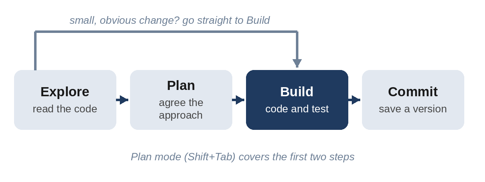

# Chapter 7: Talking to Claude Code: Prompt Patterns That Work

You've now built two apps, and you've seen that the quality of the result depends heavily on the quality of the request. This chapter collects the patterns that work best, so you can use them deliberately rather than by luck.

## The Four Ingredients of a Good Request

Almost every effective request to Claude Code contains four ingredients:

1. **The goal**: what you want to exist or change. "Add due dates to tasks."
2. **The context**: what Claude needs to know that it can't see. "The app is used on phones." "Tasks saved by the old version have no dates."
3. **The constraints**: what to avoid or keep. "No external libraries." "Don't change the database."
4. **What "done" looks like**: how you and Claude will know it worked. "Run the tests and make sure they pass." "Check the math with a $100 bill split 3 ways."

The fourth ingredient is the one beginners forget, and it's the most powerful. Claude stops when the work *looks* done. If you give it a way to check, such as a test, an example, or a command to run, it can keep going until the work *is* done, and show you the evidence.

| Vague request | Better request |
| --- | --- |
| "Make a login page." | "Add a login page with email and password fields. Show a clear error if either is empty. Don't build accounts yet; just the form. Check that the page loads with no errors in the browser console." |
| "Fix the bug." | "When I add a task with an empty name, a blank row appears. Empty or spaces-only names should be ignored. Fix it and add a test for this case." |
| "Make it look better." | "Make the page look clean and modern: more white space, a single accent color, larger text on phones. Keep the layout and features the same." |
| "Add tests." | "Write pytest tests for the summary command, including an empty file, one category, and a month with no expenses. Run them and fix any failures." |

## Explore, Plan, Build, Commit

For anything bigger than a small fix, use a four-step rhythm:

1. **Explore**: let Claude read the relevant files first. "Read app.py and explain how habits are stored. Don't change anything yet."
2. **Plan**: ask for a plan, in plan mode. Read it, question it, adjust it.
3. **Build**: approve the plan and let Claude implement it, including running the checks you agreed on.
4. **Commit**: save a version once it works.



This rhythm prevents the most expensive mistake in vibe coding: a lot of fast work that solves the wrong problem.

## Let Claude Interview You

When you have an idea but not a clear picture, ask Claude to ask *you* the questions:

```
I want to build <brief description of your app>. Interview me
about it, one question at a time. Ask about the features, who
will use it, what could go wrong, and anything I might not have
thought of. When we've covered everything, write a complete
specification to SPEC.md.
```

The questions will surprise you. Should finished tasks disappear or stay visible? What happens if two people edit at once? What if the internet drops? You'll end up with a written **specification**, a document describing what to build, and Chapter 9 shows how powerful building from a spec can be.

> **Tip:** After the interview, start a fresh session with `/clear` before building. The new session starts with clean context, focused entirely on the spec, rather than carrying the whole interview along.

## Point to Specifics

Claude can search your project, but you'll get faster, more accurate results when you point it at the right place:

- **Name files** with `@`: "In @app.js, the counter is wrong after deleting a task."
- **Point to existing patterns**: "Add an 'export' command that works the same way as the existing 'summary' command."
- **Paste errors in full**: copy the entire error message, not your summary of it. The details matter.
- **Paste screenshots**: "Here's what the page looks like on my phone [image]. The buttons overflow on the right. Fix the layout."
- **Give links** to documentation when you're using a specific service or library.

## Work in Small Steps

AI can write a lot of code quickly, which tempts you to ask for everything at once. Resist. A request like "build a complete social network with profiles, messaging, and payments" produces a huge amount of code that's hard to check and hard to fix.

Instead, build in thin slices, testing and committing after each one:

1. "Create the page with a list of posts from sample data."
2. "Let me add a new post through a form."
3. "Save posts in a database so they survive a restart."
4. "Add a delete button with a confirmation."

Each slice is small enough to understand, test, and undo if needed.

## Ask for Evidence, Not Promises

"I've fixed it" is a claim. Evidence is better: test output, the command that was run and what it printed, or a screenshot. Build the request for evidence into your prompts:

```
Fix the bug, run the tests, and show me the test output.
```

```
After the change, start the server, load the main page, and
tell me the HTTP status code you got.
```

You saw this pay off in Chapter 5, when "check your math and tell me the results" produced a table of verified examples, and led Claude to discover and fix a deeper rounding problem.

## Course-Correct Early

If Claude starts going the wrong way, stop it with Esc and redirect immediately. Waiting until it finishes means more to undo.

If you've corrected Claude twice on the same issue, and it's still wrong, the conversation is probably cluttered with failed attempts. At that point:

1. Rewind (Esc twice) or use Git to get back to a good state.
2. Type `/clear` to start a fresh conversation.
3. Write a better first prompt that includes what you learned: "Add due dates. Important: build dates in local time, not UTC, and keep old tasks without dates working."

A clean session with a sharper prompt almost always beats a long session full of corrections.

## Ask Questions Before, During, and After

The best vibe coders ask a lot of questions. Some of the most useful:

- "What are two or three ways to build this, and what are the tradeoffs?"
- "What could go wrong with this approach?"
- "What did you assume that I didn't tell you?"
- "Explain this change as if I'm new to coding."
- "What should I test by hand to be confident this works?"
- "Is there anything here that could be a security problem?"

The answers improve the code, and they teach you the things you need to know to check it.

## Common Mistakes

**The kitchen-sink session.** You start on one task, ask about something unrelated, then go back. Claude's context fills with irrelevant details. Fix: `/clear` between unrelated tasks.

**"Make it better."** Claude will change things, but not necessarily the things you care about. Fix: say what "better" means.

**Accepting without testing.** The code looks plausible and the reply sounds confident. Fix: always test, especially the awkward cases.

**The mega-prompt.** Five features in one request, with no way to check any of them. Fix: one slice at a time.

**Fighting the AI.** Correcting the same mistake over and over. Fix: rewind, clear, and write a better prompt.

## Four Templates to Start From

**Build a feature:**

```
Add <feature> to <app>. It should <behavior>. <Context Claude
can't see>. Don't <constraint>. When you're done, <how to
verify>, and show me the result.
```

**Fix a bug:**

```
Bug: when I <steps to reproduce>, I expect <expected>, but I
get <actual>. Here's the full error: <paste>. Find the cause,
write a test that fails because of it, then fix it and show me
the test passing.
```

**Understand code:**

```
Explain how <feature> works in this project. Walk me through the
files involved, in order, in plain English. Don't change
anything.
```

**Improve code safely:**

```
Simplify <file or function> without changing what it does. Run
the tests before and after, and tell me what you changed and why.
```

Appendix A contains forty more prompts, organized by task.

> **Try It:** Take the one-sentence app ideas you wrote down in Chapter 1. Pick one and run the interview prompt from this chapter. Save the resulting SPEC.md; you might build it after Chapter 9.

## Key Takeaways

- Good requests contain a goal, context, constraints, and what "done" looks like.
- Giving Claude a way to verify its work is the single most powerful habit.
- For bigger changes: explore, plan, build, commit.
- Let Claude interview you to turn a vague idea into a written spec.
- Point to specific files, patterns, errors, and screenshots.
- Build in small slices, and commit after each one.
- After two failed corrections, rewind, clear, and write a better prompt.
