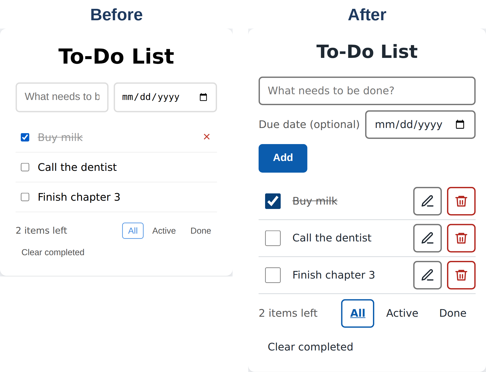

# Chapter 8: Design That Works for Everyone: UI, UX, and Accessibility

Your to-do app works. But "works" isn't the same as "pleasant to use," and it's certainly not the same as "usable by everyone." In this chapter, you'll ask Claude for a design and accessibility review of the to-do app, apply the fixes, and then test the result in a real browser. You'll find bugs that Claude's own tests missed, and you'll learn one of the most useful lessons in vibe coding: check what the AI says it *didn't* test.

## UI and UX in Plain English

Two terms come up whenever people talk about design:

- **UI (user interface)** is what people see and touch: the layout, colors, text, buttons, and icons.
- **UX (user experience)** is how it feels to use: whether people understand what to do, can do it quickly, and recover easily from mistakes.

A beautiful app can have terrible UX (a gorgeous button nobody can find), and a plain app can have great UX. Good apps get both right.

**Accessibility** is the part of UX that makes sure an app works for people with disabilities: people who are blind and use a **screen reader** (software that reads the screen aloud, such as VoiceOver on Apple devices and TalkBack on Android), people with low vision who zoom in or need strong contrast, people who can't use a mouse and rely on a keyboard, and people with shaky hands who need big tap targets. Accessibility also helps everyone else: big buttons are easier for anyone on a bumpy bus, and good contrast helps anyone reading in bright sunlight.

## Seven Principles to Ask For

You don't need to be a designer to steer design. These seven principles cover most of what makes an interface good, and each one translates into a concrete request:

1. **Clarity.** Every control says what it does. *"Label every button with words or a clear icon plus an accessible name."*
2. **Hierarchy.** The most important thing is the most visible. *"Make today's total the largest thing on the screen."*
3. **Consistency.** Similar things look and behave the same everywhere. *"Use the same button style on every screen."*
4. **Feedback.** Every action visibly does something. *"After saving, show a short confirmation."*
5. **Forgiveness.** Mistakes are easy to undo. *"Add an Undo after deleting."*
6. **Touch-friendly sizing.** Fingers are bigger than mouse pointers. *"Every tap target must be at least 44 by 44 pixels."*
7. **Accessibility.** It works with screen readers, keyboards, zoom, and strong contrast. *"Follow WCAG 2.2 AA."*

**WCAG** (Web Content Accessibility Guidelines) is the international standard for accessible web content, and level AA is the level most laws and organizations aim for. Two of its rules are easy to remember: normal text needs a **contrast ratio** of at least 4.5:1 against its background, and the borders of buttons and inputs need at least 3:1. For touch targets, Apple's design guidelines recommend at least 44 by 44 points and Google's Material Design recommends 48 by 48; the WCAG AA minimum is smaller, so aiming for 44 or more keeps you comfortably safe.

## The Review Prompt

Here's the prompt, sent in the to-do app's folder:

```
Do a UX and accessibility review of this to-do app, with phones
in mind. Many people will use it on a touchscreen, some with
screen readers, and some with poor eyesight.

First list the problems you find, worst first, and explain why
each one matters to a real person. Then fix them without
changing the app's features. Follow common guidelines: WCAG 2.2
AA for contrast and labels, and touch targets of at least 44 by
44 pixels. Keep the clean, simple look.
```

Notice the ingredients from Chapter 7. The goal is a review and fixes. The context is who uses the app ("phones," "screen readers," "poor eyesight"). The constraints are "without changing the app's features" and "keep the clean, simple look." And "done" is defined by named guidelines with numbers, which Claude can measure against.

Claude's reply (shortened):

```
Claude's reply:
I fixed the problems below without changing any feature. The
earlier tests and a new accessibility test all pass, but I only
tested in jsdom, which doesn't render CSS. So the layout, sizes
and touch targets are unchecked in a real browser, and I haven't
tried a screen reader.

1  Each task has an Edit button for touch, keyboard and screen
   readers. Double-click still works.
2  Delete is always visible, 44px or more, and labelled with the
   task, for example "Delete Buy milk".
3  The checkbox is linked to the task text, so screen readers
   read the task's name. It has a 44x44 tap area, and tapping
   the text toggles it.
4  Focus now stays where it was after ticking, editing or
   adding.
5  Contrast is fixed.
6  The text box has a hidden label for screen readers, and the
   date picker has a visible "Due date (optional)" label.
...
Contrast (WCAG AA needs 4.5:1 for text and 3:1 for borders):
body text 14.8:1, grey secondary text 7.0:1, input and button
borders 4.5:1, blue 6.7:1, red 6.5:1.

Not done: Delete has no undo, so a mis-tap is permanent. A real
fix means adding a feature. Say so if you want an undo.

Please try it on a real phone, and with VoiceOver or TalkBack if
you can.
```

The full list had fourteen items. The most important one is number 2: before the review, the delete button appeared only when a mouse hovered over a task, so on a phone you couldn't delete anything. Item 4 matters a lot to keyboard and screen reader users: when the list redraws, the browser forgets which control was focused, and the user is thrown back to the top of the page.

Look at the first paragraph again, though. Claude tested in **jsdom**, a simulated browser that runs JavaScript but doesn't draw anything. It said so plainly, and it asked for a real-phone check. That's the cue to test it yourself.

## Testing in a Real Browser

This book's tests drive a real browser (Chromium, through Playwright), so they were run against the redesigned app. Two of them failed.

**Bug 1: double-click editing was broken.** Double-clicking a task ticked it done and then unticked it, and the edit box never appeared, even though Claude's reply said "Double-click still works." Here's the bug report sent back:

```
Bug found when testing in a real browser (Chromium): double-click
editing no longer works. Double-clicking a task's text toggles it
done and back, and the edit box never appears. The Edit button
still works. Find the cause, fix it so double-click editing works
again without losing the accessibility improvements, and explain
why your earlier tests didn't catch it.
```

Asking "why didn't your tests catch it?" is worth doing every time. The answer tells you how much to trust the next claim. Claude's reply (shortened):

```
Claude's reply:
Cause: In the accessibility pass I made the task text a
<label for="..."> linked to the checkbox. A real double-click
fires click, click, then dblclick.
1. Each click on that label toggled the checkbox.
2. Each toggle rebuilt the whole list.
3. The text element was destroyed and replaced before dblclick
   fired, so the edit handler never ran.
4. The two toggles cancelled out, which is the "done and back"
   you saw.

Why my earlier tests missed it: My double-click test fired a
bare dblclick event on the text. Real browsers fire click, click
and dblclick in that order.
```

**Bug 2: Enter reopened the editor.** After that fix, pressing Enter to save an edit saved the text and then immediately opened the edit box again. The cause was subtle: the new focus-restoring code moved focus to the task's Edit button after saving, and the browser then treated the same Enter press as a click on that button. The fix was one line, and Claude left a comment explaining it:

```
@include projects/02-todo-app/app.js#L256-L265
```

Both bugs came from accessibility improvements interacting with real browser behavior, and a simulated browser couldn't see either one. Neither is a reason to skip accessibility work. They're reasons to test in a real browser.

## Fixing the Layout from a Screenshot

The app now worked, but on a phone it looked cluttered: each task's buttons wrapped onto a second line. When something *looks* wrong, a screenshot is the fastest way to say so:

```
Here's a screenshot of the app on a phone (390 pixels wide):
phone-screenshot.png. The accessibility fixes work, but the
layout got cluttered: each Delete button wraps onto its own line
under the task, so the list is twice as tall and looks messy.

Make each task fit on a single row on a phone again, as clean as
before, while keeping every accessibility improvement: 44 px tap
targets, visible buttons, clear labels, and contrast. Compact
icon buttons with accessible names are fine. Check the layout
at 390 px and at 320 px wide.
```

The 320-pixel width is the narrowest common phone screen; if a layout works there, it works almost everywhere. Claude's reply (shortened):

```
Claude's reply:
Each task now fits on one row, with Edit and Delete beside it
and not wrapped underneath. I checked this in a real Chromium at
both 390px and 320px.

- Icon buttons: Edit and Delete are now 44x44px icon buttons, a
  pencil and a trash can. They are always visible and keep their
  borders.
- Accessible names: each button still has a full name, such as
  "Delete Buy milk". The icons are hidden from screen readers,
  so nothing is read twice.

Last time I could only simulate browser behaviour. This time I
found a real Chromium at /opt/pw-browsers and wrote real.py,
which uses genuine mouse and keyboard events. I missed that
browser in earlier rounds, which is why the double-click and
Enter bugs slipped through.

I haven't checked the layout on a real phone's touch screen,
only at those two widths in desktop Chromium.
```



An **icon button** with an **accessible name** is a common pattern: sighted users see a trash can, and screen reader users hear "Delete Buy milk." Notice also that Claude admitted it had missed an available browser in earlier rounds. That honesty is useful, and you'll get more of it if you ask "how did you check?" as a habit.

The new style sheet starts with named colors, each with its contrast ratio recorded in a comment. Keeping colors in one place like this, as **design tokens**, makes the design consistent and easy to change:

```
@include projects/02-todo-app/style.css#L1-L8
```

## Automating the Accessibility Checks

Some accessibility rules can be checked by a program, and those checks belong in your test suite so they never regress. This book's tests now check that every button on a phone-sized screen is at least 44 pixels tall, and that taps near the checkbox, not only on it, toggle the task:

```
@include tests/test_02_todo_app.py#L142-L153
```

They also run **axe-core**, a widely used open-source accessibility checker, over the page and fail if it reports any violation of WCAG A and AA rules or of its best practices:

```
@include tests/test_02_todo_app.py#L163-L167
```

You don't need to write these yourself. Ask: "Add browser tests that check tap target sizes on a phone-sized screen and run axe-core on the page. Fail on any violation." You can also run the accessibility audit in your browser's developer tools (Lighthouse in Chrome) for a quick check.

Automated checks catch perhaps the easier half of accessibility problems: missing labels, low contrast, tiny targets. They can't tell you whether the screen reader experience makes sense, or whether the layout is confusing. For that, try the app yourself with VoiceOver or TalkBack for five minutes, using only the keyboard, and zoomed to 200 percent. You'll learn more than any tool can tell you.

> **Note:** Every result in this chapter can be reproduced. The redesigned app is in `projects/02-todo-app`, the version from Chapter 6 is in `projects/02-todo-app/before-redesign`, and the tests are in `tests/test_02_todo_app.py`.

## Getting the Look You Want

The review fixed problems. When you want to change the overall look, describe it the way you'd brief a designer:

- **Describe the feeling and the audience.** "Calm and minimal, for adults tracking health habits" gives Claude more to work with than "make it nice."
- **Show examples.** Paste a screenshot of an app you like, or of a sketch on paper. Claude can read images.
- **Fix the basics first.** One accent color, one or two fonts, consistent spacing, and generous white space go a long way.
- **Ask for options.** "Show me three different color schemes as separate HTML files, so I can open them side by side." Choosing is easier than describing.
- **Design for phones first.** Most people will see your app on a phone. A layout that works on a narrow screen is easy to widen; the reverse is hard.
- **Support dark mode.** Many people use it all day. Ask for it from the start, using the system setting, and test both modes.

## Best Practices for UI and UX

- **Name the users and their situations** in every design prompt: phones, screen readers, poor eyesight, slow connections.
- **Ask for measurable targets**: WCAG 2.2 AA, 44-pixel targets, specific widths to check (320 and 390 pixels).
- **Ask for problems first, fixes second**, so you can see the reasoning and choose what to fix.
- **Read what Claude didn't test**, and test that yourself, in a real browser and ideally on a real phone.
- **Test real interactions**: double-clicks, the Enter key, touch, and keyboard-only use. Simulated events can hide real bugs.
- **Put measurable rules in automated tests**, such as target sizes and axe-core, so they stay fixed.
- **Never rely on color alone.** The selected filter in the redesign is also bold and underlined, so it's clear without color vision.
- **Keep design tokens in one place**, with their contrast ratios noted.
- **Make destructive actions forgiving**: confirmation, or better, Undo.
- **Spend five minutes with a screen reader and the keyboard** before you share an app. Nothing else gives you the same insight.

> **Try It:** Run the review prompt from this chapter on your own tip calculator from Chapter 5. Then open the result on your phone and try it with the screen reader turned on (VoiceOver on iPhone, TalkBack on Android). What does it say when you tap each button?

## Key Takeaways

- UI is how an app looks; UX is how it feels to use; accessibility makes it work for everyone.
- Seven principles cover most good design: clarity, hierarchy, consistency, feedback, forgiveness, touch-friendly sizing, and accessibility.
- A good review prompt names the users, the guidelines with numbers, and what must not change.
- Claude told us it had tested only in a simulated browser. Real-browser testing then found two bugs its tests had missed.
- Screenshots are the fastest way to describe layout problems.
- Automate what you can measure (target sizes, axe-core), and check the rest yourself with a screen reader, a keyboard, and zoom.
