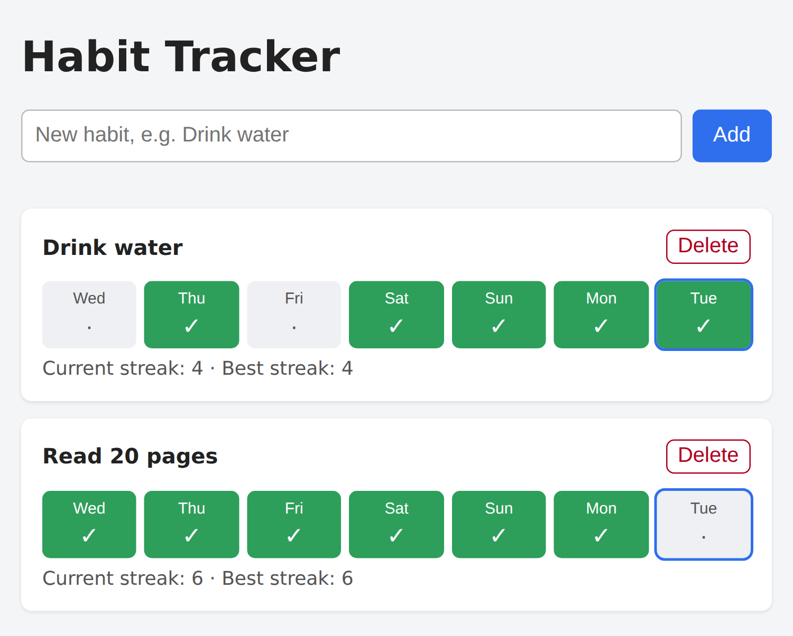

# Chapter 9: Project 4: A Full-Stack Habit Tracker

Your fourth project is a real web application with both halves: a front end in the browser and a back end with a database. It tracks daily habits, such as "Drink water" or "Read 20 pages," and shows streaks. This is also the project you'll keep improving for the rest of the book: debugging it, testing it, putting it online, and teaching Claude its rules.

This time you won't describe the app in a prompt. You'll write a **specification** first, and let Claude build from that.

## Why This App Needs a Back End

The to-do app stored its data in the browser. That's simple, but it means the data lives on one device and anyone can tamper with it. A habit tracker you might share with friends, or use from both your phone and laptop, needs:

- **One shared copy of the data**, stored in a database on a server.
- **Rules enforced in one place**, such as "habit names must be unique" or "you can't tick tomorrow."
- **An API**, so the page in the browser can ask the server to read and change data.

This is the classic shape of a web app, the one you saw in Chapter 2: front end, API, back end, database.

## Writing the Spec

A **specification** (spec) is a short document that describes what to build. Writing one forces you to make decisions up front, and it gives Claude a single, complete source of truth to build from and check against. You can write it yourself, or have Claude interview you and write it, as described in Chapter 7.

Here's the spec used for this project. Save it as `SPEC.md` in a new project folder:

```
# Habit Tracker: Specification

## Goal
A small web app to track daily habits, such as "Drink water" or
"Read 20 pages", and see streaks.

## Tech
- Python 3 with Flask, and SQLite (Python's built-in sqlite3).
- Plain HTML, CSS, and a little JavaScript. No front-end framework.
- Data is stored in habits.db. Tables are created automatically.

## Features
1. Add a habit by name (1 to 50 characters). Names are unique,
   ignoring upper and lower case.
2. Delete a habit, after a confirmation.
3. Each habit shows the last 7 days (oldest on the left, today on
   the right). Clicking a day marks it done or not done.
4. Each habit shows its current streak and its best streak.

## Streak rules
- The current streak is the number of days in a row, ending today,
  that are marked done.
- If today isn't marked yet, the streak ends yesterday instead, so
  it doesn't drop to 0 until the day is over.
- The best streak is the longest run of days in a row ever.

## API (JSON)
- GET    /api/habits              list habits with last 7 days and streaks
- POST   /api/habits              body {"name": "..."}; 201, 400, or 409
- DELETE /api/habits/<id>         204 or 404
- POST   /api/habits/<id>/toggle  body {"date": "YYYY-MM-DD"}; 200
  Dates in the future are rejected with 400.

## Files
app.py, templates/index.html, static/style.css, static/app.js,
test_app.py, requirements.txt, README.md

## Testing
pytest tests using Flask's test client and a temporary database.
Cover the API, validation errors, and the streak rules, including
a streak that crosses the start of a month.

## Out of scope
User accounts, reminders, editing a habit's name.
```

A few things make this a good spec:

- **The streak rules are spelled out**, including the subtle "if today isn't marked yet" rule. Without it, your streak would show 0 every morning until you ticked today, which feels like failure.
- **The API is listed** with its status codes (201 means "created," 400 means "bad request," 404 "not found," 409 "conflict," for example a duplicate name). You don't need to memorize these; Claude knows them. Listing them just makes the behavior precise.
- **The testing section names the tricky case**: a streak that crosses the start of a month, where naive date math often breaks.
- **"Out of scope" says what not to build.** This is as important as what to build. It stops the AI from adding accounts or reminders you didn't ask for.

## Setting Up and Building

Create a virtual environment and install Flask and pytest, as in Chapter 8:

```
python3 -m venv .venv
source .venv/bin/activate
pip install flask pytest
```

(On Windows, use `python` and `.venv\Scripts\Activate.ps1`, as before.) Commit the spec with Git, then send Claude this prompt:

```
Read SPEC.md and build the app it describes.

Work in small steps: first the database and the API with their
tests, then the web page. Run the tests after each step and fix
any failures. When everything passes, start the server, check
that the main page and the API respond, then stop the server.
```

The prompt is short because the spec does the heavy lifting. It adds two instructions about *process*: build in small steps with tests after each one, and finish with a real check that the server works.

Claude's reply:

```
Claude's reply:
The habit tracker is built and all 24 tests pass. I started the
server and checked it: the main page and a static file returned
200, a POST created a habit, and the list returned it. The
server is stopped, and I deleted the habits.db created by that
check. I haven't looked at the page in a browser, so the
click-to-toggle and delete-confirmation behaviour in
static/app.js is untested.

- Database and API: app.py has the Flask routes and the streak
  rules, with tables created on first start.
- Tests: test_app.py covers the API, the validation errors and
  the streak rules, including streaks that cross a month start
  (also in a leap year).
- Web page: templates/index.html, static/style.css and
  static/app.js show an add form and the last 7 days per habit.

The server decides what "today" is, so a browser in a different
timezone could see its own today rejected as a future date, or
the 7-day window off by one.
```

Read that last paragraph again. Claude spotted a real limitation in its own design and told you about it, without being asked. It's easy to skim past a remark like this. Don't. In the next chapter, that exact limitation turns into a bug report.

## Running Your App

Start the server:

```
python app.py
```

Open `http://localhost:5000` in your browser. Add a couple of habits, tick some days, and watch the streaks change. When you're finished, press Ctrl+C in the terminal to stop the server.



When this app was tested for the book in a real browser, everything Claude couldn't check worked: adding, ticking today, the duplicate-name message ("a habit with that name already exists," for "drink WATER" when "Drink water" exists), and the delete confirmation.

## A Tour of the Code

Open the folder in your editor. Here's what each file does:

| File | Role |
| --- | --- |
| `app.py` | The back end: the database setup, the streak rules, and the API |
| `templates/index.html` | The page's skeleton, sent to the browser |
| `static/app.js` | The front end's brain: calls the API and draws the habits |
| `static/style.css` | The look |
| `test_app.py` | The tests |
| `requirements.txt` | The packages the app needs |
| `README.md` | How to run and test it |

The most interesting part is the streak calculation, straight from `app.py`:

```
@include projects/04-habit-tracker/app.py#L22-L38
```

This is a **pure function**: it takes the set of done days and today's date, and returns two numbers, without touching the database or the web. Pure functions are easy to test, because you just give them inputs and check the outputs, which is why Claude's tests can cover tricky cases like month boundaries so thoroughly. When you ask Claude to build something with complex rules, it's worth asking it to "keep the rules in a pure function that's easy to test."

## How the Page Talks to the Server

When you click a day, here's what happens:

1. The JavaScript in `static/app.js` sends a request to the server: `POST /api/habits/1/toggle` with the date.
2. The server, in `app.py`, checks that the habit exists and the date isn't in the future, then adds or removes that day in the database.
3. The server recalculates the streaks and sends back the updated habit as JSON.
4. The JavaScript redraws the page with the new data.

Every web app you use works roughly like this. Once you can picture this loop, you can ask for features precisely: "Add an endpoint that returns the habit's full history, and show it as a calendar when I click the habit's name."

## Commit

```
Commit the habit tracker: app, tests, and README.
```

> **Try It:** Ask Claude to add a "notes" field so you can write a short note on any day ("ran 5 km"). Before it builds anything, ask it to update SPEC.md with the new feature, including what the API looks like. Then ask it to implement the updated spec, with tests.

## Key Takeaways

- A back end gives you shared data, enforced rules, and an API.
- A written spec is the best way to build anything non-trivial. Include the rules, the API, the tricky test cases, and what's out of scope.
- With a good spec, the build prompt can be short. Add instructions about process: small steps, tests after each, a final real check.
- Read Claude's warnings about limitations closely; they often predict real bugs.
- Pure functions keep complex rules easy to test.
- Picture the request loop: page, API, server, database, and back.
