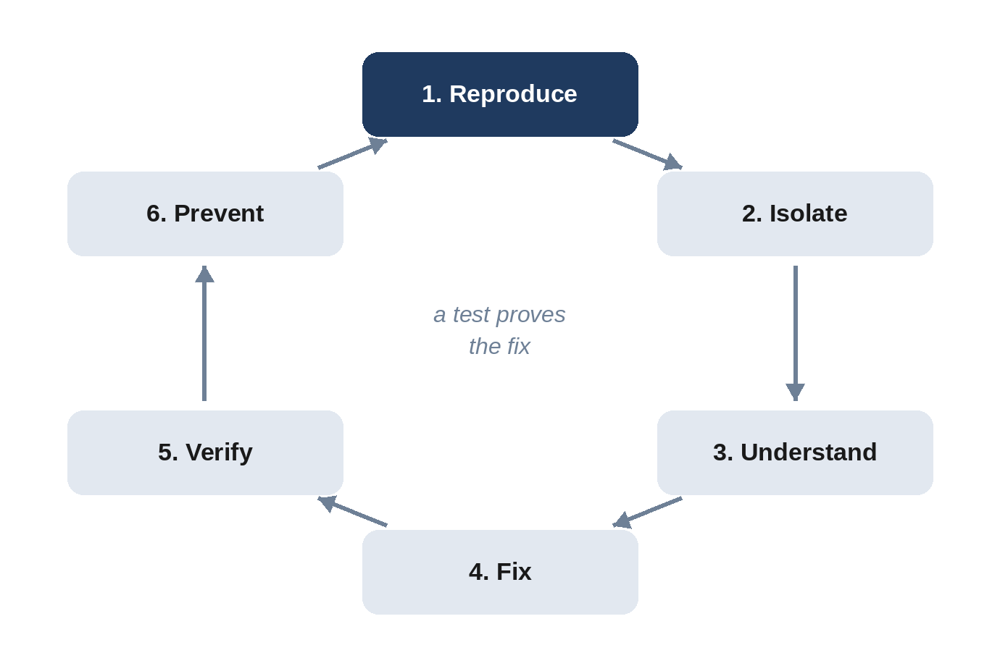

# Chapter 10: Debugging with Claude Code

Every app has bugs. Professional programmers spend a large part of their time finding and fixing them, and vibe coders are no different. The good news is that Claude Code is an excellent debugging partner, if you give it the right information. This chapter shows you how to read errors, how to report a bug so it gets fixed properly, and how to handle the hard ones. It ends with a real bug from the habit tracker, traced from a user's complaint to a tested fix.

## The Debugging Loop

Good debugging follows the same steps every time:

1. **Reproduce**: make the bug happen on purpose, reliably.
2. **Isolate**: narrow down where it happens.
3. **Understand**: find the actual cause, not just the symptom.
4. **Fix**: change the code.
5. **Verify**: show that the bug is gone.
6. **Prevent**: add a test so it can't come back unnoticed.



Claude can do most of these steps for you, but only if you insist on all six. A common failure is jumping straight from "I see the problem" to "fixed!" without understanding or verifying. You'll avoid that with one sentence in your bug reports: "write a test that fails because of this bug, then fix it."

## Reading Error Messages

Error messages look scary, but they're trying to help. Most have three parts: **where** the problem happened, **what kind** of problem it is, and a **description**. Here's a real one, from running the habit tracker without its virtual environment active:

```
Terminal output:
Traceback (most recent call last):
  File ".../app.py", line 5, in <module>
    from flask import Flask, g, jsonify, render_template, request
ModuleNotFoundError: No module named 'flask'
```

Python error reports, called **tracebacks**, are read from the bottom up. The last line is the most important: `ModuleNotFoundError: No module named 'flask'`. Python couldn't find the Flask package. The lines above show where: line 5 of `app.py`, which tries to import Flask. The fix: activate the virtual environment (or install the packages with `pip install -r requirements.txt`).

You don't need to understand every error yourself. But reading the last line first, and noticing the file name and line number, will often tell you whether the problem is in your setup or in the code.

## Common Errors and What They Mean

| Error | What it usually means | Typical fix |
| --- | --- | --- |
| `command not found` or `is not recognized` | The program isn't installed, or isn't on your PATH | Install it, or open a new terminal |
| `ModuleNotFoundError: No module named ...` | A Python package isn't installed in the active environment | Activate the virtual environment; install requirements |
| `Address already in use` | Another program (often your app, still running) is using the port | Stop the other copy, or use a different port |
| `FileNotFoundError` | The program is looking for a file that isn't there, often because you're in the wrong folder | Check your folder with `pwd`; use the right path |
| `SyntaxError` | The code itself is malformed, often from a bad edit | Ask Claude to fix it; show the full error |
| `PermissionError` or `Permission denied` | The program isn't allowed to read or write a file | Check the file's location and permissions |
| `Cannot read properties of null` (in a browser) | JavaScript is looking for a page element that doesn't exist | Check the element's ID in the HTML and the script |

Here is the "already in use" error as Flask showed it when a second copy of the habit tracker was started on the same port:

```
Terminal output:
Address already in use
Port 5055 is in use by another program. Either identify and stop
that program, or start the server with a different port.
```

Good error messages, like this one, tell you what to do. When you ask Claude to add error handling to your own apps, ask for messages like that.

## Finding Errors in the Browser

When a web page misbehaves, open the browser's **developer tools** (press F12, or Cmd+Option+I on a Mac) and click the **Console** tab. JavaScript errors appear there in red. For example, a script that looks for a button with the wrong ID produces:

```
Terminal output:
Uncaught TypeError: Cannot read properties of null (reading
'addEventListener')
```

Copy the whole message, including the file name and line number shown beside it, and paste it to Claude. If nothing appears in the Console but the page still misbehaves, look at the **Network** tab: it shows each request the page makes to the server and whether it succeeded.

## Reporting a Bug to Claude

The quality of a bug fix depends on the quality of the bug report. Include:

- **Steps to reproduce**: exactly what you did.
- **Expected**: what should have happened.
- **Actual**: what happened instead.
- **The full error message**, copied, not summarized.
- **Anything unusual**: the time of day, the device, the data you entered.

And ask for the full loop:

```
Bug: when I <steps>, I expect <expected>, but I see <actual>.
Full error: <paste>.

Find the cause. Before changing any app code, write a test that
fails because of this bug. Then fix it, run all the tests, and
explain the cause to me in plain English.
```

The "test that fails first" instruction is important. A test that fails *before* the fix and passes *after* it proves that the fix addresses this bug, rather than something else, and it stays in your project forever, guarding against the bug coming back.

## A Real Bug: "My Streak Looks Wrong"

In Chapter 9, Claude warned that the server decides what "today" is, so users in other time zones might see the wrong day. Imagine the app is online, running on a server set to UTC (as cloud servers usually are), and a friend in California sends you a complaint. For this book, that scenario was turned into the following prompt and run in Claude Code:

```
A friend is using my habit tracker after I put it online, and
sent me this bug report:

  "It's 8 p.m. on Tuesday here in California, but the app shows
  Wednesday as today. When I tick Tuesday, it counts as
  yesterday, so my streak looks wrong."

The server runs in UTC. Find the cause. Before changing any app
code, write a test that fails because of this bug. Then fix it so
"today" always means the user's own today, keep all the other
tests passing, and explain the cause to me in plain English.
```

Notice that the prompt passes on the user's words exactly, plus the one technical detail the user couldn't know: the server's time zone. Claude's reply, abridged:

```
Claude's reply:
Your friend's bug is fixed: "today" now follows their own
calendar date, and all 31 tests pass (27 existing, 4 new).

Cause, in plain English

The server worked out "today" with date.today(), which reads the
server's clock. Your server runs in UTC. At 8 p.m. Tuesday in
California it is already 3 a.m. Wednesday in UTC, so the server
decided today was Wednesday. The app built the 7-day row ending
on Wednesday, so Tuesday became "yesterday".

What I did

1. Test first. I added tests that simulate a UTC server on
   Wednesday 5 March with a user whose date is Tuesday 4 March.
   Three of them failed on the old code.
2. Fix. static/app.js now sends the browser's local date with
   every request, in an X-Client-Date header. app.py uses that
   date as "today" for the 7-day row, the streaks and the
   future-date check. If the header is missing, malformed, or
   more than one day away from the server's date, the server
   falls back to its own date. Real timezones differ from UTC by
   at most a day, so anything further out is bogus.

Limits of this fix
- A user can still claim a date up to one day off, so they could
  tick tomorrow if they set a wrong clock. That seemed fine for a
  personal habit tracker with no accounts.
```

That's the whole debugging loop in one reply: reproduced (in a test), understood (the server's clock), fixed, verified (all tests pass), and prevented (four new tests). It even ends with an honest note about what the fix doesn't cover.

Here is the heart of the fix, from the final `app.py`:

```
@include projects/04-habit-tracker/app.py#L77-L91
```

Even if you can't read Python fluently, the comment explains the reasoning, and the logic reads almost like English: use the date the browser sends, unless it's missing, malformed, or implausible.

To be sure, this book's own browser test recreated the friend's situation: a browser set to California time at 8 p.m., talking to a server running in UTC. On the original code, the test failed exactly as the friend described: the page showed the server's date as "today." On the fixed code, it passed.

> **Note:** This is a classic "works on my machine" bug. Your computer and your browser share a time zone, so you would never see it while developing. That's why reports from real users are precious, and why it's worth asking Claude, "What could behave differently when this runs on a server, or for users in other countries?"

## When Claude Gets Stuck

Sometimes the first fix doesn't work, or Claude goes in circles. Try these, in order:

1. **Ask for hypotheses, not fixes.** "List the three most likely causes, and how we could test each one, before changing anything."
2. **Add visibility.** "Add temporary logging that prints the values at each step, run it, and show me the output." Remove the logging afterward.
3. **Shrink the problem.** "Make the smallest possible example that shows this bug." Small examples often reveal the cause on their own.
4. **Find when it started.** If it used to work, Git can tell you which change broke it: "Look at the recent commits and find which one introduced this behavior."
5. **Start fresh.** Rewind or reset with Git, `/clear` the conversation, and write a new bug report with everything you've learned.

> **Tip:** Paste the *whole* error, every time. It's tempting to type "it says something about a module," but the exact module name, file, and line number are often the entire answer.

> **Try It:** Introduce a bug on purpose. In the expense tracker, ask Claude to "make the summary sort categories alphabetically instead of by amount," then run the tests. A test should fail. Read the failure message: it tells you exactly which expectation was broken. Then rewind.

## Key Takeaways

- Debug in a loop: reproduce, isolate, understand, fix, verify, prevent.
- Read error messages from the bottom up; the last line names the problem.
- Use the browser's Console and Network tabs for web page problems.
- A good bug report has steps, expected and actual results, and the full error.
- Ask for a failing test before the fix. It proves the fix and guards against regressions.
- "Works on my machine" bugs often involve time zones, servers, or other users' devices.
- When stuck: ask for hypotheses, add logging, shrink the problem, check history, or start fresh.
