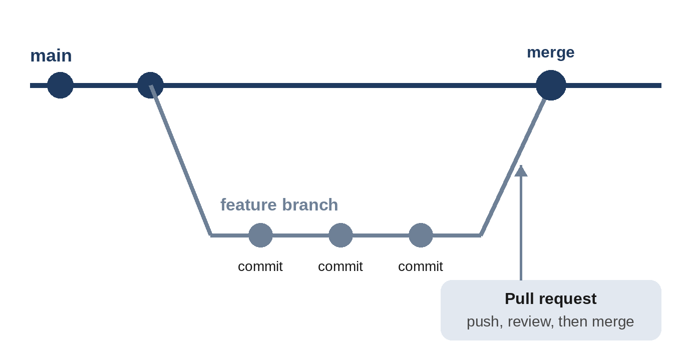

# Chapter 13: Git and GitHub for Vibe Coders

You've been committing your work since Chapter 4. This chapter explains what's really happening, shows you how to recover from mistakes, and takes your projects online with GitHub, which you'll need for deployment and automation later.

## Why Version Control Is Your Best Friend

Git gives you five superpowers:

1. **Undo**: go back to any saved version, no matter how badly things broke.
2. **History**: see what changed, when, and why.
3. **Experiments**: try a risky idea on a separate branch without touching your working app.
4. **Backup**: a copy of your project online, safe if your laptop dies.
5. **Collaboration**: work with others, or with AI agents, without overwriting each other.

For vibe coders, the first one matters most. Claude will sometimes make a change that breaks things in ways that are hard to untangle. With Git, it doesn't matter: you go back to the last good version and try again.

## The Key Ideas

- A **repository** (repo) is a project folder that Git is tracking.
- A **commit** is a saved snapshot of the whole project, with a message describing the change.
- The **working tree** is your files as they are right now, including changes you haven't committed.
- A **diff** shows exactly what changed between two versions, line by line.
- A **branch** is a separate line of work. The main line is usually called `main`.
- **Merging** brings the changes from one branch into another.
- A **remote** is a copy of the repository somewhere else, usually on GitHub. You **push** your commits to it and **pull** others' commits from it.
- A **pull request** (PR) is a proposal on GitHub to merge a branch, where changes can be reviewed and discussed first.



## Let Claude Drive Git

Claude Code is fluent in Git, so you can manage it conversationally:

```
What files have I changed since the last commit?
```

```
Show me what changed in app.js, and explain it in plain English.
```

```
Commit these changes with a clear message.
```

```
Create a new branch called dark-mode for this experiment.
```

```
Show me the last five commits.
```

Claude writes good commit messages that describe *why* a change was made, not just what. Reading them later is like reading a diary of your project.

## The Commands Worth Knowing

You don't have to type Git commands yourself, but recognizing them helps you follow what Claude is doing:

| Command | What it does |
| --- | --- |
| `git status` | Shows which files have changed |
| `git diff` | Shows the exact changes not yet committed |
| `git add -A` | Marks all changes to be included in the next commit |
| `git commit -m "message"` | Saves a snapshot with a message |
| `git log --oneline` | Lists past commits, one per line |
| `git switch -c name` | Creates a new branch and switches to it |
| `git switch main` | Switches back to the main branch |
| `git restore file` | Throws away uncommitted changes to a file |
| `git revert <commit>` | Creates a new commit that undoes an old one |
| `git push` | Uploads your commits to GitHub |
| `git pull` | Downloads new commits from GitHub |

## Recovering from Mistakes

Here's what to do in the most common situations:

**"Claude's last change broke everything, and I haven't committed."** Ask: "Discard all changes since the last commit." Claude will run `git restore` (and remove any new files it created). Your project is back to the last commit.

**"I committed something that broke the app."** Ask: "Revert the last commit." This creates a new commit that undoes it, which is safe because it keeps the history.

**"It worked yesterday, and I don't know which change broke it."** Ask: "Look through the recent commits and find which one broke the streak display." Claude can check out old versions and run the tests on each to find the culprit.

> **Warning:** Some Git commands destroy work permanently, especially `git reset --hard`, `git clean -f`, and `git push --force`. Claude's permission system treats these with caution, but if Claude ever proposes one, stop and ask what will be lost before you approve it.

## What Not to Commit

Some files should never go into Git:

- **Secrets**: API keys, passwords, and `.env` files that hold them.
- **Virtual environments** and installed packages (`.venv/`, `node_modules/`). They're large and can be recreated from `requirements.txt` or `package.json`.
- **Local data**: database files like `habits.db`, which contain real user data.
- **Temporary files**: caches, logs, and editor settings.

You list these in a file called `.gitignore`, and Git ignores anything that matches. Here's the one Claude created for the habit tracker:

```
@include projects/04-habit-tracker/.gitignore
```

When you start a new project, ask Claude to "create a suitable .gitignore." It knows the right patterns for most languages and tools.

> **Warning:** If a secret is ever committed, deleting the file afterward isn't enough: it's still in the history, and if the repository is on GitHub, you should assume someone has seen it. Revoke the key (create a new one and disable the old one) immediately. Chapter 31 covers secrets in detail.

## Putting Your Project on GitHub

GitHub stores your repositories online, privately or publicly, for free. To set it up:

1. Create an account at github.com.
2. Install the **GitHub CLI** (`gh`) from cli.github.com. It lets Claude work with GitHub directly.
3. Log in from your terminal:

```
gh auth login
```

Then, from your project folder, ask Claude:

```
Create a private GitHub repository for this project and push all
my commits to it.
```

Claude will use `gh repo create` and `git push`. Open github.com, and you'll see your project, with its full history.

> **Tip:** Start with **private** repositories. You can make a project public later, after checking that it contains no secrets or personal data.

## Working with Branches and Pull Requests

Once your project is on GitHub, a safe and professional workflow is:

1. Start each feature on a new branch: "Create a branch called habit-notes."
2. Build and test the feature, committing as you go.
3. Push the branch and open a pull request: "Push this branch and open a pull request with a summary of the changes."
4. Review the changes on GitHub. You'll see every changed line.
5. Merge the pull request when you're happy, and switch back to `main`.

This may seem like ceremony for a one-person project, but it pays off. Your `main` branch always works, your experiments are isolated, and every change has a written summary. It's also the workflow you'll automate in Chapter 29, where Claude reviews pull requests on GitHub by itself.

> **Try It:** Put the habit tracker on GitHub as a private repository. Then create a branch, ask Claude to change the color of the "Add" button, commit, push, and open a pull request. Look at the pull request on GitHub, merge it, and pull the change back to your computer.

## Key Takeaways

- Git gives you undo, history, experiments, backup, and collaboration.
- Commits are snapshots; branches are separate lines of work; pull requests propose merging them.
- Let Claude run Git for you, but learn to recognize the common commands.
- To recover: discard uncommitted changes, revert bad commits, or search history for the breaking change.
- Never commit secrets, virtual environments, or local databases. Use `.gitignore`.
- Put your projects on GitHub with the `gh` CLI, starting with private repositories.
- Branches and pull requests keep `main` working and every change reviewed.
