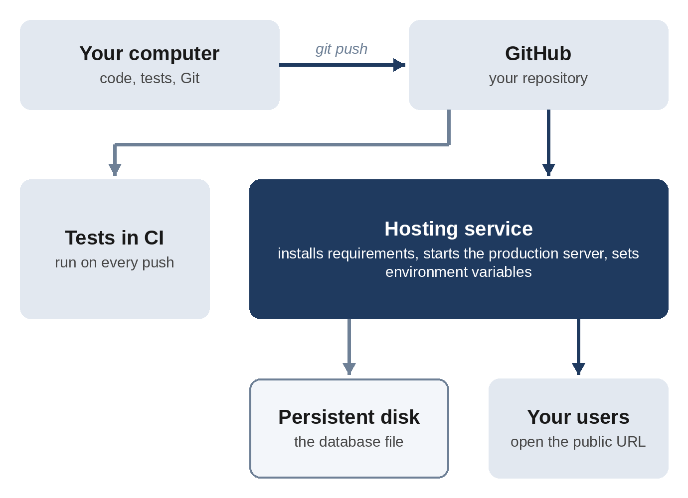

# Chapter 14: Putting Your App Online

An app on your laptop is a prototype. An app with a web address is something you can share. This chapter shows you how to deploy both kinds of app you've built: simple pages that run entirely in the browser, and full apps with a server and a database. It also covers the mistakes that most often turn a successful launch into a bad day.

> **Current as of October 2026:** Hosting services change their menus, free tiers, and prices often. The steps below describe the general process, which is the same everywhere. When a screen looks different, look for the same ideas: connect your repository, set the start command, add environment variables, and attach storage.

## Two Kinds of Apps, Two Kinds of Hosting

**Static sites** are apps made only of files the browser runs: HTML, CSS, JavaScript, and images. The tip calculator and the to-do app are static. Hosting them is easy and often free, because the server only has to hand out files.

**Dynamic apps** run code on a server: the habit tracker (Flask and a database) and Study Buddy (Flask and the Claude API). They need a host that runs your program continuously, keeps your secrets, and stores your data.

## Deploying a Static Site

Two beginner-friendly options:

**GitHub Pages.** If your project is on GitHub (Chapter 12), open the repository on github.com, go to **Settings**, then **Pages**, choose to deploy from your `main` branch, and save. After a minute, your site is live at an address like `https://your-name.github.io/tip-calculator/`. On a free GitHub account, Pages requires the repository to be public, so check it contains nothing private first.

**Drag-and-drop hosts.** Services such as Netlify let you drag your project folder onto a web page and get a live address in seconds, without Git at all.

You can also simply ask Claude: "Help me publish this static site on GitHub Pages," and it will walk you through the steps or do them with the `gh` command.

> **Tip:** When your static site is live, open it on your phone. The tip calculator was designed for phones, and seeing it work on yours, from a real web address, is a great moment.

## What a Dynamic App Needs

Running a server app for other people introduces five requirements that don't exist on your laptop:

1. **A production server.** Flask's built-in server (`python app.py`) is for development. Real deployments use a production server such as **gunicorn**, which handles many visitors at once and recovers from errors.
2. **Environment variables.** Secrets such as API keys, and settings such as the database location, are set in the host's dashboard, never in your code.
3. **Persistent storage.** Many hosts wipe your app's files every time you deploy a new version. A database stored in a normal file would be erased. You need a **persistent disk** (also called a volume) that survives redeploys.
4. **A start command.** The host needs to know how to start your app.
5. **Automatic checks.** Running the tests on every change, before it goes live.



## Preparing the Habit Tracker

Rather than learning each host's details, ask Claude to explain the risks and prepare the app:

```
I want to put the habit tracker online with a hosting service
such as Render or Railway, so my friends can use it.

First, explain in plain English what I need to change and what
could go wrong for a beginner, especially with the database.
Then make the changes needed for a production setup, and add a
GitHub Actions workflow that runs the tests on every push and
pull request. Run the tests and start the production server
locally to check it works.
```

Here are the key parts of Claude's reply:

```
Claude's reply:
What I changed
- app.py: the database location now comes from a DATABASE_PATH
  environment variable. It falls back to habits.db next to the
  code, so local use is unchanged. The app creates the folder if
  it's missing.
- requirements.txt: added gunicorn, the production server.
- Procfile: the start command. Render and Railway both give the
  app a port in PORT, and the command listens on it.
- render.yaml: a Render Blueprint that attaches a 1 GB disk and
  sets DATABASE_PATH.
- .github/workflows/tests.yml: runs pytest on every push and pull
  request.
- test_app.py: a new test that data written to DATABASE_PATH is
  still there after the app restarts.

What I checked
- Production server: I started it with the exact Procfile
  command, with two workers. The page loaded (200) and adding a
  habit returned 201.
- Restart: I stopped the server and started it again. The habit
  was still there.

Things to know
- Persistent disk: without one, you lose all data on each
  redeploy. On Render a disk needs a paid plan. The free plan
  would work, but everything resets.
- One instance only: don't scale up to more than one copy of the
  app.
- No accounts: all your friends share one habit list, and anyone
  with the link can delete habits.
```

Every item in "Things to know" is a real trap. The database warning matters most: an app that works perfectly but loses everyone's data on the next deploy is worse than no app at all. The "one instance only" note is there because a SQLite database file can't be shared between several copies of an app running on different machines. And "no accounts" means anyone with the address can see and change everything. That's fine for a few friends, and not fine for strangers.

For this book, the production setup was checked independently: the server was started with the exact start command, a habit was added, the server was stopped and restarted, and the habit was still there, in the separate folder the `DATABASE_PATH` variable pointed to.

## The Pieces Claude Added

The **start command** lives in a file called `Procfile`:

```
@include projects/04-habit-tracker/Procfile
```

It starts gunicorn, tells it how to create the app, listens on the port the host provides (or 8000 if none is given), and runs two worker processes.

The **database location** now comes from an environment variable:

```
@include projects/04-habit-tracker/app.py#L43-L50
```

And the **automatic tests** run on GitHub every time you push, thanks to this workflow file:

```
@include projects/04-habit-tracker/.github/workflows/tests.yml
```

Read it from the top: on every push or pull request, start a fresh Linux machine, check out the code, install Python 3.11, install the requirements, and run pytest. If a test fails, GitHub marks the commit with a red cross, and you know not to deploy it. This workflow file was checked with **actionlint**, a tool that catches mistakes in GitHub Actions files.

## Deploying on a Hosting Service

The exact clicks vary, but the process on services like Render and Railway is:

1. **Push** your project to GitHub.
2. **Create a new web service** in the host's dashboard and connect it to your repository.
3. **Set the build command** (`pip install -r requirements.txt`) and the **start command** (from the Procfile), if the host doesn't detect them automatically.
4. **Add environment variables**, such as `DATABASE_PATH` (and, for Study Buddy, `ANTHROPIC_API_KEY`).
5. **Attach a persistent disk** and point `DATABASE_PATH` at a file on it.
6. **Deploy.** The host gives you a public address with HTTPS (the padlock) included.

From then on, every push to `main` deploys a new version automatically. If you want help at any step, paste a screenshot of the host's page into Claude Code and ask what to do next.

> **Warning:** Before giving anyone the address of an app that calls the Claude API, make sure it has rate limits (as Study Buddy does) and that your Console has a spending limit. A public page with no limits is an open invitation to spend your money.

## The Pre-Launch Checklist

Before you share a dynamic app, check:

- **Debug mode is off.** (Chapter 13 showed why.)
- **Secrets are in environment variables**, not in code or Git.
- **Data is on a persistent disk**, and you know how to back it up.
- **The tests pass** in CI.
- **Costs are capped**: rate limits in the app, spending limits on paid APIs.
- **You know who can see what.** Without accounts, everyone sees everything.
- **Users know where their data goes**, especially if it's sent to an AI service.
- **You can roll back**: if a deploy breaks things, redeploying the previous commit should be one click.

You can ask Claude to run this checklist for you: "Review this app against a pre-launch checklist for a small public web app, and tell me what's missing."

> **Try It:** Deploy the tip calculator or to-do app as a static site, and open it on your phone. If you're feeling ambitious, deploy the habit tracker on a hosting service with a persistent disk, add a habit, trigger a redeploy, and confirm the habit survives.

## Key Takeaways

- Static sites (HTML, CSS, JavaScript only) are easy and often free to host.
- Dynamic apps need a production server, environment variables, persistent storage, a start command, and automated tests.
- Hosts often wipe files on redeploy. Put databases on a persistent disk.
- Ask Claude to explain the risks before it makes changes; the warnings are often the most valuable part.
- A GitHub Actions workflow runs your tests on every push.
- Cap costs and check privacy before sharing anything that calls a paid API.
