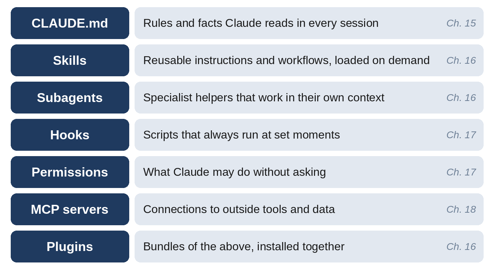
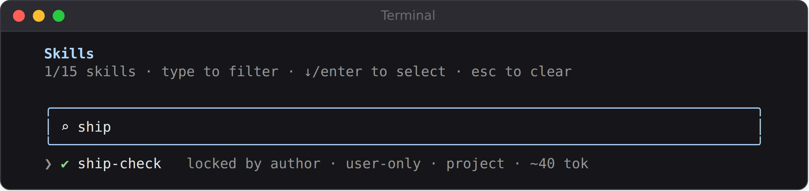

# Chapter 17: Skills, Subagents, and Plugins

CLAUDE.md teaches Claude about your project. This chapter teaches Claude new *abilities*: reusable workflows you can run with a single command (**skills**), specialist helpers that work in their own context (**subagents**), and installable bundles of both (**plugins**). You'll build a pre-commit checklist skill and a code-reviewer subagent for the habit tracker, and see both catch real problems.



## Skills: Reusable Workflows

A **skill** is a set of instructions saved in a file, which Claude follows when you invoke it, or when Claude decides it's relevant. If you find yourself typing the same long prompt again and again, it should be a skill.

Skills live in folders inside `.claude/skills/` in your project (shared with everyone who works on it) or in `~/.claude/skills/` in your home folder (just for you). Each skill is a folder containing a file called `SKILL.md`. The skill's `name` (or, by default, the folder name) becomes the command: a skill in `.claude/skills/ship-check/` runs when you type `/ship-check`.

Claude Code also comes with **bundled skills** you can use right away, such as `/code-review` (reviews your current changes for bugs), `/verify` (runs your app to confirm a change works), `/simplify` (reviews recent changes for cleanup opportunities and applies them), and `/debug` (turns on debug logging to troubleshoot Claude Code itself). Type `/` to see the full list.

## Building a Pre-Commit Skill

Before committing, a careful developer runs the tests, checks for leftover debugging code, and makes sure the documentation still matches the code. Here's a prompt that turns that habit into a skill:

```
Create a skill called "ship-check" in
.claude/skills/ship-check/SKILL.md that I run myself with
/ship-check before I commit. It should: run the tests, list the
changed files, look for leftover debug code (print statements,
console.log, TODOs) in the changes, check that README.md and
SPEC.md still match the code, and finish with a short "Ready to
commit" or "Not ready" verdict. Only I should be able to start
it, not Claude on its own. Keep it short and easy to read.
```

(For this book, the skill and the code reviewer later in this chapter were created with a single prompt that combined both requests.) Here is the skill file, as used in the final project:

```
@include projects/04-habit-tracker/.claude/skills/ship-check/SKILL.md
```

The part between the `---` lines is the **frontmatter**: settings for the skill.

- `name` and `description` identify the skill. Claude uses the description to decide when a skill is relevant.
- `disable-model-invocation: true` means only *you* can start it, by typing `/ship-check`. Use this for workflows that take time or have side effects.
- `allowed-tools` pre-approves the commands the skill needs, so it doesn't stop to ask permission for each test run or Git command.

Below the frontmatter are plain-English instructions, numbered so they're followed in order.

## Seeing It Work

To test the skill, a debug line was left in the habit tracker's code, the kind of `print` statement that's handy while investigating a problem and embarrassing in production:

```
print("DEBUG adding habit:", name)
```

To see which skills Claude Code knows about, type `/skills`. Type part of a name to filter the list:



Then `/ship-check` was run. Claude's report:

```
Claude's reply:
Ship check

1. Tests: plain pytest failed at collection because flask isn't
   installed in the default environment. In a scratch venv with
   requirements.txt installed, all 31 tests pass.
2. Changed files: M app.py (unstaged). There are no staged or
   untracked files.
3. Debug leftovers: app.py:114 has print("DEBUG adding habit:",
   name), added in the POST add-habit handler. There are no
   console.log, debugger, breakpoint(), TODO or FIXME hits.
4. Docs match code: the diff has no route, field or streak
   changes, so README.md and SPEC.md need no update.

Not ready
- Remove the debug print at app.py:114.
```

The skill found the leftover line, with its exact location, and gave a clear verdict. It also hit a realistic snag: the first version of the skill said "run `pytest`," which used the computer's default Python instead of the project's virtual environment. Claude worked around it, but the skill was then improved to say "run `python -m pytest` with the project's `.venv` Python if it exists," which is the version shown above. Skills improve like any other code: when one stumbles, fix the instructions.

## Passing Information to a Skill

Skills can take arguments. Anything you type after the command is available in the skill as `$ARGUMENTS`. For example, a skill in `.claude/skills/explain/SKILL.md` might say:

```
---
name: explain
description: Explain a file or feature for a beginner
---
Explain $ARGUMENTS to me as if I'm new to programming. Start
with what it does for the user, then walk through the code in
order, in plain English. Don't change any files.
```

Typing `/explain the streak calculation` runs it with "the streak calculation" in place of `$ARGUMENTS`.

> **Tip:** Good candidates for skills: your release checklist, "explain this file," "add a new API endpoint following our conventions," "write a weekly summary of commits," and any multi-step workflow you'd otherwise retype.

## Subagents: Specialist Helpers

A **subagent** is a separate Claude helper with its own instructions, its own set of allowed tools, and, crucially, its own **context window**. When Claude hands a task to a subagent, the subagent does the work in a fresh context and reports back a summary. This has two big benefits:

- **Focus and fresh eyes.** A reviewer subagent hasn't seen the reasoning that produced the code, so it judges the code on its own merits, like a colleague doing a review.
- **A clean main conversation.** Research that reads dozens of files happens in the subagent's context, not yours, so your main session stays uncluttered.

Claude Code already uses built-in subagents. For example, **Explore** is a fast, read-only helper Claude uses to search and understand a codebase, and **Plan** does research during plan mode. You can create your own in `.claude/agents/` (for the project) or `~/.claude/agents/` (for all your projects).

## Building a Code Reviewer

Here's the prompt used to create a reviewer for the habit tracker:

```
Create a subagent called "code-reviewer" in .claude/agents/ that
can only read files and run git commands, never edit. It reviews
recent changes for bugs, security problems, and missing tests,
explains each finding in beginner-friendly language with the
file and line, and labels each one Must fix, Should fix, or
Nice to have.
```

And here is the final file:

```
@include projects/04-habit-tracker/.claude/agents/code-reviewer.md
```

The `tools` line is what makes the reviewer safe: it has no Edit or Write tool, so it *can't* change your files, whatever it decides. One honest note about this file: Claude's first version listed `Bash(git *)` in the tools line, intending to allow only Git commands. The official documentation shows plain tool names in that field, and Claude itself pointed out that `git *` would also allow commands that change things, like `git commit`. So the final version lists plain `Bash` and states the read-only rule in the instructions. Checking AI-written configuration against the documentation is a habit worth keeping.

## Seeing the Reviewer Work

To test the reviewer, two problems were planted in the habit tracker: the debug `print` from earlier, and a subtler one. The code that deletes a habit was changed from a safe database query to one built by inserting the value directly into the query text:

```
cur = db.execute(f"DELETE FROM habits WHERE id = {habit_id}")
```

Then:

```
Use the code-reviewer subagent to review my uncommitted changes.
```

Claude handed the review to the subagent and relayed its findings:

```
Claude's reply:
Should fix
1. app.py:129, delete_habit: the delete query is now built with
   an f-string instead of a parameterized query.
   - Flask's <int:habit_id> converter only lets integers through,
     so it isn't exploitable today.
   - It would become a SQL injection hole if the route changes to
     a string or the pattern gets reused.
   - Fix: go back to db.execute("DELETE FROM habits WHERE id = ?",
     (habit_id,)).
2. app.py:114, add_habit: a leftover print("DEBUG adding
   habit:", name).
   - It writes user-supplied habit names to the server logs,
     including input that is later rejected.
   - Fix: delete the line.

Missing tests
3. test_app.py wasn't changed. The reviewer didn't check whether
   delete tests already exist.
```

Both planted problems were caught, with locations, plain-language explanations, and fixes. Notice the judgment in the first finding: the reviewer recognized that this particular query happens to be safe today, because only whole numbers can reach it, but flagged the pattern as dangerous anyway. That's the kind of nuance a good human reviewer brings. Chapter 25 explains SQL injection and why the "parameterized" version matters.

> **Tip:** Pair a writer and a reviewer. After Claude finishes a feature, run the reviewer in its fresh context before you commit. A second opinion from a helper that didn't write the code catches things the author misses.

## Skills or Subagents?

| Use a skill when... | Use a subagent when... |
| --- | --- |
| You want a repeatable workflow or checklist | You want a specialist with its own focus and tools |
| The steps should run in your main conversation | The work would clutter your main conversation |
| You'll trigger it with a command | Claude should delegate to it, or you ask for it by name |
| Example: `/ship-check`, `/explain` | Example: code reviewer, test writer, researcher |

They also combine: a skill can tell Claude to use a subagent for one of its steps.

## Plugins: Installing Bundles

A **plugin** packages skills, subagents, hooks, and MCP servers into a single unit that you can install with one command. Type `/plugin` to browse the plugins available from marketplaces, including Anthropic's official one, or install a specific plugin by name, for example:

```
/plugin install commit-commands@claude-plugins-official
```

That plugin adds commands for committing, pushing, and opening pull requests.

> **Warning:** A plugin can run code on your computer with your permissions, through its hooks and servers. Install plugins only from sources you trust, read what a plugin contains before installing it, and prefer Anthropic's official marketplace when you're starting out.

> **Try It:** Create a personal skill in `~/.claude/skills/explain/SKILL.md` using the example in this chapter, then try `/explain` on a file in each of your projects. Afterward, create a "test-writer" subagent that looks at recent changes and writes missing tests, and try it on the expense tracker.

## Key Takeaways

- Skills are reusable instructions in `.claude/skills/<name>/SKILL.md`, run with `/name` or used by Claude when relevant.
- Frontmatter controls skills: `description`, `disable-model-invocation`, and `allowed-tools`. Use `$ARGUMENTS` to pass details in.
- Bundled skills like `/code-review`, `/verify`, and `/simplify` are ready to use.
- Subagents are specialist helpers with their own context and tools, defined in `.claude/agents/`.
- Limit a subagent's tools to what it needs. A reviewer without edit tools can't change your code.
- A reviewer with fresh context catches problems the writer misses.
- Plugins bundle all of this. Install only from sources you trust.
