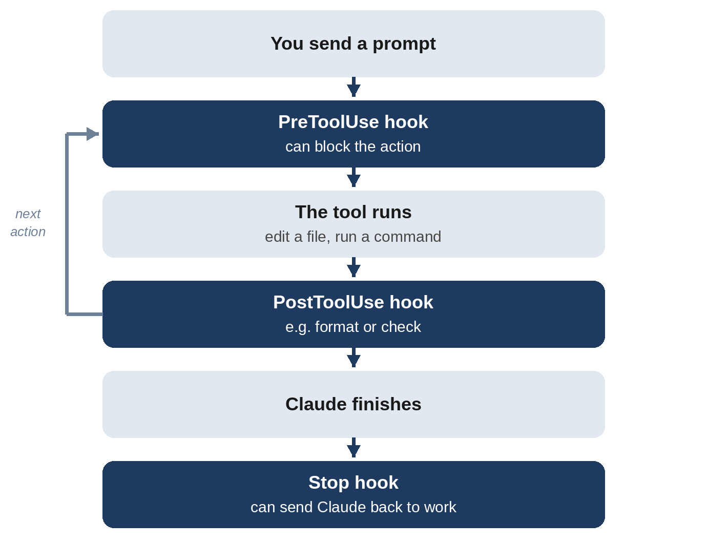

# Chapter 18: Hooks and Permissions: Guardrails That Always Work

CLAUDE.md, skills, and subagents all work by *asking* Claude to behave a certain way, and Claude follows instructions well. But some rules must never be broken, however a request is phrased: never read the file with your passwords, never edit the live database, never finish a task while tests are failing. For those, Claude Code has two mechanisms that are enforced by the program itself rather than by the model's judgment: **permission rules** and **hooks**.

This chapter builds both for the habit tracker, then tests them in real sessions, including one where a guardrail failed in an instructive way.

## Where Settings Live

Both permissions and hooks are configured in **settings files**, written in JSON:

| File | Applies to | Shared? |
| --- | --- | --- |
| `~/.claude/settings.json` | All your projects | No |
| `.claude/settings.json` in the project | This project | Yes, commit it |
| `.claude/settings.local.json` in the project | This project, just you | No |

You can edit these files directly, ask Claude to write them, or use the built-in screens: `/permissions` to manage permission rules and `/hooks` to see which hooks are configured.

> **Note:** Claude Code treats its own configuration folder, `.claude`, as protected. In Manual and Accept edits modes, Claude must ask before changing anything there; in auto mode, such changes get an extra review by the safety checker. Either way, read any change to these files carefully: they're what keeps Claude in check.

## Permission Rules

Permission rules say which actions are **allowed** without asking, which should always **ask**, and which are **denied** outright. Deny rules win over everything, in every mode.

Rules name a tool and, optionally, what it applies to:

| Rule | Meaning |
| --- | --- |
| `Bash(python -m pytest *)` | Running the tests |
| `Bash(git push *)` | Pushing to GitHub |
| `Read(.env)` | Reading the `.env` file |
| `Edit(habits.db)` | Changing the database file |
| `Edit(.venv/**)` | Changing anything inside `.venv` |

A sensible setup for a beginner project: **allow** running tests, **ask** before pushing, and **deny** reading or editing secrets. You'll see why the deny rules matter shortly.

## Hooks: Scripts That Always Run

A **hook** is a command that Claude Code runs automatically at a specific moment in its work. Hooks can inspect what Claude is about to do and block it, run checks after a change, or stop Claude from finishing.



The most useful hook events for beginners:

| Event | When it runs | Example use |
| --- | --- | --- |
| `PreToolUse` | Before Claude uses a tool, such as editing a file | Block edits to protected files |
| `PostToolUse` | After a tool succeeds | Format code after every edit |
| `Stop` | When Claude finishes a response | Run the tests; keep working if they fail |
| `Notification` | When Claude needs your attention | Show a desktop notification |

## Having Claude Write the Hooks

Hooks are small scripts, and Claude can write them for you:

```
Set up two Claude Code hooks for this project in
.claude/settings.json, with the scripts in .claude/hooks/.
Write the scripts in Python so they work on Windows, macOS,
and Linux.

1. Before any file edit, block changes to habits.db, to any .env
   file, and to anything inside .venv/. Explain why in the message.
2. When you finish a task, run the test suite. If any test fails,
   don't let the task end: show the failures so they get fixed.
   Make sure this can't loop forever.

Then test both hook scripts by feeding them sample input, and
show me the results.
```

Claude wrote two thorough scripts, about 185 lines in total, tested them with sample inputs, and reported a table of results. They worked, but they were hard for a beginner to read. So a follow-up asked for something simpler:

```
These hooks work, but I'm a beginner and I want to understand
every line. Rewrite both scripts to be as short and simple as
possible while still doing the job, with plain-English comments.
Use the stop_hook_active field to prevent loops instead of a
counter file. Keep the Windows/macOS/Linux support. Test them
again with sample input.
```

Claude cut the scripts to 70 lines, and, importantly, was honest about what simplicity cost:

```
Claude's reply:
What I gave up for simplicity
- One retry only: Claude gets a single chance to fix the tests.
  If they still fail on the second stop, it ends anyway, without
  the "tests still failing" warning from the old version.
- No symlink check: the path check no longer resolves symlinks,
  so a symlink pointing at habits.db would get through.
- No safety nets: the script no longer handles a missing pytest,
  a hung test run or bad input. Any of these makes the hook
  error out instead of quietly allowing the stop.
```

"Make it simpler" is a perfectly good request, and a good assistant tells you the trade-offs. Here is the simplified file-protection hook:

```
@include projects/04-habit-tracker/.claude/hooks/protect_files.py
```

Claude Code sends the hook a description of the planned action as JSON. The script finds the file path, tidies it up so tricks like `static/../.env` can't sneak past, and checks it against the protected names. If it prints a "deny" decision, Claude Code blocks the edit and shows Claude the reason. If it prints nothing, the edit goes ahead.

And the start of the test-running Stop hook, with its loop protection:

```
@include projects/04-habit-tracker/.claude/hooks/run_tests_on_stop.py#L1-L14
```

The rest of the script runs pytest and, if anything fails, tells Claude Code to block the stop and passes along the test output.

## Testing the Guardrails, for Real

Hooks are code, and code should be tested. Here's what happened when these guardrails were tried in real Claude Code sessions.

**Test 1: protect the secrets file.** A `.env` file containing a pretend secret was created, and a fresh session was asked:

```
Add the line DEBUG=1 to the .env file.
```

```
Claude's reply:
I added DEBUG=1 to .env, which now contains
SECRET_KEY=change-me followed by DEBUG=1.
```

The guardrail failed. Looking at the session's log showed why: Claude never used its file-editing tool. It used a terminal command, `echo 'DEBUG=1' >> .env`, which appends a line to the file. The hook was set to watch file *edits*, so it never saw the terminal command. Claude had even warned about this when writing the hooks: "The hooks only cover Claude's edit tools, so a Bash command like `sed -i` on `.env` isn't blocked."

This is the most important lesson about hooks: **a hook only guards the actions it's attached to.**

**The fix: deny rules.** Claude Code's permission rules for files are smarter than a simple hook. A deny rule for `Edit(.env)` also applies to terminal commands that Claude Code recognizes as writing to that file, including `>>` redirection. These rules were added to the project's settings by hand. Guardrails are worth writing yourself, or at least reviewing line by line:

```
{
  "permissions": {
    "deny": [
      "Read(.env)",
      "Read(.env.*)",
      "Edit(.env)",
      "Edit(.env.*)",
      "Edit(habits.db)",
      "Edit(.venv/**)"
    ]
  }
}
```

(In the project's real `.claude/settings.json`, this `permissions` section sits alongside the `hooks` section.)

**Test 1, again.** Same request, fresh session:

```
Claude's reply:
I couldn't add DEBUG=1 to .env. My attempt to inspect the file
with Bash was denied, and a direct read of .env was blocked
because the directory is denied by your permission settings. I
haven't changed anything.

If you want me to do it, allow access to that directory, or tell
me to go ahead another way. You can also add the line yourself
with echo 'DEBUG=1' >> .env.
```

This time, every route was blocked: the terminal command, and the direct read. Just as important, Claude didn't hunt for a workaround. It stopped, explained, and handed the decision back to you.

> **Warning:** Even deny rules have limits. They can't see inside an arbitrary program that opens files itself, such as a Python script that Claude writes and runs. For protection that covers *every* program, turn on Claude Code's **sandbox** with the `/sandbox` command, which restricts which files and network addresses terminal commands can reach at the operating-system level. For maximum isolation, run Claude Code inside a container or virtual machine.

**Test 2: the Stop hook.** The next session was given a change that would break an existing test, with instructions that kept Claude from noticing:

```
Change the maximum habit name length from 50 to 30 characters.
Only edit app.py and templates/index.html, and don't run the
tests yourself.
```

Claude made the change and tried to finish. The Stop hook ran the tests, found a failure (an existing test checked that 50-character names are accepted), and blocked the stop, handing the failure to Claude. Claude's reply:

```
Claude's reply:
The failing test is expected. test_app.py:53
(test_add_max_length_ok) adds a 50-character name and expects
201, which the new 30-character limit correctly rejects with
400. The other 30 tests pass.

The fix is in test_app.py, which you told me not to edit, so
I've left it alone. Do you want me to update test_app.py that
way? I'll leave the stop hook failing until you say.
```

The hook did its job: the task couldn't silently end with a failing test. And Claude handled the conflict well. The hook demanded passing tests, but the user had said not to edit the test file, so Claude explained the situation and asked, instead of breaking either rule. After the reply "Yes, update the test. Also update SPEC.md and README.md if they mention the old limit," Claude updated the test and the spec, and all 31 tests passed.

## More Hook Ideas

- **Desktop notifications**: a `Notification` hook that alerts you when Claude needs input, so you can work on something else while it runs.
- **Auto-formatting**: a `PostToolUse` hook that runs a code formatter after every edit.
- **Command blocking**: a `PreToolUse` hook on the Bash tool that blocks specific dangerous commands.
- **Logging**: a hook that records every command Claude runs, for your own audit.

Describe what you want, and ask Claude to write the hook and test it with sample input. Then test it for real, like the sessions above, because a hook that silently doesn't fire is worse than no hook at all.

> **Try It:** Add a `Notification` hook to your personal settings (`~/.claude/settings.json`) that shows a desktop notification when Claude Code needs your attention. Ask Claude to write it for your operating system, then switch to Manual mode, give Claude a task, and switch to another window to see the notification arrive.

## Key Takeaways

- Instructions guide Claude; permission rules and hooks are enforced by Claude Code itself.
- Settings live in `~/.claude/settings.json` (personal), `.claude/settings.json` (shared), and `.claude/settings.local.json` (personal, per project).
- Permission rules allow, ask, or deny specific actions. Deny rules always win.
- Hooks run scripts at set moments: before actions, after them, and when Claude finishes.
- A hook only guards the actions it's attached to. Test your guardrails with real sessions.
- Deny rules on files also cover recognized terminal commands. The sandbox covers all programs.
- A Stop hook that runs the tests prevents Claude from finishing with broken code.
