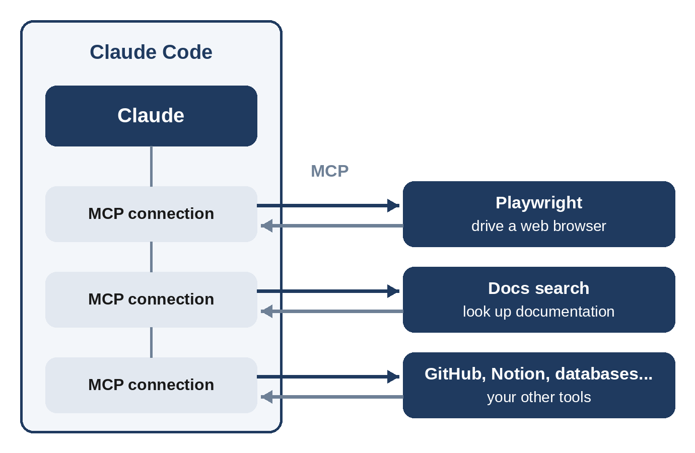
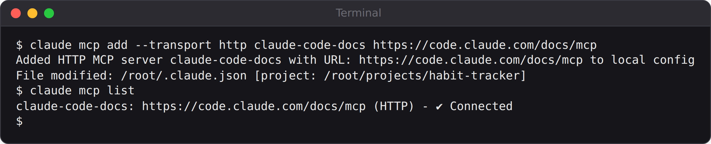

# Chapter 19: Connecting Tools with MCP

Out of the box, Claude Code can read and write files, run commands, and search the web. The **Model Context Protocol (MCP)** lets you give it more: a real web browser to test your apps, your project tracker, your design files, your database, and hundreds of other tools. In this chapter you'll connect two MCP servers and watch Claude use a browser to test the to-do app, finding a real usability problem along the way.

## What MCP Is

MCP is an open standard for connecting AI applications to tools and data. It works like a universal adapter:

- An **MCP server** is a small program that offers **tools** to an AI: for example, "open a web page," "click a button," "search the docs," or "create an issue."
- An **MCP client**, here Claude Code, connects to servers and lets Claude call their tools.

Because MCP is a standard, a server written once works with any MCP-compatible AI application. Many companies publish official MCP servers for their products.



Servers come in two kinds:

- **Remote servers** run on the internet; you connect with a URL.
- **Local servers** run as a program on your computer, which lets them use local things such as a web browser or your files.

## Your First MCP Server

Anthropic runs a remote MCP server that searches the Claude Code documentation. It needs no account, so it's a good first server. MCP servers are managed from your terminal, not inside a Claude Code session. In your project folder, type:

```
claude mcp add --transport http claude-code-docs https://code.claude.com/docs/mcp
```

When this was run for the book, Claude Code confirmed it:



Here's what each piece means: `claude mcp add` tells Claude Code about a new server; `--transport http` says it's a remote server reached by URL; `claude-code-docs` is a name you choose; and the URL is where the server lives. Check that it's working:

```
claude mcp list
```

The server should be listed as **Connected**. Now start Claude Code and use it:

```
Use the claude-code-docs server to look up what MCP_TIMEOUT does
```

Claude searched the documentation through the server and replied, in part:

```
Claude's reply:
MCP_TIMEOUT is an environment variable that sets how long Claude
Code waits for an MCP server to start and connect. The value is
in milliseconds, and the default is 30 seconds.

- Usage: MCP_TIMEOUT=60000 claude raises the limit to 60
  seconds.
- When to raise it: a stdio server's first run can be slow while
  npx downloads the package.
- Tool calls: MCP_TIMEOUT doesn't cover them. They use
  MCP_TOOL_TIMEOUT instead.
```

> **Tip:** You don't normally need to name the server in your prompt; Claude picks relevant tools on its own. Naming it is useful when you want to be sure the answer comes from that source.

## Giving Claude a Browser

The most useful MCP server for vibe coders is probably **Playwright**, which gives Claude a real web browser it can navigate, click, type into, and screenshot. It runs locally and needs **Node.js** (version 18 or later, from nodejs.org). Add it with:

```
claude mcp add playwright -- npx -y @playwright/mcp@latest
```

Everything after the `--` is how Claude Code launches the server program. `npx` downloads and runs the Playwright MCP package; `-y` skips the confirmation prompt. The first connection can take a moment while it downloads.

> **Note:** In the environment used to test this book, the browser ran on a server with no screen, which needed two extra options (`--headless` and `--no-sandbox`). On a normal computer, the command above is all you need, and you'll see a browser window open and move by itself.

Now serve the to-do app as it was at the end of Chapter 6, before the Chapter 8 redesign (the book's code keeps that version in `projects/02-todo-app/before-redesign`). In its folder, run `python3 -m http.server 8765` in one terminal, then, in another terminal in a project with the Playwright server added, give Claude a testing task:

```
Use playwright to open http://localhost:8765. Add three tasks:
"Buy milk", "Call the dentist", and "Finish chapter 3". Mark
"Call the dentist" as done, then click the "Active" filter.
Tell me which tasks are visible and what the counter says, and
point out anything in the layout that looks broken or confusing.
```

Claude worked through the steps using the browser's tools, which appeared in its log with names like `browser_navigate`, `browser_type`, `browser_click`, and `browser_take_screenshot`. Then it reported (shortened):

```
Claude's reply:
Visible after filtering:
- Buy milk
- Finish chapter 3

"Call the dentist" is hidden, as expected.

Counter: "2 items left". That's correct, because two tasks are
still unfinished.

Layout and behavior issues:
1. Delete button hidden until hover. The red "×" showed only on
   the completed row in the screenshot. The other rows have a
   "Delete task" button in the DOM but nothing visible. It's
   probably hover-only, which is hard to discover and unusable
   on touch screens.
2. Footer shifts around. The "Clear completed" button appears
   only once something is done, so the footer layout changes.
3. Ambiguous counter. "2 items left" stays the same in every
   filter view.
4. Unlabeled date field. The date input shows a bare mm/dd/yyyy
   with no visible label.

The filter, the done state and the counter all worked correctly.
I found no functional bugs.
```

The functional test passed, and the review found genuine design problems that no automated test had checked. The first one matters most: the app's style sheet shows the delete button only when the mouse hovers over a task, so on a phone, where there's no mouse, you can't delete anything. It's the same problem Chapter 8's accessibility review found and fixed, discovered here independently by an AI driving a real browser.

Not every point needs action. The shifting footer and the counter wording are matters of taste, and you can decide. This is how to treat any AI review: as a list of observations to weigh, not orders to follow.

> **Tip:** If you use Google Chrome, Claude Code can also connect to the **Claude in Chrome** browser extension (start Claude Code with `claude --chrome`). It uses your real browser, including sites you're signed into, which is handy for testing apps that need a login. Because it acts as you, review its permission requests carefully.

## Where Servers Are Saved

By default, `claude mcp add` saves a server for **you, in this project only** (the "local" scope). Two other scopes are available:

- `--scope project` saves the server in a file called `.mcp.json` in your project, which you can commit so everyone working on the project gets the same servers. Claude Code asks each person to approve project servers before using them.
- `--scope user` makes the server available in all your projects.

Useful commands:

| Command | What it does |
| --- | --- |
| `claude mcp list` | Lists servers and whether they're connected |
| `claude mcp get <name>` | Shows details and errors for one server |
| `claude mcp remove <name>` | Removes a server |
| `/mcp` (inside Claude Code) | Manages connections and sign-ins |

## Other Servers Worth Knowing

There are MCP servers for most popular tools, including GitHub (issues and pull requests), Notion (documents), Figma (designs), Sentry (error reports), databases, and many more. Some require you to sign in through your browser the first time; `/mcp` handles that. Anthropic maintains a directory of reviewed connectors, and many companies publish official servers in their own documentation.

## Using MCP Safely

MCP servers are powerful, which means they deserve care:

- **Install only servers you trust**, ideally official ones from the company that makes the tool. A local server runs as a program on your computer.
- **Watch what tools can do.** A server that can send emails or delete records can do so on Claude's request. Keep risky actions behind permission prompts.
- **Beware of instructions hidden in data.** A web page or document that a server reads might contain text designed to manipulate the AI ("ignore your instructions and..."). This is **prompt injection**, covered in Chapter 25. Auto mode's safety checker looks for actions that appear to be driven by such content, but your own judgment still matters.
- **Remove servers you don't use.** Each connected server's tool descriptions take up some of Claude's context.

> **Try It:** Add the Playwright server and ask Claude to test the tip calculator from Chapter 5 at a phone-sized window: "Open it at 390 by 844 pixels, enter $100, an 18% tip and 3 people, take a screenshot, and tell me if anything is hard to read or tap on a phone."

## Key Takeaways

- MCP is an open standard that connects Claude Code to outside tools and data through MCP servers.
- Add servers from the terminal with `claude mcp add`; check them with `claude mcp list`.
- Remote servers use a URL; local servers are programs started by Claude Code.
- The Playwright server gives Claude a real browser for testing and reviewing your apps.
- Treat AI reviews as observations to weigh, not orders.
- Choose a scope: local (default), project (`.mcp.json`, shared), or user (all projects).
- Install only trusted servers, keep risky tools behind permission prompts, and watch for prompt injection.
