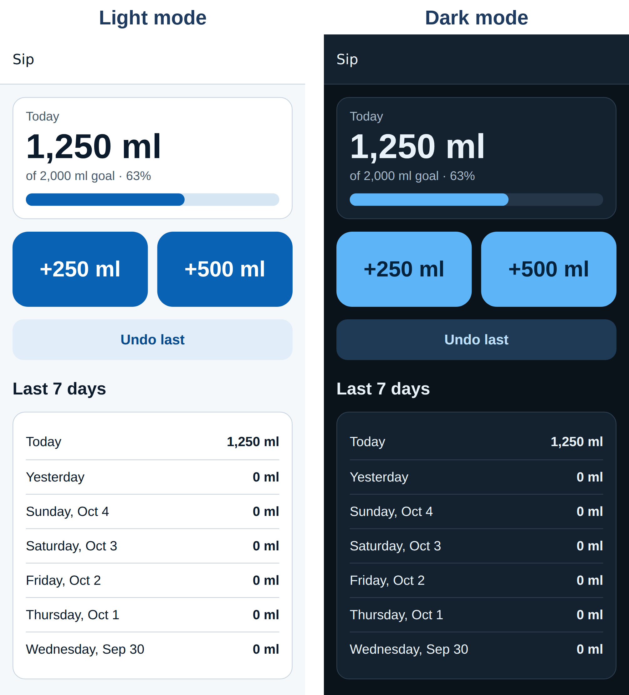

# Part IV: Mobile Apps

# Chapter 20: Project 6: An App for Android and iPhone

Most people spend more time in phone apps than in web browsers, and "I want to make an app" usually means an app in the App Store and Google Play. In this chapter, you'll build **Sip**, a water intake tracker that runs on both iPhone and Android from a single codebase. You'll also see how to test a mobile app when you don't have every phone on your desk, and you'll meet three real bugs that only showed up when the app was checked the way users would see it. Chapter 21 then takes Sip through the app store submission process.

## Three Ways to Build a Mobile App

Before writing a prompt, choose an approach. There are three main options:

- **A mobile-friendly web app.** A website designed for phones, which people can add to their home screen (a **progressive web app**, or PWA). It's the simplest option and reaches everyone with a link, but it isn't in the app stores by default and has limited access to phone features.
- **A cross-platform app.** One codebase that produces real iPhone and Android apps, using a framework such as **React Native** (with **Expo**) or **Flutter**. This suits most apps built by small teams and solo builders. It occasionally needs platform-specific code, and you depend on the framework.
- **Native apps.** Separate apps written in each platform's own language: **Swift** for iPhone (with Xcode, on a Mac) and **Kotlin** for Android (with Android Studio). Choose this for the very best performance or the newest platform features, at the cost of two codebases to build and maintain.

For vibe coders, cross-platform is usually the sweet spot. This chapter uses **Expo**, a popular set of tools built on React Native, for four reasons:

1. **One codebase, in TypeScript**, a version of JavaScript with types that catch many mistakes before the app runs.
2. **Try it on your own phone instantly** with the free **Expo Go** app: scan a QR code and the app opens.
3. **No Mac required for iPhone builds.** Expo's cloud service, **EAS** (Expo Application Services), can build and submit iPhone apps for you. You'll use it in Chapter 21.
4. **A web version comes free**, which makes automated testing much easier.

> **Note:** Claude Code can also write native Swift and Kotlin apps. If you choose that route, you'll need Xcode (Mac only) for iPhone apps and Android Studio for Android apps, and you'll run Claude Code in the project folder those tools create. The prompting habits in this chapter apply unchanged.

## What You Need

- **Node.js**, the LTS version from nodejs.org (you may already have it from Chapter 19).
- **Expo Go** on your phone, from the App Store or Google Play.
- Optional: the **Android emulator** (part of Android Studio) or the **iOS Simulator** (part of Xcode, Mac only), which show a virtual phone on your computer.

## The Build Prompt

In an empty folder, start Claude Code and send this prompt:

```
Create a mobile app for iPhone and Android called "Sip", a water
intake tracker, using Expo (React Native) with TypeScript. Start
it with the official create-expo-app tool in this folder.

Features:
- Big buttons to log +250 ml and +500 ml, and an "Undo last" button.
- A daily goal (default 2,000 ml) that I can change in a settings
  screen.
- Today's progress as a bar, an amount, and a percentage.
- A list of the last 7 days with each day's total.
- Data is saved on the device so it survives closing the app, and
  a new day starts at local midnight.

Requirements:
- Accessible: screen reader labels on every control, touch targets
  of at least 44 points, and it works in dark mode.
- Keep the date and totals logic in a separate pure TypeScript
  module with Jest tests.
- In app.json, set the app name, an iOS bundle identifier and an
  Android package name (com.example.sip), and a version, ready for
  app store submission later.

When you're done, run the TypeScript check and the tests, and make
sure the web build (npx expo export --platform web) succeeds.
```

Three parts of this prompt do a lot of work. "Start it with the official create-expo-app tool" makes Claude use the standard project template rather than inventing its own structure. "A separate pure TypeScript module with Jest tests" keeps the tricky logic (dates and totals) out of the screens, where it's easy to test. And the accessibility requirements carry over everything from Chapter 8. (The placeholder `com.example.sip` will cause trouble later, as you'll see in Chapter 21.)

Claude's reply (shortened):

```
Claude's reply:
Sip is built and all three checks pass: tsc --noEmit is clean,
the 32 Jest tests pass, and npx expo export --platform web
succeeds. I haven't run it on a phone or simulator.

- Logging: the home screen has large +250 ml and +500 ml buttons
  and an "Undo last" button. Undo only removes today's most
  recent entry, never an earlier day's, and is disabled when
  there's nothing to undo.
- Saving: entries and the goal are stored on the device with
  AsyncStorage. Entries older than 30 days are dropped when
  saving.
- New day: the app switches to a new day at local midnight, and
  also checks when it returns from the background.
- Accessibility: every control has a screen reader label. Touch
  targets are at least 44 points, and the main buttons are much
  larger. Light and dark palettes follow the system setting.

src/lib/water.ts has the date and totals logic. It takes "now"
as an argument, so the tests don't depend on the clock.
src/__tests__/water.test.ts covers midnight rollover, month and
year boundaries, a daylight-saving change, undo and goal
validation. It passes under UTC, New York and Kolkata time zones.

The icons and splash image are still the template's
placeholders, and com.example.sip is a placeholder you'll want
to change before store submission.
```



## How a React Native App Is Organized

The project Claude created has a few important parts:

- **`app.json`** holds the app's identity: its name, version, icon, and the identifiers the app stores use.
- **`src/app/`** holds the screens. Expo Router turns each file into a screen: `index.tsx` is the home screen and `settings.tsx` is the settings screen.
- **`src/lib/water.ts`** is the pure logic, with no screens and no storage.
- **`src/lib/store.tsx`** holds the app's data while it runs, and saves it to the phone with **AsyncStorage**, a simple storage system that works like the browser's localStorage from Chapter 6.
- **`src/__tests__/`** holds the Jest tests.

Here's the heart of the date logic. As in Chapter 6, dates are built in **local time**, and "the next midnight" is computed from the calendar rather than by adding 24 hours, which would be wrong on the days when daylight saving time starts or ends:

```
@include projects/06-sip/src/lib/water.ts#L30-L47
```

And here's a detail that only matters on phones. A web page that's open in a browser keeps running, but a phone suspends apps you're not looking at, so a timer set for midnight might never fire. Claude's code handles both cases: it sets a timer for midnight, and it re-checks the date whenever the app comes back to the foreground:

```
@include projects/06-sip/src/lib/store.tsx#L84-L107
```

This is the kind of platform knowledge an AI assistant brings to a project, and it's why it's worth asking, "What's different about doing this on a phone?"

## Running It on Your Phone

To try the app, run `npx expo start` in the project folder. A QR code appears in the terminal. Scan it with the Camera app on iPhone, or from inside Expo Go on Android, and Sip opens on your phone. Every time Claude changes a file, the app on your phone reloads by itself.

Try everything by hand: log drinks, undo, change the goal, close the app completely and reopen it, switch your phone to dark mode, and turn on VoiceOver or TalkBack and listen to each button.

> **Note:** This book's apps were built and tested on a server with no phone attached and no Mac, so the native apps were never run here on a real device or simulator. The app was checked in four ways instead: the TypeScript check, the 32 unit tests (in four time zones), Android project generation, and browser tests of the web version on a phone-sized screen. Chapter 21 explains how to build the real apps in the cloud. Always try your own app on a real phone before releasing it.

## Testing Like a User: Three Bugs

The book's own tests open Sip's web version in a real browser, at the size of a phone screen (390 by 844 pixels), measure every button, and run the axe-core accessibility checker from Chapter 8. They found two problems right away:

```
I tested the web build on a phone-sized screen (390 x 844) and
found two problems:

1. The "Settings" link on the home screen is only 20 points tall,
   below the 44-point minimum you said every control meets.
2. An accessibility scan (axe-core) reports that the web page has
   no document title.

Fix both, and check every other touchable control again, so I
can trust the 44-point claim. Then rerun the type check, tests,
and web build.
```

"So I can trust the 44-point claim" tells Claude why you're asking: not just to fix one button, but to make the claim true everywhere. Claude's reply (shortened):

```
Claude's reply:
Both problems are fixed. I measured the rendered web build in
Chromium at 390x844 in light and dark mode, and every touchable
control is at least 44 points tall.

1. Settings link was 20 points tall. The cause was the Expo
   Router Link asChild wrapper, which was discarding the
   button's minHeight. It also rendered as a link instead of a
   button. It's now a normal button that navigates with
   router.push('/settings') and measures 358x44.
2. No document title. Each screen now sets its own title with
   expo-router/head.

I only measured the web build. On iOS and Android the same
styles apply.
```

The original claim, "touch targets are at least 44 points," was made in good faith, but the framework quietly dropped one style. Only a measurement could catch that.

**The third bug: dark mode.** The tests then compared the app in light and dark mode, and the two looked identical: both light. Here's the report:

```
Dark mode doesn't work in the web build. The screenshot
dark-mode-screenshot.png shows the app with the browser set to
light (left) and dark (right): both are identical and light,
even though the page reports prefers-color-scheme: dark. Find
the cause and fix it, and make sure it would also work on
iPhone and Android. Check the web build in a real browser in both
modes before you finish; there is a Chromium at /opt/pw-browsers.
```

Claude's reply (shortened):

```
Claude's reply:
Cause. The web build is pre-rendered to static HTML at build
time, and there the colour scheme is always "light". When the
page loads, React Native's useColorScheme read the real scheme
(dark) on the first client render. React then matched that
render against the light HTML and kept the light styles. Nothing
triggered a second render, so it stayed light.

Fix. src/hooks/use-color-scheme.web.ts (new): on web it returns
"light" for the first render, which matches the static HTML,
then switches to the real scheme once the page has loaded.
src/hooks/use-color-scheme.ts (new): iOS and Android just
re-export React Native's useColorScheme. They have no
pre-rendered HTML, so the real scheme is correct from the first
frame. I haven't run it on a device or simulator, so native dark
mode is untested.
```

Notice the file names. A file ending in `.web.ts` is used only in the web version, and the plain `.ts` file is used on phones. This is how React Native lets you write **platform-specific code** when one platform behaves differently:

```
@include projects/06-sip/src/hooks/use-color-scheme.web.ts#L4-L15
```

Finally, a question Claude itself had raised: axe-core noted that some screen reader labels didn't contain the visible text. The +250 ml button was announced as "Add 250 millilitres." That sounds nicer, but people who control their phones by voice say what they *see* ("tap plus 250 ml"), and a mismatched label can stop that from working. Asked to fix it, Claude changed each label to match the visible text and moved the longer wording into a **hint**, a second description that screen readers read after a pause:

```
Claude's reply:
Each label now starts with or contains the visible text, so "tap
plus 250 ml" works. I moved the longer wording into hints, so
screen readers still describe what each button does.

I couldn't test with real VoiceOver, TalkBack or iOS/Android
voice control here. The axe scan checks the web build only.
```

All of these checks now live in the book's test suite. Here's the test that freezes the clock two minutes before midnight in New York, logs a drink, lets five minutes pass, and checks that the drink moved to "Yesterday":

```
@include tests/test_06_sip_mobile.py#L72-L82
```

## Best Practices for Mobile Apps

- **Choose the approach deliberately.** A phone-friendly web app may be all you need; choose cross-platform for store apps; choose native when you need the platform's newest features.
- **Keep logic out of screens.** Pure functions for dates, money, and totals are easy to test on any computer.
- **Pass the time in, don't read the clock inside your logic.** It makes midnight, month-end, and daylight-saving tests possible.
- **Remember that phones suspend apps.** Re-check time-sensitive state when the app returns to the foreground.
- **Respect the phone's settings**: dark mode, larger text sizes, and screen readers. Test each one.
- **Use touch targets of 44 points or more**, and measure them rather than trusting a claim.
- **Work offline by default.** Store data on the device unless you truly need a server, and say so in your privacy policy (Chapter 21).
- **Ask for the fewest permissions possible.** Every permission is a question for the user and the app store reviewer.
- **Test on real devices**, including an older, smaller, slower phone if you can, before every release.
- **Treat the app's identifiers as permanent.** Choose your bundle identifier and package name carefully; you can't change them after the first upload.

> **Try It:** Ask Claude to add a third button that lets the user log a custom amount. Specify the edge cases yourself (empty input, zero, negative numbers, and absurdly large amounts), and ask for unit tests first. Then try it on your phone with Expo Go.

## Key Takeaways

- There are three ways to build a mobile app: a mobile-friendly web app, a cross-platform app, or native apps. Cross-platform with Expo suits most vibe coders.
- Expo Go lets you run your app on your own phone by scanning a QR code; EAS builds the store versions in the cloud.
- Keep pure logic in its own module with tests, and design for phones suspending your app.
- Measure what the AI claims: the 44-point promise failed for one button until it was measured.
- Platform-specific files (`.web.ts`, `.ios.ts`, `.android.ts`) handle behavior that differs between platforms.
- Match accessibility labels to the visible text so voice control works, and use hints for extra description.
