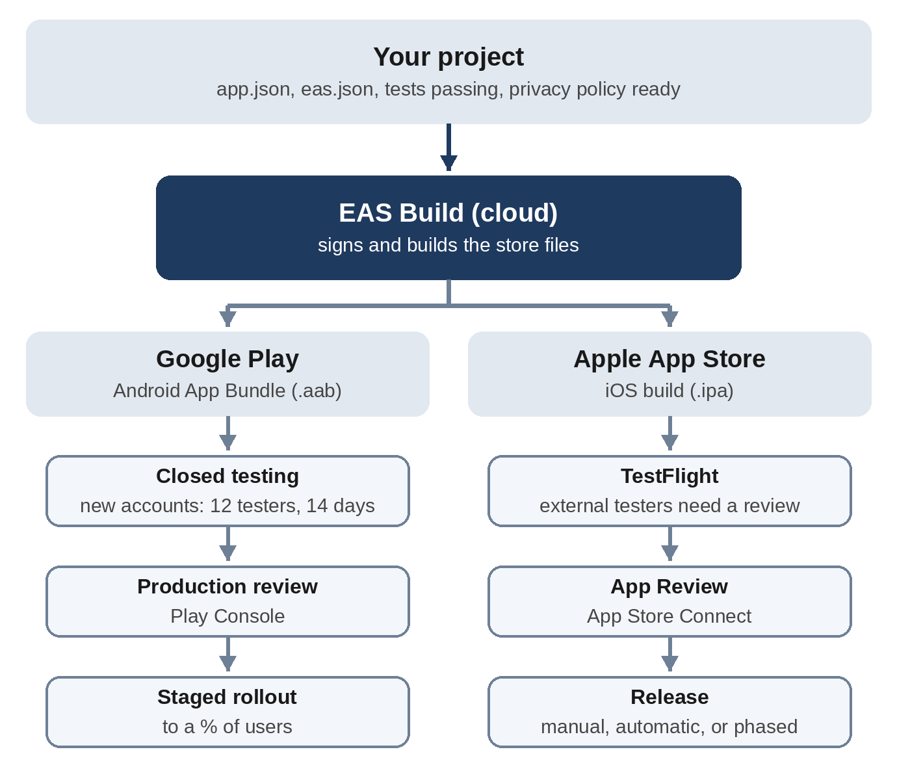

# Chapter 21: Shipping to Google Play and the App Store

Putting a web app online takes minutes. Putting a mobile app in the app stores takes longer, because Google and Apple review every app, ask detailed questions about privacy, and require testing before launch. None of it is difficult, but there are many steps, and some decisions can't be undone. In this chapter, you'll use Claude Code to prepare Sip for submission, and then walk through the release process for each store.

> **Warning:** App store rules, fees, and deadlines change often. Everything in this chapter was checked in October 2026. Before you submit, check the current requirements in the Google Play Console and App Store Connect, which always show what's needed for your account.

## The Big Picture



Here's what happens between "it works on my phone" and "it's in the store":

1. **Accounts.** You register as a developer with Google, Apple, or both.
2. **Preparation.** You set the app's identity, remove permissions it doesn't need, and write a privacy policy and the store listing.
3. **Building.** The project is turned into the files each store accepts, signed with your digital certificate. With Expo, the **EAS Build** service does this in the cloud.
4. **Testing.** Real people try the app through each store's testing system before it's public.
5. **Review.** Google and Apple check the app against their policies.
6. **Release.** The app goes live, often to a small percentage of users first.

## Developer Accounts

| | Google Play | Apple App Store |
| --- | --- | --- |
| Fee | $25, one time | $99 per year (Apple Developer Program) |
| Identity checks | Identity verification; it can take a few days | Enrollment checks; it can take a few days |
| Console | Google Play Console | App Store Connect |
| Build file | Android App Bundle (`.aab`) | iOS app (`.ipa`), built with Apple's current Xcode |

Two account details are worth knowing early. First, Google treats **personal** and **organization** accounts differently, and new personal accounts must run a closed test with at least 12 testers before they can publish (more on this below). Second, you'll also want a free **Expo account** to use EAS.

## Version Numbers and App Identity

Every store app has two kinds of numbers and one name that never changes:

- The **version** (such as 1.0.0) is what users see. You choose it, following the semantic versioning rules in Chapter 22.
- The **build number** (`versionCode` on Android, `buildNumber` on iOS) is a whole number that must increase with every upload, even for the same version. Nobody sees it but the stores.
- The **application ID** (the Android **package name** and the iOS **bundle identifier**), such as `com.vibecodingbook.sip`, identifies your app forever. You can't change it after the first upload. By convention, it's your web domain written backward, followed by the app's name.

## Preparing Sip with Claude Code

Here's the preparation prompt, sent in Sip's folder:

```
Sip works, and I want to publish it on Google Play and the Apple
App Store. Get the project ready for submission, but don't
submit or build anything in the cloud yet:

1. Permissions: an Android prebuild asks for INTERNET,
   READ_EXTERNAL_STORAGE, WRITE_EXTERNAL_STORAGE,
   SYSTEM_ALERT_WINDOW, and VIBRATE. Sip needs none of these in a
   release build. Remove what it doesn't need, and prove it by
   running "npx expo prebuild --no-install --platform android" in
   a temporary copy and listing the permissions that remain.
2. Add an eas.json with development, preview, and production
   build profiles. Production should build an Android App Bundle
   and increment the build numbers automatically.
3. Write PRIVACY.md: a short, plain-English privacy policy. All
   data stays on the device; nothing is collected or shared.
4. Write STORE-LISTING.md with the app name, a short description
   (80 characters max for Google Play), a full description, and
   what to answer in Google Play's Data safety form and Apple's
   App Privacy section.
5. Write RELEASE-CHECKLIST.md: the steps from here to a public
   release on both stores, in order, including closed testing and
   TestFlight.

Keep the type check and tests passing. Tell me anything you
couldn't verify.
```

Where did that list of permissions come from? Before writing the prompt, the Android project was generated with `npx expo prebuild`, which creates the native project files that a store build uses, and its **manifest** (the file listing what an Android app may access) was checked. A water tracker that asks for access to storage and to draw over other apps would worry users and reviewers alike.

Claude's reply (shortened):

```
Claude's reply:
The project is ready for submission, and I haven't built or
submitted anything. The type check, the 32 tests and the web
export all still pass.

1. Permissions
- Expo's default Android template: all five.
- expo-file-system: INTERNET and the two storage permissions.
- expo-image: INTERNET and ACCESS_NETWORK_STATE. Sip never used
  it, so I uninstalled it, along with the unused expo-device and
  expo-web-browser.
I added app.config.ts, which extends app.json and blocks
INTERNET, ACCESS_NETWORK_STATE, both storage permissions,
SYSTEM_ALERT_WINDOW and VIBRATE. I ran npx expo prebuild
--no-install --platform android in a temporary copy:
- Before: the manifest requested all five permissions.
- After: it requests none.
- Development builds: setting APP_VARIANT=development keeps the
  permissions, because a dev client needs INTERNET to reach the
  dev server.

I also set ITSAppUsesNonExemptEncryption: false in app.json, so
Apple won't ask the export-compliance question on every upload.

Things I couldn't verify, and things you must fix
- The package name is a likely blocker. From my knowledge of
  Google Play rather than a check, it rejects package names
  starting with com.example, and neither store lets you change
  the ID after the first upload. I kept com.example.sip because
  you asked for it. Pick a real ID before the first build.
- Final merged manifest: there's no Android SDK here, so I
  couldn't build the release and read the final merged manifest.
- Placeholders: the icons and splash are still the Expo
  template images.
- Policy details from memory: this covers Google's
  closed-testing rule for new personal accounts (12 testers for
  14 days), the required screenshot sizes, and the Play app-name
  limits. Confirm them in the consoles.
- Your judgement: the export-compliance flag, the health-app
  declaration and the age-rating answers are declarations you
  make to the stores. They look right for Sip, but you're the
  one confirming them.
```

This is an excellent reply to learn from. Claude did the work, proved the permission change with the exact check requested, and then separated what it verified from what it knew "from memory," and from what only you can decide. It also pushed back on an instruction: the placeholder `com.example.sip` from Chapter 20's prompt would have been rejected by Google Play. A one-line follow-up fixed it:

```
Good catch on com.example. Change the Android package and the iOS
bundle identifier to com.vibecodingbook.sip, and update anything
that mentions the old ID. Then rerun the checks.
```

The permission change was checked independently for this book by generating the Android project again: every permission in the manifest is now marked for removal. Here's the core of the configuration Claude wrote:

```
@include projects/06-sip/app.config.ts#L14-L33
```

And here are the build profiles. **development** is for a special debugging version of the app, **preview** produces an Android file you can install directly on a phone for testing, and **production** produces the files for the stores:

```
@include projects/06-sip/eas.json
```

## Privacy: The Questions Every App Must Answer

Both stores require a **privacy policy** at a public web address, even for an app that collects nothing. Sip's policy, written by Claude, says in plain English that everything stays on the phone, explains what's stored and how to delete it, and mentions that phone backups are controlled by the user. You can publish it free with GitHub Pages or on any website.

Each store also asks its own privacy questions:

- **Google Play's Data safety form** asks what data the app collects or shares, and why. Sip's honest answer is "no data collected, no data shared."
- **Apple's App Privacy section** produces the "nutrition label" shown on your App Store page. Sip's is "Data Not Collected."
- **Apple's privacy manifest** is a file inside the app describing certain system features it uses and why. Expo's libraries include their own manifests, and you can add entries in `app.json` if your code needs them.

> **Warning:** Your answers must cover everything in the app, including third-party libraries for analytics, crash reports, ads, and sign-in. If you add one later, update the policy and both forms before releasing that version. Inaccurate answers are a common reason for rejection and removal.

## Building in the Cloud

With the preparation done, these are the commands that build Sip for the stores. Run them on your own computer, after creating an Expo account:

```
npm install --global eas-cli
eas login
eas init
eas build --platform android --profile preview
eas build --platform android --profile production
eas build --platform ios --profile production
```

The first three lines install the EAS command-line tool and connect the project to your Expo account. The preview build gives you an installable Android file (an **APK**) to try on real phones. The production builds create the files the stores accept, and EAS handles the **signing**: the digital certificates that prove updates come from you. For iPhone builds, EAS asks you to sign in to your Apple developer account and creates the certificates for you. EAS's build servers use current Xcode versions, so you meet Apple's rule that new uploads be built with a recent Xcode (Xcode 26 since April 2026) without owning a Mac.

> **Note:** These commands were not run for this book, because the build service needs real developer accounts, and the environment the book was tested in couldn't reach Expo's servers. Everything before this point was run and checked. The release checklist Claude wrote (`RELEASE-CHECKLIST.md` in the book's code) lists every remaining step in order.

## Releasing on Google Play

1. **Create the app** in the Play Console, and complete the **App content** section: privacy policy, Data safety, ads, target audience, content rating questionnaire, and, for apps like Sip, the health apps declaration.
2. **Upload the first build by hand.** Google's API can't create an app's very first release, so upload the `.aab` file to a testing track yourself. Later releases can be uploaded with `eas submit --platform android`. Accept **Play App Signing** when prompted, which lets Google hold the final signing key securely.
3. **Test.** Use **internal testing** for a handful of people, and **closed testing** for a wider group. Personal accounts created after November 13, 2023, must run a closed test with at least 12 testers who stay opted in for 14 days in a row before they can apply for production access. Plan for this: it's the longest wait in the whole process.
4. **Check the pre-launch report.** Google automatically tries your app on real devices and reports crashes and accessibility issues.
5. **Apply for production access** (personal accounts), then create a production release.
6. **Roll out gradually.** A **staged rollout** releases an update to a small percentage of users first. If crash reports stay low, increase it to 100 percent.

Google also requires apps to target a recent Android version. From August 31, 2026, new apps and updates must target Android 16 (API level 36). The Expo version used for Sip already targets level 36, which was checked in the generated project. When you update an older app, check this first.

## Releasing on the Apple App Store

1. **Create the app** in App Store Connect with the same bundle identifier, and fill in the App Privacy section, age rating, and category.
2. **Upload a build.** Run `eas submit --platform ios` after the production build, or build and submit in one step with `eas build --platform ios --auto-submit`.
3. **Test with TestFlight**, Apple's beta testing app. Up to 100 members of your team can test immediately as **internal testers**. You can invite up to 10,000 **external testers** by email or a public link, after a short Beta App Review of the first build of each version.
4. **Prepare the store page**: screenshots in the sizes App Store Connect asks for, the description, keywords, support web address, and privacy policy link. Add **review notes** that tell the reviewer anything they need, such as "No login required. All data is stored on the device."
5. **Submit for App Review.** Reviews often take a day or two. If the app is rejected, the message explains why; fix the issue, reply, and resubmit.
6. **Release** manually, automatically on approval, or as a **phased release** that reaches users gradually over seven days.

## Common Reasons for Rejection

Most rejections come from a short list of problems, and Claude can check for most of them before you submit:

- **Crashes or broken features.** Test the release build on real phones.
- **Placeholder content**: template icons, "Lorem ipsum" text, or "com.example" identifiers.
- **Missing or inaccurate privacy information**, or a broken privacy policy link.
- **Permissions without a clear purpose.** Ask only for what you use, and explain why when you ask.
- **A login the reviewer can't get past.** If your app needs an account, give the reviewer a demo account in the review notes.
- **Misleading listings**: screenshots or descriptions that don't match the app.
- **Too little functionality.** An app that's just a website in a wrapper often gets rejected by Apple.

## After Launch

Shipping version 1.0 is the beginning, not the end:

- **Watch crash reports and reviews** in both consoles, and reply to reviews politely.
- **Ship updates the same way**: raise the version for user-visible changes (the build numbers increase automatically with `autoIncrement`), build with the production profile, and submit.
- **Keep up with platform deadlines**, such as Google's yearly target API level and Apple's Xcode requirements. A yearly calendar reminder helps.
- **Re-check privacy answers** whenever you add a library or a network feature.

## Best Practices for Shipping Mobile Apps

- **Decide the permanent things first**: the application ID, the app name, and the account type.
- **Ask for the fewest permissions**, and prove it by inspecting the generated manifest, not by trusting a claim.
- **Write the privacy policy before the first build**, and keep it in the repository so it changes with the code.
- **Keep a written release checklist** in the project, and follow it every time. Claude can write the first draft.
- **Never commit signing keys or store credentials.** Let EAS manage them, or keep them in a password manager. Sip's `.gitignore` already excludes key files.
- **Test the release build, not just the development version**, on at least one real iPhone and one real Android phone.
- **Start the Google closed test early**, since it takes at least 14 days for new personal accounts.
- **Roll out gradually** with staged or phased releases, and watch crash reports before going to 100 percent.
- **Confirm current rules in the consoles.** Ask Claude to separate what it verified from what it remembers, as it did here.

> **Try It:** Ask Claude to review your own app against the "Common Reasons for Rejection" list in this chapter, and to produce a table of each item with "OK," "Needs work," or "Can't check," plus the reason. Fix every "Needs work" before you submit.

## Key Takeaways

- Store releases follow six stages: accounts, preparation, building, testing, review, and release.
- The version is for users; the build number must increase with every upload; the application ID is permanent.
- Claude prepared Sip for submission: minimal permissions, build profiles, a privacy policy, store text, and a release checklist. It also caught a placeholder ID that Google Play would have rejected.
- Both stores require a privacy policy and privacy answers, even for apps that collect nothing.
- EAS builds and signs both apps in the cloud, so you don't need a Mac to publish on iPhone.
- New personal Google Play accounts need a 14-day closed test with at least 12 testers; Apple uses TestFlight and App Review.
- Check current store rules before every submission; they change every year.
