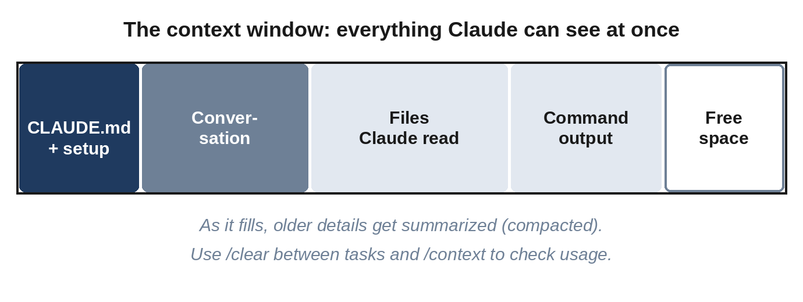

# Chapter 24: Working on Bigger and Existing Projects

The projects in this book are small enough to fit in your head. Real projects often aren't: an app you've grown over months, an open-source project you want to contribute to, or your company's codebase. This chapter covers the skills that matter at that scale: understanding unfamiliar code, managing Claude's attention, making large changes safely, and running several sessions at once.

## Getting to Know an Unfamiliar Codebase

When you open a project you didn't write, use Claude as a guide before changing anything. Ask the questions you'd ask a senior colleague:

```
Give me a tour of this project: what it does, how it's
organized, and which files I should read first. Don't change
anything.
```

```
How does a request flow through this app, from the moment a user
clicks "Save" to the moment the data is stored?
```

```
How do I run this project and its tests on my computer?
```

```
Look at the git history of the payments folder and summarize how
it has changed over the last year.
```

For a broad investigation, ask Claude to use subagents, so the reading happens in their contexts rather than yours:

```
Use subagents to investigate how authentication works in this
project and whether there are existing helpers for sending
emails I should reuse.
```

Once you understand the project, run `/init` to create a CLAUDE.md (Chapter 16), or improve the existing one with what you've learned.

## Managing the Context Window

In Chapter 2, you learned that Claude's **context window** holds everything it can see at once: your conversation, the files it has read, and the output of the commands it has run. On a big project, this fills up quickly, and as it fills, Claude can lose track of earlier details.



Your tools for managing it:

- **`/context`** shows how full the context window is and what's using the space.
- **`/clear`** starts fresh. Use it between unrelated tasks; it's the single most effective habit.
- **`/compact`** summarizes the conversation so far to free space while continuing. Add focus instructions: `/compact keep the details of the database changes`.
- **Automatic compaction** happens when the window nears its limit. Claude Code summarizes older parts of the conversation, keeping the important decisions and code.
- **`/btw`** asks a quick side question ("/btw what's the command to run one test?") whose answer doesn't stay in the conversation.
- **Subagents** do heavy reading in their own context and report back only a summary.

> **Tip:** If a session has gone on for a long time and Claude starts forgetting things you agreed earlier, don't fight it. Ask Claude to write a short summary of the current state and next steps into a file, run `/clear`, and start a new session with "Read NOTES.md and continue."

## Making Large Changes Safely

Big changes, such as switching databases, restructuring folders, or adding user accounts, deserve extra care. A reliable recipe:

1. **Commit everything first**, so you can always get back.
2. **Explore and plan in plan mode.** Ask for a written plan saved to a file: "Write the plan to PLAN.md, split into small phases that each leave the app working."
3. **Review the plan carefully.** This is where your judgment matters most.
4. **Make sure tests exist** for the behavior that must not change. If they don't, add them before starting.
5. **Implement one phase at a time**, in fresh sessions if needed ("Read PLAN.md and do phase 2"), running the tests and committing after each phase.
6. **Review the whole change** at the end, ideally with a reviewer subagent or `/code-review`, before merging.

The point of phases is that you're never far from a working app. If phase 3 goes badly, you rewind to the end of phase 2, not to the beginning.

## Refactoring: Improving Code Without Changing Behavior

**Refactoring** means restructuring code to make it clearer or easier to change, without changing what it does. AI is good at refactoring, and tests make it safe:

```
The file app.py has grown to 600 lines. Split it into sensible
modules without changing any behavior. Run the tests before you
start and after each step, and stop if anything fails.
```

The phrase "without changing any behavior" matters, and so does the instruction to run the tests before starting: if they don't all pass beforehand, you need to know.

## Running Sessions in Parallel

Once you're comfortable, you can have several Claude sessions working at once, for example one building a feature while another writes tests or investigates a bug. The problem is that two sessions editing the same files would trip over each other. The solution is a **git worktree**: a separate working copy of your repository, on its own branch, that shares the same history.

Claude Code can create one for you:

```
claude --worktree dark-mode
```

This starts a session in a new worktree (inside `.claude/worktrees/`) on a branch of its own. For a second, fully separate session, open another terminal and repeat the command with a new name. When each piece of work is finished and tested, merge its branch as usual. The desktop app can also run several sessions side by side, each in its own worktree.

A useful pattern with parallel sessions is **writer and reviewer**: one session implements a feature; a second, fresh session reviews it ("Review the changes on the dark-mode branch for bugs and edge cases"); and you pass the review back to the first session to address. The reviewer, unlike the writer, has no attachment to the code.

For large, repetitive changes across many files, the built-in `/batch` command splits the work among many subagents, each working in its own worktree.

> **Warning:** Parallel sessions multiply both speed and confusion. Start with two at most, give each a clearly separate task, and merge one at a time with the tests running.

## Choosing the Model and Effort

Claude Code lets you choose which model to use with `/model`, and how hard it thinks with `/effort` (low, medium, high, and above). Higher effort means more thorough reasoning, at the cost of time and usage. Lower effort is faster and cheaper. The defaults are sensible; adjust when you notice a need:

- **Hard problem, subtle bug, or big design decision**: raise the effort.
- **Simple, repetitive edits**: lower effort, or a smaller model, is faster.

## Contributing to Someone Else's Project

When working on a project that isn't yours, a few extra courtesies apply:

- **Follow the project's conventions**: its style, its tests, its contribution guide. Ask Claude to read `CONTRIBUTING.md` first and follow it.
- **Keep changes focused.** One pull request should do one thing.
- **Understand every line you submit.** Maintainers will ask questions, and "the AI wrote it" isn't an answer. Some projects have explicit policies about AI-generated contributions; check them first.
- **Write a clear pull request description**: what changed, why, and how you tested it. Claude can draft it.

> **Try It:** Find a small open-source project you use (a command-line tool or a library). Clone it, start Claude Code in plan mode, and ask for a tour and an explanation of how to run its tests. Then ask, "What would be a good first contribution for a beginner?"

## Key Takeaways

- Before changing an unfamiliar codebase, ask Claude for a tour, the request flow, and how to run it.
- Manage context: `/clear` between tasks, `/compact` with focus, `/context` to check, and subagents for heavy reading.
- For large changes: commit, plan in phases to a file, ensure tests, implement phase by phase, and review at the end.
- Refactor "without changing behavior," with tests before and after every step.
- Use `claude --worktree` for parallel sessions that don't collide. Try a writer and reviewer pair.
- Adjust model and effort for the difficulty of the task.
- When contributing to others' projects, follow their rules and understand everything you submit.
