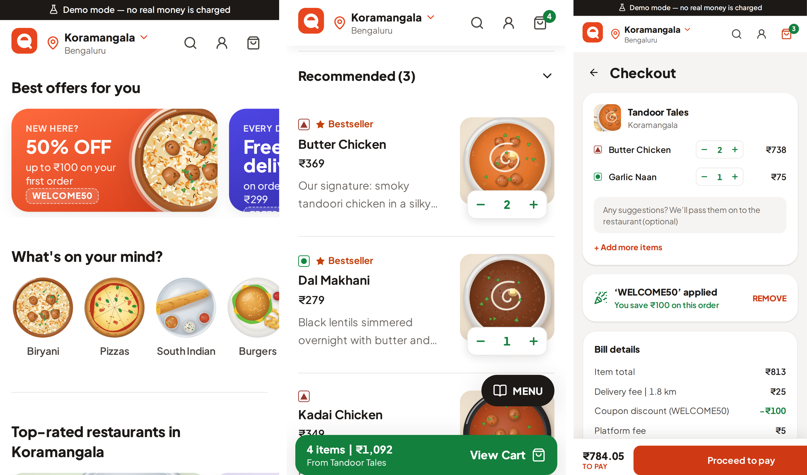
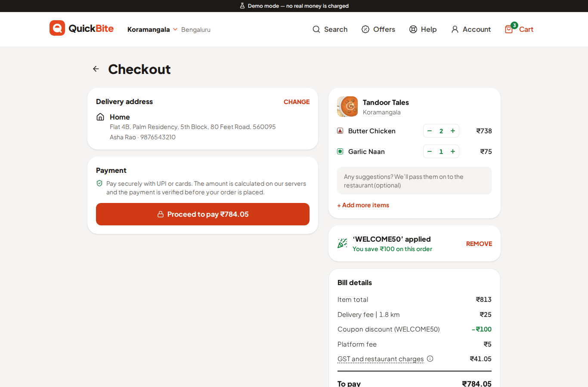

# Chapter 24: A Production-Quality Interface

The difference between a school project and an app people choose to use is mostly in the details: the spacing, the type, the loading states, the way a button responds to your thumb. In this chapter, Claude builds QuickBite's interface to the standard of the food delivery apps people use every day, and you'll see what that standard is made of, how a design system holds it together, and how honest Claude was when asked to compare its work with Swiggy and Zomato.

## What Makes an App Feel Professional

Open any top food delivery or shopping app, and you'll find the same building blocks, refined over years of testing with millions of customers:

- **A header that answers "where?"**: the delivery location, one tap away from changing.
- **Offers up front**: a swipeable row of banners with a clear headline ("50% OFF up to ₹100").
- **Browse by craving**: "What's on your mind?" with round images of cuisines.
- **Quick filters** as chips: Rating 4.0+, Pure Veg, Fast Delivery, Offers.
- **Rich cards**: a photo with an offer strip, a rating pill colored by score, delivery time, cuisines, and cost for two.
- **Familiar symbols**: in India, the green and brown veg and non-veg marks on every dish.
- **An ADD button that becomes a stepper** ("− 2 +") so changing quantity takes one tap.
- **A cart that follows you**: a sticky "View Cart" bar on phones and a side panel on desktop.
- **A clear bill** with every fee and tax listed, and the savings from a coupon celebrated.
- **Polish everywhere**: skeleton placeholders while content loads, helpful empty states, smooth motion, and nothing jumping around as images arrive.

None of these is hard on its own. Together, consistently, they're what "production quality" looks like. The QuickBite plan (Chapter 23) listed them explicitly, so Claude had a precise target.

## Building the Interface

With the plan approved, Claude built phases 0, 1, and 2: the project foundation, browsing (home, search, and restaurant menus), and the cart and bill. The instructions included what this machine could and couldn't do:

```
Things to know about this machine:
- There's no access to image websites, so you can't download food
  photos. Create appetizing, consistent artwork for the seed data
  yourself (for example, illustrated dishes on soft colored
  backgrounds), and keep the image pipeline ready for real photos.
```

and ended with a request for evidence and an honest assessment:

```
When phase 2 is done, run every check and show me the app on a
phone-sized and a desktop-sized screen in the browser: take
screenshots of the home page, a restaurant menu and the cart, and
tell me honestly how close it looks to Swiggy or Zomato quality,
and what's still missing.
```

Here's the result on a phone:



And on a desktop, where the same components rearrange into a wider layout:



## The Honest Assessment

Asked to compare its work with the real apps, Claude didn't oversell it. Its reply (shortened):

```
Claude's reply:
Layout and flow: close. The home grid, restaurant cards with an
offer strip over the image, the ADD-to-stepper button, the sticky
"View Cart" bar and the bill all use the same patterns as Swiggy,
and they hold up on desktop. I'd put the layout at roughly 80-85%
of their polish.

Overall: noticeably below them, for these reasons:
- Images: the illustrations are consistent and pleasant, but they
  look like a demo. Real food photography is most of why those
  apps feel appetizing.
- Restaurant variety: there are 21 restaurant chains, so the same
  21 cover images repeat in every area.
- Missing details: a dish detail popup with a large photo,
  customising a dish (size, add-ons), ratings on individual
  dishes, and skeleton loaders on the search screen.
- Address: there's no map pin.
```

This is the kind of answer to ask for. It tells you what's already good, what's missing, and, most usefully, what matters most: **photography**. A food app sells appetite, and illustrations can't do that. In a real launch, restaurants upload their own photos, which the app stores and serves through an image service that resizes and compresses them for each screen. QuickBite's image component was built so that real photos can replace the illustrations without code changes.

## The Design System

The consistency in those screenshots comes from a **design system**: a small set of named decisions that every screen reuses. QuickBite's starts with **design tokens**, the named colors, fonts, shadows, and timings, defined once in the style sheet:

```
@include projects/07-quickbite/apps/web/src/styles/globals.css#L12-L36
```

Notice the comments: "Use 600+ behind white text (meets WCAG AA)," and a darker green "for small text on light-green tints." Accessibility was designed in, as Chapter 8 recommended, rather than patched on later.

On top of the tokens sit **components**: Button, Chip, RatingPill, VegMark, Sheet (a panel that slides up on phones and becomes a dialog on desktop), Skeleton, EmptyState, and a few more. Every screen is assembled from them. Here's the smallest one, the veg mark, which shows how even a tiny component carries accessibility with it:

```
@include projects/07-quickbite/apps/web/src/components/ui/VegMark.tsx#L3-L36
```

For a sighted user, it's a green dot or a brown triangle in a square. For a screen reader user, it says "Vegetarian" or "Non-vegetarian." When the mark is purely decorative, because the text beside it already says the same thing, it's hidden from screen readers so nothing is read twice.

## What Went Wrong, and What It Taught

Two real problems came up while building these phases, and both are worth knowing about.

**A session ran out of usage in the middle of a phase.** Claude Code accounts have usage limits, and a long session on the strongest model uses them quickly. Phase 0 had been committed, but phase 1 was half-written when the session stopped. Because every phase is committed when it's finished, nothing was lost. When the limit reset, a short prompt picked up the work:

```
You were cut off by a usage limit partway through phase 1. Check
the working tree, finish phases 1 and 2, and commit after each.
```

**A broken test helper was hiding failures.** When Claude resumed, it found that four end-to-end tests were failing, and that a type error in a test helper had broken the build, so the tests had been running against an *old* version of the app. Fixing that exposed real accessibility problems, which the axe-core scans in the tests then caught:

```
Claude's reply:
Fixing it also exposed real accessibility problems, which are now
fixed:
- some small text was too low-contrast to read comfortably;
- a sideways-scrolling row couldn't be reached with the keyboard;
- the bill's list markup was invalid.
```

The lesson applies to every project: a test suite is only as good as the build it runs against. When tests suddenly pass or fail for no clear reason, check that they're testing the code you think they are.

At the end of phase 2, the checks were:

| Check | Result |
| --- | --- |
| Lint and formatting | clean |
| Type check | clean |
| Unit and component tests | 75 passed |
| Production build | succeeds; main code about 74 KB compressed |
| End-to-end browser tests | 14 passed (7 tests, each on a phone and a desktop screen), including accessibility scans |

## Best Practices for a Professional Interface

- **Name the quality bar and the reference apps** in your prompts, and list the specific patterns you want.
- **Build a design system first**: tokens for colors, type, spacing, and motion, then a small set of components that every screen reuses.
- **Design for phones first**, then let the layout grow for desktop, and test both.
- **Use real photography** for anything that sells appetite or products; keep illustrations for icons and empty states.
- **Show a skeleton, not a spinner**, while content loads, and reserve space for images so nothing jumps.
- **Make every state deliberate**: loading, empty, error, and offline, not just the happy path.
- **Keep accessibility in the components** (labels, contrast, keyboard access) so every screen inherits it.
- **Ask for screenshots and an honest comparison** with the apps you admire, and act on the gaps.
- **Commit after every phase**, so an interruption costs minutes, not hours.

> **Try It:** Open your favorite shopping or delivery app and take screenshots of three screens. List every pattern you see: headers, cards, buttons, badges, empty states. Then ask Claude to restyle one screen of your own app using those patterns, keeping your colors and brand.

## Key Takeaways

- Professional apps are built from familiar patterns, applied consistently, with polish in every state.
- A design system (tokens plus components) is what makes many screens look like one product.
- Ask for evidence and an honest comparison. Claude rated QuickBite's layout at about 80 to 85 percent of Swiggy's polish, and named photography as the biggest gap.
- Commit after every phase, and check that tests run against the current build.
