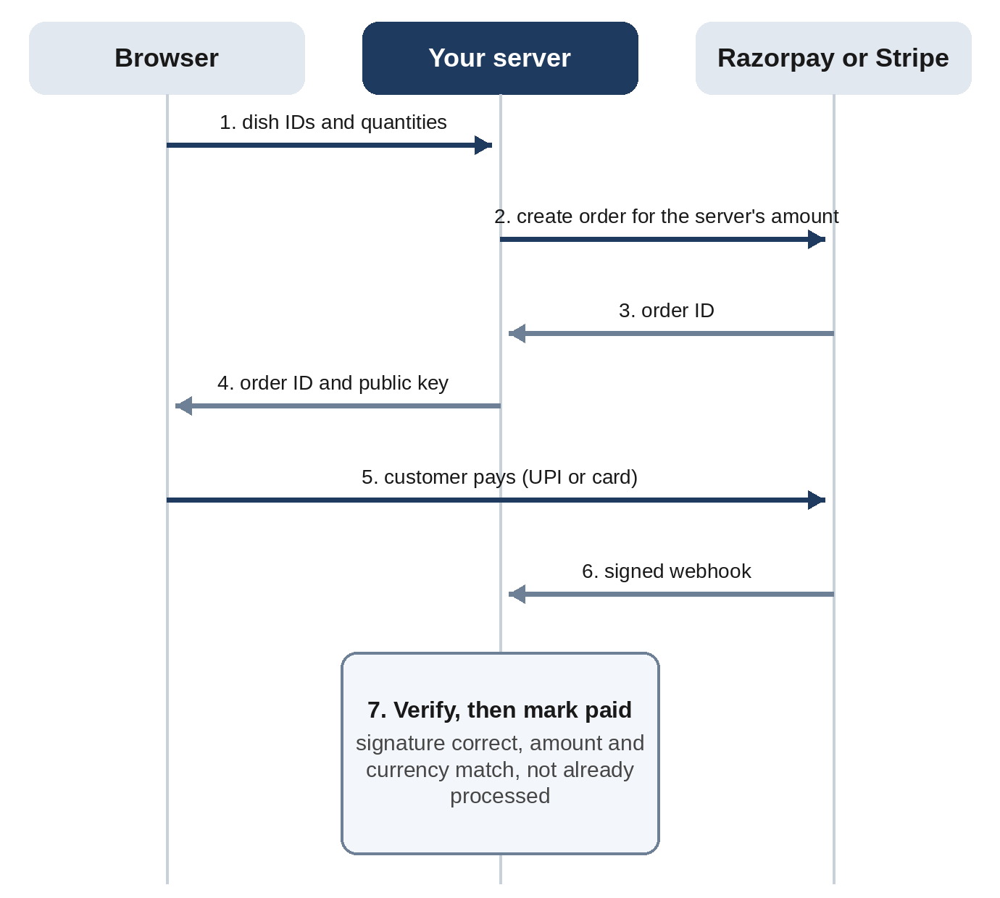
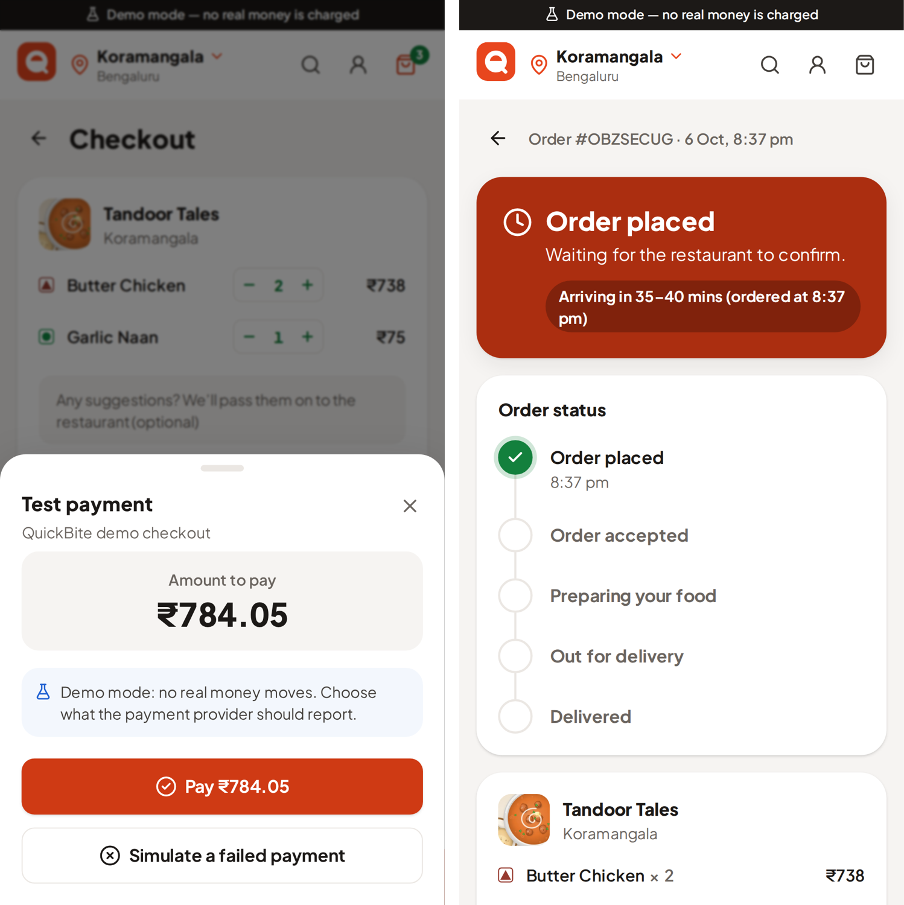

# Chapter 26: Taking Payments with Razorpay and Stripe

Taking money is where a vibe-coded app stops being a hobby. A bug in a to-do app loses a task; a bug in a payment flow loses money, or trust, or both. This chapter shows how QuickBite takes payments safely with **Razorpay**, a major payment provider in India (UPI, cards, netbanking), and **Stripe**, a popular choice for international cards, and how to verify payment code you didn't write yourself.

## Choosing a Payment Provider

| | Razorpay | Stripe |
| --- | --- | --- |
| Best for | Businesses in India; UPI, cards, netbanking, wallets | International cards and many countries |
| Signing up in India (October 2026) | Open; activation needs KYC and a compliant website | Invite-only for new Indian businesses since May 2024 |
| Checkout | Checkout.js, a payment window on your page | Stripe Checkout or the Payment Element |
| Proof of payment | A payment signature, plus webhooks | Webhooks |

Because Stripe stopped open sign-ups for new Indian businesses in 2024, QuickBite uses Razorpay for India and Stripe for international customers, chosen on the server for each region. The code for both is the same shape, which makes it easy to add other providers later.

> **Warning:** Payment rules, fees, and onboarding change. Check the provider's current documentation and your account dashboard before you build, and get advice on tax and legal requirements for your business. This chapter teaches the technical pattern; it isn't financial or legal advice.

## The Golden Rules of Payments

Every safe payment integration follows the same rules, and QuickBite's plan stated them before any code was written (Chapter 23):

1. **The server decides the amount.** The browser sends what the customer wants (dish IDs and quantities); the server looks up the prices and creates the payment for that amount.
2. **Secret keys never reach the browser.** The browser gets only public identifiers: Razorpay's key ID and Stripe's publishable key.
3. **Nothing is paid until a signature is verified.** The provider proves a payment happened by signing a message with a secret only you and the provider know.
4. **Check the amount and currency too.** A valid signature on the wrong amount is still the wrong payment.
5. **Handle every message exactly once.** Providers retry, and customers double-click. A repeated message must change nothing.
6. **Test mode first, always.** Both providers have test modes with test keys and test cards. Live keys are for production only.



## How Signatures Work

A **signature** here is an HMAC: a short code computed from a message and a secret key, using the SHA-256 algorithm. Anyone who knows the secret can compute it; nobody else can produce a valid one, and changing even one character of the message changes the code completely.

- After a successful Razorpay checkout, the browser receives a payment ID, the order ID, and a signature. The server recomputes `HMAC-SHA256(order_id + "|" + payment_id)` with its key secret and compares.
- When a provider sends a **webhook**, a message posted directly to your server, it includes a signature header. Razorpay signs the raw request body with your webhook secret. Stripe signs the timestamp, a dot, and the raw body, and includes the timestamp so old messages can be refused.

Here's QuickBite's Razorpay payment signature, which follows that formula exactly:

```
@include projects/07-quickbite/packages/server/src/gateways/razorpay.ts#L74-L86
```

Two details make this production quality. The signature must be computed over the **raw** body, exactly as received, because re-formatting the JSON changes it. And the comparison uses a **timing-safe** function, which takes the same time whether the first character or the last one differs, so an attacker can't learn the correct signature by measuring response times.

## Building It with Claude

Payment code deserves the strongest settings (Chapter 22), so this phase ran on Opus at high effort. The prompt stated the constraints of the build machine and asked for something every payment integration needs, a way to check it against the real providers:

```
Read docs/PLAN.md and the git log, then build phase 6: real
Razorpay and Stripe payments, in test mode, on both backends.
Commit when it's done.

Important facts:
- This machine can't reach Razorpay's or Stripe's servers, so
  nothing can be checked live here. Build the gateways so they're
  fully testable offline: the HTTP calls to the providers should
  be replaceable in tests, and the signature checks must use the
  providers' documented algorithms exactly, tested with known
  good, tampered and replayed messages.
- Add a script I can run on my own computer with my own TEST keys
  that creates a real test-mode order or payment on each provider
  and checks the response, so the live part can be verified
  outside this machine. Never use live keys in tests.
- Stripe is invite-only for new businesses in India, so Razorpay
  is the main gateway for India and Stripe is for international
  customers. Make the choice per region, as the plan says.

Before you finish, run every test suite and tell me exactly what
you verified, what can only be verified with real test keys, and
anything in the providers' rules you are unsure about.
```

The session ran out of usage partway through, and a short follow-up resumed it, just as in Chapter 24. Claude's final report (shortened):

```
Claude's reply:
What I verified offline
- Signatures match the providers' own code. For every good,
  tampered and malformed message, my code reaches the same verdict
  as the official razorpay 2.9.8 and stripe 23.0.0 libraries. To
  check the tests can fail, I deliberately broke both algorithms:
  they failed, then I restored them.
- Tampering is refused and nothing is recorded: a changed amount,
  a re-serialised body, the wrong secret, a flipped hex digit,
  another order's payment presented for this order.
- Replays: within Stripe's 5-minute window a replay is skipped by
  event id; after it, the message is refused. The browser
  confirmation and the webhook can't double-place an order.

What needs your test keys
Put the keys in .env.payments.local (git-ignored) and run
pnpm payments:check. It refuses to run if any live key is present.

Provider rules I'm unsure about
- Razorpay capture: I assume automatic capture is on. With it off,
  a customer who closes the tab leaves the payment authorised and
  the webhook path won't place the order. The README says to keep
  it on.
- Razorpay retries: I assume webhook retries stop within about 24
  hours; the 3-day cut-off depends on that.
```

The last section is the most valuable part of the reply. Claude didn't just say "done"; it listed the assumptions you need to confirm in your Razorpay dashboard and documentation. Treat lists like this as a checklist.

## Verifying It Independently

For this book, the payment code was checked a second time, by a test written separately from the session that built it. It uses the **official** Stripe and Razorpay libraries to create signatures, and checks that QuickBite's code accepts the genuine ones and rejects the rest:

```
@include tests/quickbite/sdk-crosscheck.test.ts#L18-L49
```

All five checks passed: the Stripe SDK's test header was accepted; a one-character change to the body, the wrong secret, and a 301-second-old timestamp were rejected; and Razorpay's payment and webhook signatures matched the SDK's own verification functions. This is the pattern to follow with any code that handles money: **check it against the provider's own library**, not just against tests the same author wrote.

Here's the result in the app, running in fake payment mode. The amount on the payment sheet comes from the order the server created, and the tracking page updates live once the server has verified the payment message:



## Testing Against the Real Providers

Offline tests prove the logic; only the providers can prove the integration. With free test-mode accounts, on your own computer, you'd run:

```
pnpm payments:check
pnpm payments:check --browser
pnpm payments:check --webhooks
```

The first creates a ₹1 Razorpay test order and, on Stripe, a real test card payment and a declined one. The `--browser` option opens Razorpay Checkout so you can complete the test payment yourself, proving the signature code against Razorpay's real output. The `--webhooks` option verifies real webhook deliveries, using the Stripe CLI (`stripe listen`) for Stripe and a tunnel such as ngrok for Razorpay.

> **Note:** These live checks couldn't be run for this book, because the build machine had no access to Razorpay's or Stripe's servers. Everything else in this chapter was run and verified. Run the live checks yourself before you accept real payments.

## Going Live

Moving from test mode to live payments takes a few deliberate steps:

1. **Complete the provider's onboarding.** For Razorpay, that means KYC and a website that shows About, Contact (with an address, phone, and email), Pricing, Terms, Privacy, and Cancellation and Refund policies. QuickBite adds these pages in Chapter 27.
2. **Set up webhooks** in the provider's dashboard, pointing at your deployed server, with their own secrets.
3. **Store the live keys only on the server**, in a secret manager, never in code or the browser.
4. **Switch modes deliberately.** QuickBite refuses live keys unless an explicit setting says so, and then refuses test keys, so the two can't mix by accident.
5. **Make a small real payment** yourself, refund it, and check every step: the order, the email, the dashboard, and your records.

## Best Practices for Payments

- **Never trust the browser with prices, totals, or payment status.**
- **Verify every signature** with a timing-safe comparison, over the raw request body.
- **Check amount and currency** against your order, not just the signature.
- **Make payment handling idempotent**: the same message twice changes nothing.
- **Use webhooks as the source of truth**, and the browser's success message only as a quick first signal.
- **Keep secrets in a secret manager**, separate for test and live, and never commit them.
- **Cross-check your code with the provider's official library**, and run their test-mode flows end to end.
- **Choose providers by region and onboarding rules**, and check them before you build.
- **Ask Claude to list its assumptions about the provider**, then confirm each one in the provider's documentation.

> **Try It:** Ask Claude to explain, in plain English, what happens in QuickBite when a Razorpay webhook arrives twice, when it arrives with the wrong amount, and when it arrives with a forged signature. Then find the test that proves each answer.

## Key Takeaways

- Razorpay is a major payment provider in India; Stripe is invite-only for new Indian businesses, so it serves international customers.
- The server sets the amount; secrets stay on the server; nothing is paid until a signature, the amount, and the currency are verified.
- Signatures are HMAC-SHA256 codes over the raw message; compare them in a timing-safe way.
- Verify payment code against the official SDKs, and test against the providers' test modes before going live.
- Claude listed the provider rules it was unsure about; confirming them is your job.
