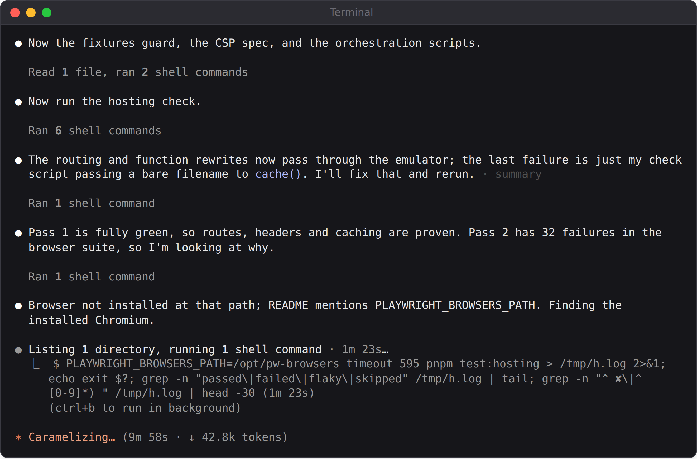
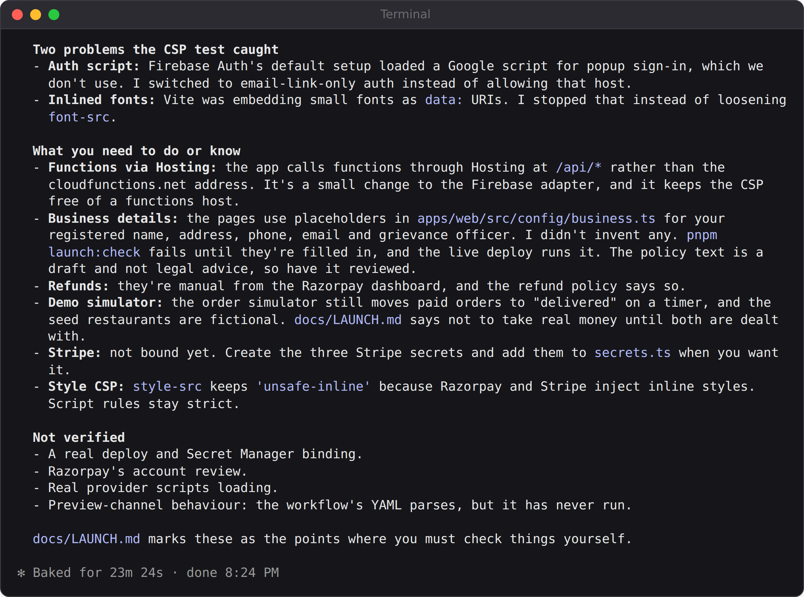

# Chapter 27: Launching on Firebase Hosting

QuickBite works on your computer. This chapter puts it on the internet at a `web.app` address, with the security headers, secrets, automatic deployments, and legal pages a real business needs, and ends with the checklist that takes you from test mode to taking real money. It's also where you'll watch Claude Code work in a real terminal for a long, multi-step task.

## Firebase Hosting in a Nutshell

**Firebase Hosting** serves websites from Google's global network, with HTTPS included. Every Firebase project gets two free addresses, `your-project-id.web.app` and `your-project-id.firebaseapp.com`, and you can connect your own domain later, with a free certificate.

Hosting on its own is part of the free **Spark** plan, with 10 GB of storage and 360 MB of transfer a day as of October 2026. QuickBite also uses **Cloud Functions** for its server code, and those need the pay-as-you-go **Blaze** plan, which still includes a generous free allowance each month.

> **Warning:** On any pay-as-you-go plan, set a **budget alert** in the Google Cloud console before you launch, so a mistake or a sudden traffic spike can't surprise you with a bill.

Three commands do most of the work, on your own computer:

```
npm install --global firebase-tools
firebase login
firebase deploy
```

The configuration lives in one file, `firebase.json`, at the root of the project.

## The Launch Prompt

This phase was run interactively, in an ordinary terminal, so you can see what a long session looks like. The prompt asked for everything a launch needs, and for proof:

```
Read docs/PLAN.md and the git log, then build phase 7, getting
QuickBite ready to launch on Firebase Hosting (a web.app
address). Include: firebase.json with the single-page-app
routing, the functions and webhook routes, security headers
including a Content-Security-Policy that allows only what we use,
and long caching for hashed files; secrets through Firebase
Secret Manager; a GitHub Actions workflow that deploys a preview
channel for every pull request and the live site from main; the
pages Razorpay requires before it activates an account (about,
contact, terms, privacy, refunds and cancellations, and shipping
or delivery); and docs/LAUNCH.md, a step-by-step launch
checklist. I don't have a Firebase project yet and this machine
can't deploy, so prove it works with the Hosting emulator: check
the routes, the headers, and that the app and payments still work
under the CSP. Commit when done.
```

Claude worked for 23 minutes. This phase ran on Sonnet 5.5, the default model in that session, and cost about $2.50 at API list prices, against $10 to $20 for each of the earlier phases on Opus; for a well-specified task with tests to check it, Sonnet did excellent work, just as Chapter 22's experiment predicted. Here's the terminal about ten minutes in. Notice how it narrates as it goes: what it just did, what failed, and what it will try next.



You don't have to watch a session like this, but glancing at it now and then is worthwhile. If it heads somewhere you don't want, press Esc and redirect it, as Chapter 7 described.

## What firebase.json Does

The finished `firebase.json` has three jobs. The first is **routing**: requests for `/api/...` go to the server functions, payment webhooks go to the webhook function, and everything else gets the app's single page, which then shows the right screen:

```
@include projects/07-quickbite/firebase.json#L78-L89
```

The second job is **security headers**, instructions the browser follows for every page:

- **Content-Security-Policy (CSP)** lists exactly where scripts, styles, images, frames, and network requests may come from. For QuickBite, scripts may load only from the site itself, Razorpay's checkout, and Stripe; anything else, including injected scripts, is blocked by the browser. It's one of the strongest defenses against cross-site scripting (Chapter 31).
- **Strict-Transport-Security** tells browsers to use only HTTPS.
- **X-Frame-Options** and `frame-ancestors` stop other sites from embedding yours, to prevent "clickjacking."
- **Permissions-Policy** turns off the camera and microphone, which the app doesn't use.

The third job is **caching**. Files whose names include a content hash, such as `assets/index-3f9a2c.js`, never change, so browsers may keep them for a year; the app's main page is always checked for updates, so a new deployment reaches everyone immediately:

```
@include projects/07-quickbite/firebase.json#L128-L136
```

## Proving It Without Deploying

Without a Firebase project, Claude couldn't deploy. Instead, it ran the **Hosting emulator** with the real `firebase.json` and checked everything it could. Its report (shortened):

```
Claude's reply:
What pnpm test:hosting showed
- Routes, rewrites, headers and caching: 63 checks pass.
- App under the CSP: the whole Firebase end-to-end suite passes
  in a browser under the real policy, including sign-in,
  checkout, fake payment and order tracking. Any blocked request
  fails the test. A negative control confirms inline scripts,
  unlisted hosts and eval are actually blocked.
- Razorpay and Stripe under the CSP: this machine can't reach
  either provider, so I answered their scripts and frames with
  small stand-ins at their real addresses. The real provider
  scripts were not loaded.
```

The **negative control** deserves a moment. A test that checks "the app works under the CSP" would also pass if the CSP did nothing at all. So Claude also checked that the policy *blocks* what it should: an inline script, a script from an unlisted host, and `eval`. As with the security rules in Chapter 25, a check is only meaningful if it can fail.

The CSP tests found two real problems, and Claude fixed both the right way:



Firebase Authentication was loading a Google script for pop-up sign-in, a feature QuickBite doesn't use. The easy fix was to allow that script in the CSP; the right fix was to stop loading it. Likewise, the build tool was embedding small font files directly in the page; the right fix was to stop that rather than weaken the font rules. When a security check fails, ask Claude to fix the cause, not to relax the check.

For this book, the hosting suite was run again independently on the final code: the Hosting check and its 30 browser tests passed, as did the 20 Firebase end-to-end tests, the 12 security-rule tests, the 50 contract tests, and the 189 unit tests. A separate probe, sent directly to the database emulator as an anonymous visitor, confirmed that creating an order, reading payments or private coupons, and editing a restaurant were all refused, while reading the menu was allowed.

## Secrets, Previews, and Legal Pages

**Secrets.** The Razorpay keys live in Google's **Secret Manager**, not in code or environment files in the repository. You add them once:

```
firebase functions:secrets:set RAZORPAY_KEY_SECRET
```

The command prompts for the value, so it never appears in your terminal history. The browser only ever receives the public key ID.

**Preview channels.** The GitHub Actions workflow deploys every pull request to a temporary **preview channel**, a private address like `your-project--pr12-....web.app`, so you can try a change on the real infrastructure before merging. Merging to `main` deploys the live site, after an approval step. The launch checklist warns about a subtle trap: previews share the live project's backend, so once you take real money, previews should use a separate staging project.

**Legal pages.** Razorpay reviews your website before activating your account, and expects pages for About, Contact (with an address, phone, and email), Terms, Privacy, Cancellation and Refunds, and Shipping or Delivery. Claude wrote drafts, linked them from the footer, and, importantly, didn't invent your business details:

```
Claude's reply:
Business details: the pages use placeholders in
apps/web/src/config/business.ts for your registered name, address,
phone, email and grievance officer. I didn't invent any. pnpm
launch:check fails until they're filled in, and the live deploy
runs it. The policy text is a draft and not legal advice, so have
it reviewed.
```

A deployment that refuses to go live with placeholder text is a small idea that prevents an embarrassing, and possibly non-compliant, launch.

## The Launch Checklist

Claude's `docs/LAUNCH.md` turns the whole process into numbered steps, each with its own commands and checks. In outline:

**Part A, in test mode:**

1. Put your real business details on the site.
2. Create the Firebase project, on the Blaze plan, with a budget alert.
3. Put the project ID in the repository.
4. Connect GitHub with a service account and repository variables.
5. Create the Razorpay account and get test keys.
6. Put the secrets in Secret Manager.
7. Deploy for the first time, in test mode.
8. Set up the Razorpay webhook.
9. Make a real test-mode payment from start to finish.

**Part B, going live:**

10. Add the live keys and the live webhook.
11. Check everything before flipping the switch: Razorpay's approval, the policies, real restaurants, and a plan for the delivery side of the business.
12. Switch to live, and make a small real payment yourself.
13. After launch: watch errors and payments daily, and keep the checklist current.

The checklist is also honest about what isn't done. **Firebase App Check**, which helps keep bots away from the server functions, isn't enabled yet, because it needs the reCAPTCHA script added to the CSP; the checklist recommends it before heavy traffic. And the order status still moves on a timer, because restaurant and rider apps were out of scope for version 1. Don't take real orders until real people are cooking and delivering them.

## From Version 1 to "Amazon Scale"

QuickBite version 1 is production quality for a small launch. Apps at the scale of Swiggy, Zomato, or Amazon add layers that you'd plan for as you grow, each a project in its own right:

- **Real-time operations**: restaurant and rider apps, live location, and dispatch.
- **Search and recommendations**: a dedicated search service such as Typesense or Algolia, and personalized suggestions.
- **Images at scale**: restaurant photo uploads, automatic resizing, and an image delivery network.
- **Observability**: error tracking, performance monitoring, logs, and alerts that wake someone up.
- **Reliability**: backups with tested restores, staging environments, gradual rollouts, and incident plans.
- **Trust and safety**: fraud checks, rate limits, bot protection, and customer support with refunds.
- **Compliance**: tax invoices, data protection law, accessibility standards, and food safety rules.

The habits you've practiced in this book (a written plan, phases that each leave the app working, tests at every level, security rules tested as an attacker, and honest reports of what wasn't verified) are exactly how those layers get built, one phase at a time.

## Best Practices for Launching

- **Treat `firebase.json` as code**: review it, test it with the emulator, and keep it in Git.
- **Ship a strict Content-Security-Policy**, and fix the causes of violations instead of loosening it.
- **Include negative controls**: prove your security checks fail when they should.
- **Cache hashed assets for a long time** and the main page not at all.
- **Keep secrets in a secret manager**, separate for test and live.
- **Deploy pull requests to preview channels**, and use a separate project for previews once you take real money.
- **Make deployment refuse obvious mistakes**, such as placeholder business details or test keys in live mode.
- **Set budget alerts** before launch, and check usage weekly at first.
- **Follow a written launch checklist**, test mode first, then a small real payment of your own.
- **Know what version 1 doesn't do**, and say so to yourself, your team, and your users.

> **Try It:** Ask Claude to add Firebase App Check to QuickBite, including the CSP changes it needs, and to extend `pnpm test:hosting` to prove the app still works under the new policy and that calls without a valid App Check token are refused.

## Key Takeaways

- Firebase Hosting serves your app at a free `web.app` address with HTTPS; Cloud Functions need the Blaze plan, so set a budget alert.
- `firebase.json` handles routing, security headers, and caching; test it with the Hosting emulator before you deploy.
- A Content-Security-Policy, proved with a negative control, blocks whole classes of attacks.
- Secrets go in Secret Manager; pull requests get preview channels; legal pages and real business details are part of launch.
- A written launch checklist, test mode first, turns a working app into a business you can operate.
