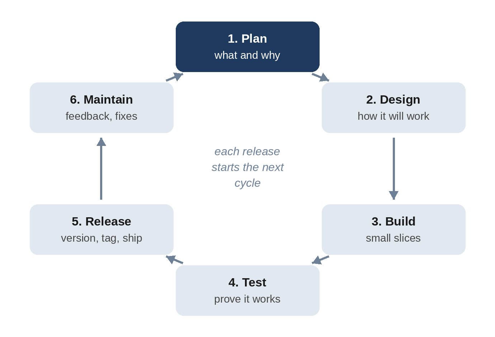

# Part VI: Working Like a Pro

# Chapter 28: The Software Development Lifecycle: From Idea to Release and Beyond

Building one version of an app is a project. Keeping it useful for years, while people report bugs, ask for features, and depend on it, is a process. Professional teams call that process the **software development lifecycle**, or **SDLC**. In this chapter, you'll see what the lifecycle is, how each stage maps to what you've already done in this book, and how to run it with Claude Code: giving the habit tracker its first official release, then taking a real feature request from a user all the way to version 1.1.0.

## The Lifecycle in Six Stages



Different companies use different names, but almost every version of the lifecycle has these six stages:

1. **Plan.** Decide what to build and why. Who is it for? What problem does it solve? What's in this version and what isn't?
2. **Design.** Decide how it will work: the data, the screens, the files, and how you'll test it.
3. **Build.** Write the code, in small slices.
4. **Test.** Prove it works, including the awkward cases.
5. **Release.** Give it a version number, record what changed, and ship it.
6. **Maintain.** Fix bugs, answer feedback, update dependencies, and plan the next version.

There are two broad styles of running the cycle. In a **waterfall** process, each stage happens once, in order, for the whole project. In an **iterative** or **agile** process, you go around the cycle many times, shipping a small improvement each time. Vibe coding is naturally iterative: every request you send to Claude is a tiny trip around the loop.

You've already practiced every stage in this book. The table shows where:

| Stage | What you did | Where |
| --- | --- | --- |
| Plan | Interview prompts and written specs | Chapters 7 and 10 |
| Design | Plan mode; choosing static or dynamic, storage, platforms | Chapters 6, 10, and 20 |
| Build | Small slices with commits | Chapters 5 to 10 |
| Test | Unit, API, and browser tests; accessibility checks | Chapters 8, 12, and 20 |
| Release | Deploying online and to the app stores | Chapters 15 and 21 |
| Maintain | Bug reports, debugging, security reviews | Chapters 11 and 31 |

What's missing is the glue that connects the stages over time: version numbers, a record of changes, and a routine for handling requests. That's what this chapter adds.

## Semantic Versioning

A **version number** tells people what changed. The most widely used system is **semantic versioning** (often shortened to **semver**), which uses three numbers, MAJOR.MINOR.PATCH:

- **PATCH** (1.0.0 to 1.0.1): bug fixes only. Nothing new, nothing breaks.
- **MINOR** (1.0.0 to 1.1.0): new features that don't break anything existing.
- **MAJOR** (1.0.0 to 2.0.0): changes that break something people depend on, such as removing a feature or changing an API.

Version 1.0.0 is a promise: "this is ready for real use." Versions below 1.0.0 (0.1.0, 0.2.0, and so on) signal that things may still change.

## The First Official Release

The habit tracker from Chapter 10 has been tested, put online, and protected with hooks and reviews. It's time to call it 1.0.0, and to set up the routine for every release after it. In the habit tracker's folder, in a fresh session:

```
The habit tracker is ready for its first official release, and I
want to manage it the way a professional team would from now
on. Set up the release process:

1. Give the app a version number, 1.0.0, kept in one place, and
   show it in small text at the bottom of the page.
2. Write a CHANGELOG.md in the Keep a Changelog format, with a
   1.0.0 entry built from the git history.
3. Add GitHub templates: a bug report and a feature request issue
   template, and a pull request template with a short checklist.
4. Add a "Releasing" section to the README that explains how we
   choose the next version number (semantic versioning) and the
   exact steps to make a release.
5. Commit, then create an annotated git tag v1.0.0.

Run the tests before you finish.
```

"Kept in one place" prevents a classic problem: a version number copied into several files, which drift apart. **Keep a Changelog** is a popular, simple format for a file that lists notable changes in each version, grouped under headings such as Added, Changed, and Fixed. A **git tag** is a permanent label on one commit, so you can always find the exact code of any release.

Claude's reply (shortened):

```
Claude's reply:
The 1.0.0 release setup is committed as 1af1296 and tagged with
the annotated tag v1.0.0. All 33 tests pass, including a new one
that checks the version appears on the page. I haven't looked at
the footer in a browser.

1. Version: __version__ = "1.0.0" in app.py is the only place it
   lives. It shows as small grey text at the bottom of the page
   ("v1.0.0").
2. CHANGELOG.md: Keep a Changelog format with an empty
   [Unreleased] section and a 1.0.0 entry. I wrote the entry
   from the git history.
3. GitHub templates: bug_report.md, feature_request.md, and
   pull_request_template.md, with a three-item checklist for
   tests, docs and changelog.
4. README "Releasing" section: it explains when to bump major,
   minor or patch for this app and gives the steps.
5. Commit and tag: the tag is v1.0.0.

Nothing has been pushed, since there's no remote configured.
```

The **issue templates** shape the reports people send you. When someone opens a new issue on GitHub, they get a form instead of a blank box. Here's the feature request template:

```
@include projects/04-habit-tracker/.github/ISSUE_TEMPLATE/feature_request.md
```

The first question asks about the *problem*, not the solution. That's deliberate: users are experts in their problems, and you're the expert in solutions. The bug report template asks for the steps to reproduce and the app version, which is why the version is shown on the page.

## A Feature Request, from Start to Finish

A few days after the release, a user opens an issue:

> "I made a typo in a habit name ('Excercise') and the only way to fix it is to delete the habit, which loses my 40-day streak. Please let me rename habits."

Here's how it goes through every stage of the lifecycle, in one prompt:

```
A user opened this feature request:

  "I made a typo in a habit name ('Excercise') and the only way
  to fix it is to delete the habit, which loses my 40-day streak.
  Please let me rename habits."

Handle it with our process, from start to finish:

1. Create a branch for it.
2. Update SPEC.md with the new behavior, including the edge cases
   (empty names, the 30-character limit, duplicate names).
3. Write the tests first and show me they fail.
4. Implement it, backend and frontend, and make the tests pass.
5. Add it to CHANGELOG.md under [Unreleased].
6. Since there's no GitHub remote, write the pull request
   description to PR.md, using our pull request template.
7. Then act as the release manager: merge the branch into
   master, release it with the right version number following
   the README, and tag it.
```

Each numbered step is one stage. Step 2 is planning: the specification is updated *before* any code, so the edge cases are decided by you, not discovered by accident. Step 3 is test design. Step 4 is the build. Steps 5 and 6 document the change for reviewers and users. Step 7 is the release. Notice the phrase "following the README": the version number isn't chosen by feel but by the rules written down during the 1.0.0 release.

Claude's reply (shortened):

```
Claude's reply:
Habit renaming is released as v1.1.0, merged into master and
tagged v1.1.0. All 44 tests pass, but I haven't tried the Rename
button in a browser.

1. Branch: I worked on feature/rename-habit.
2. SPEC.md: Added feature 5, "Rename a habit", and the
   PATCH /api/habits/<id> entry. Edge cases:
   - Names are trimmed, and empty or all-space names give 400.
   - Names over 30 characters give 400.
   - A name that matches another habit, ignoring case, gives 409.
   - Renaming to its own name, or changing only the
     capitalisation, is allowed.
   - An unknown habit gives 404.
   - A rejected rename changes nothing.
3. Tests first: I wrote 11 tests. They failed with 405 METHOD NOT
   ALLOWED because the endpoint didn't exist (11 failed, 33
   passed).
4. Implementation: PATCH /api/habits/<id> returns the updated
   habit. Completions are stored by habit ID, so the 40-day
   streak survives. Add and rename now share one name check.
   Each habit has a "Rename" button that opens a prompt.
5. CHANGELOG.md: the change went under [Unreleased].
6. PR.md: written from our pull request template, with the
   checklist filled in.
7. Release: I merged the branch into master with --no-ff. I
   chose 1.1.0 because this is a backwards-compatible new
   feature, which the README's rules make a minor bump.
```

Look at the edge case "changing only the capitalisation is allowed." Habit names must be unique ignoring case, so a careless duplicate check would find the habit's own name and refuse to change "exercise" to "Exercise." That's the value of writing the spec first: you see the case and decide it, rather than learning about it from an annoyed user.

The claims were checked independently. The 11 new tests were run against the 1.0.0 code and failed exactly as reported, and the book's browser test now renames a habit that has a streak, confirms the streak survives, and confirms a 31-character name is refused. Here's the history Git now shows:

```
Terminal output:
* 62f43f4 Release 1.1.0
*   6f5aa6b Merge feature/rename-habit: rename habits
|\
| * 0006c37 Add renaming of habits
|/
* 1af1296 Release 1.0.0: version, changelog, GitHub templates, release docs
```

The feature was built on its own branch, merged as one unit, and released with its own commit and tag. And here's the changelog entry users will read:

```
@include projects/04-habit-tracker/CHANGELOG.md#L8-L15
```

> **Note:** Claude reported that it hadn't tried the Rename button in a browser, and that the button opens a simple browser prompt. That's consistent with how the app already asks before deleting, but a custom dialog would look better. That's a good candidate for 1.2.0, and it's exactly how the next trip around the cycle begins.

## Environments: Development, Staging, Production

As an app gains users, you'll want somewhere safe to try changes before real people see them. Teams usually keep three **environments**:

- **Development**: your own computer, with test data. Break things freely.
- **Staging**: a private copy of the live app, set up exactly like production but used only for testing. Many hosting services can create a temporary copy for each pull request, called a **preview deployment**.
- **Production**: the live app real users depend on.

Mobile apps have the same idea with different names: development builds, TestFlight and closed testing tracks, and the public store release (Chapter 21). The rule is the same everywhere: nothing reaches production without passing through testing first.

## Maintenance: The Longest Stage

Most of a successful app's life is spent in maintenance. A simple routine keeps it healthy:

- **Triage new issues weekly.** Label each one as a bug or feature, ask for missing details, and decide its priority. Claude can draft replies and reproduce bugs from the steps in a report.
- **Fix bugs as patch releases.** Write a failing test first, as in Chapter 11.
- **Update dependencies regularly**, in small batches with the tests running, and immediately for security fixes.
- **Watch the production app**: error logs, crash reports, and uptime. A free uptime checker can email you when the site goes down.
- **Back up the data**, and test restoring from a backup at least once.
- **Keep documentation current.** README, SPEC.md, CHANGELOG.md, and CLAUDE.md are your project's memory, and Claude's.

## Best Practices for the Lifecycle

- **Write requirements down before building**: a spec, an issue, or at least a bulleted list with edge cases.
- **Keep one source of truth for the version**, and follow semantic versioning.
- **Keep a changelog**, and update it in the same change as the code, under [Unreleased].
- **Use a branch per feature or fix**, and merge it through a pull request with a checklist.
- **Write the tests first for bug fixes and new behavior**, and confirm they fail before the fix.
- **Write down the release steps** in the README, and follow them every time.
- **Tag every release** so you can find, compare, and roll back to any version.
- **Test in a safe environment before production**: staging, preview deployments, or store testing tracks.
- **Use issue templates** to get useful reports, and triage regularly.
- **Ask Claude to report what it didn't verify** at every stage, and verify it yourself.

> **Try It:** Pick one of your own projects. Ask Claude to set up the release process from this chapter, then open a GitHub issue for a small improvement and send the "feature request, from start to finish" prompt, adapted to your project. Read the pull request description before merging.

## Key Takeaways

- The SDLC has six stages: plan, design, build, test, release, and maintain. Vibe coding runs the cycle in small, frequent loops.
- Semantic versioning (MAJOR.MINOR.PATCH) tells users what kind of change each release contains.
- A changelog, git tags, issue templates, and a written release process turn a project into a maintainable product.
- One well-structured prompt took a user's feature request through every stage, from specification to tagged release.
- Writing the spec first surfaced an edge case (renames that only change capitalization) before any code existed.
- Keep development, staging, and production separate, and remember that maintenance is the longest stage.
